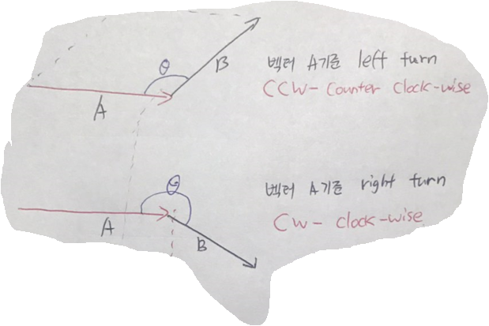

[Algorithms]
======================


# 1. Interval Scheduling


## 1.1 다양한 접근법

- Earliest start time (Earlist Job First) : 시작 시간이 가장 빠른 작업들로 스케쥴링, 하지만 이는 항상 최적해를 구하지 않는다. 정확하지 않은 알고리즘
- Shortest interval (Shortest Job First) : 가장 짧은 구간(시간이 적게 걸리는)을 가진 작업들로 스케쥴링, 하지만 이 또한 반례가 존재. 항상 최적해를 구할 수 없다.
- Earilest finish time : 작업 종료 시간이 가장 빠른 작업들로 스케쥴링, 몇가지 예시들을 생각해보면 최적이라는 것을 알 수 있다. [증명 1.2]

```
* 스케쥴링 문제의 해는 구간들의 부분집합으로 이루어진다. (Exaustive Scheduling)
  즉, 2^n개의 부분집합 각각 모두를 고려하면 해가 반드시 하나는 존재한다.
  하지만 시간복잡도가 커 문제를 해결하는데 시간이 오래걸린다.
```

-> 이보다 더 빠른 시간 안에 해결할 수 있는가?
   - Earilest finish time (Optimal Scheduling) : 수학적 귀납법으로 재귀적인 증명이 가능하다. 어떤 작업 E를 제외하고 최적의 해인 부분집합 I'이 있다고 생각할 때, (가정)
         작업 시간이 겹치는 다른 작업들(E, E', E'', ...)과 비교했을 때 가장 먼저 끝나는 작업 E를 포함하는 것이 최적의 해라는 것을 증명하면 된다.


## 1.2 최적의 접근법에 대한 증명과 고찰
```
즉, E를 포함하는 부분집합이 최대 구간의 수를 갖는다를 증명 (최대 구간의 수를 갖는 독립집합)  
// (독립집합 (Independent Set) : 집합 간에 서로소가 되는 집합)
```

: 그렇다면 E를 포함하지 않는 부분집합이 최적의 해가 아니라고 할 때 (E'을 포함한 부분집합이 최적이라면) E를 포함하도록 변형이 가능하다면 이를 증명할 수 있다.
E와 E' 작업을 뺀 부분집합은 E와 E'의 작업시간과는 겹치지 않는다. 그러므로 E'을 빼고 E를 포함해도 구간의 수는 똑같이 최적임을 알 수 있다. E를 포함한 부분집합과
E' 포함한 부분집합의 구간의 수는 같다는 말.

```
* 쉽게 생각해보면 빨리 시작하는 작업을 고르는 알고리즘과는 다르게 현재 가장 빨리 끝나는 작업(E)을 매 순간에 고르게 됐을 때,  
선택된 작업은 시작시간이 어떻게 됐든 간에 매 순간에 가장 빨리 끝나는 작업(E)을 고르는 것을 반복했기 때문에  
이전에 고른 가장 빨리 끝나는 작업(E') 시간이 현재 고른 가장 빨리 끝나는 작업(E)의 시작 시간보다 늦을 수가 없다는 이야기이다.  
즉, 가장 빨리 끝나는 작업들을 계속해서 고르게 되면 처리할 수 있는 가장 많은 작업의 수를 고를 수 있다는 것이다.
```


## 1.3 시간복잡도

- 시간복잡도는 O(NlogN)에 가능.

1) 입력 데이터를 정렬
2) 입력 데이터가 들어올 때마다 힙(Heap) 자료구조에 삽입하여 가장 빨리 끝나는 작업 시간을 가진 데이터가 먼저 pop되도록 구성

위의 두 가지 방법이 있다. 이후 각각 작업시간을 비교하여 겹치는지 여부를 확인해주며 최대 처리가능한 작업의 개수를 세면 된다.


## 1.4 심화


### 1.4.1 작업들에 가중치(비용)이 존재한다면?

: 결론부터 말하면 정점에 가중치가 존재하는 Interval Graph에서 특정한 가중독립집합을 구하는 문제가 된다.  
// 독립집합 <=> 클릭 (Clique) : 모든 가능한 변이 존재하는 꼭짓점들의 부분집합  
```
여기서 말하는 클릭은 Interval Graph에서 정점의 모든 쌍에 대해 간선이 존재하는 정점의 부분집합.  
* Coloring Problem : 지도가 있을 때 인접한 구간이면 서로 다른 색으로 색칠(서로 배타적인 구간을 최소 개수로 나눠라)하는 문제  
-> NP-Complete  
(구간을 정점으로 하고 인접한 구간에 대해 간선을 구성하면 최소 개수의 독립집합으로 그래프를 칠하는 문제라고 볼 수 있다.)  
Interval Graph에서는 Coloring 부분집합의 수와 Clique의 수가 같다. 평면 그래프는 어떤 경우이든 간에 4가지 색으로 해결 가능.  
star형 그래프의 경우는 5가지 색이 필요하다.  
```

모든 부분집합을 탐색할 필요없이 구간들의 관계를 나타내는 방향그래프를 구성한다.

왼쪽에 있는 구간에서 부터 오른쪽에 있는 구간으로 사이클이 없는 방향그래프(Directed Acyclic Graph)로 구성이 된다. // DAG라는 것은 다른 그래프들보다 빠른 시간 안에 해결 가능한 문제로 만들 수 있다는 의미.

위의 DAG를 위상정렬한 뒤, 정점의 가중치의 합이 최대가 되는 최대가중경로를 구하면 된다.
최대가중경로를 구하는 알고리즘은 모든 정점들에서 그 정점을 지나는 순간에 가장 큰 가중치를 가질 때의 값을 배열에 저장한 뒤,
배열에서 가장 큰 값에서 시작하여 역산(정점의 가중치는 빼고 해당 값을 배열에서 찾는 작업의 반복)으로 경로를 구할 수 있다.
구간에 대한 문제를 그래프 문제로 변형하였기 때문에 최악의 경우 O(N^2)의 시간복잡도를 갖는다.

* 조금 더 빠른 시간 안에 문제를 해결할 수 있는가? 다른 방안의 변형이 가능한가?

구간들의 관계를 나타내는 그래프를 전부 구성할 필요가 없다. 왼쪽 끝점 or 오른쪽 끝점을 기준으로 정렬하면 DAG를 구성하여 위상정렬할 필요없이 구간을 순차적으로 볼 수 밖에 없다.  
이것이 라인 스위핑 [Algorithm 2]  
구간을 순차적으로 보면서  

1. 겹치는 구간이 아닌지를 확인  
2. 이전 부분집합들 안에서 최대의 가중치의 값만을 따로 저장하여 확인  
3. 각 구간에서 가능한 경우에 대해서 가중치의 합들을 짝(끝점, 가중치의 합)을 지어 가장 먼저 오는 끝점을 기준으로 하는 최소힙에 저장한다. (현재 보고있는 구간의 시작점 좌표가 이전 구간들의 끝점 좌표를 비교하여 겹치는 구간을 확인해주기 위함.)  
4. 반복해서 힙에 push, pop을 반복하여 왼쪽부터 오른쪽 구간까지 모두 확인하여 최대 가중치를 구해주면 된다. 위에 나온 가중치를 합하는 과정에 대한 기록과 역산을 포함하면 경로 또한 구할 수 있다.  
> @ Search Keyword : 구간경로에서 최대가중치를 찾는 알고리즘


### 1.4.2 장소에 따른 제약조건이 존재한다면?


# 2. Line Sweep (Plane Sweep) 평면 소거법

가장 기본적인 라인 스위핑으로는 왼쪽에서 오른쪽 혹은 오른쪽에서 왼쪽으로 진행방향을 잡고 구간을 의미하는 시작점과 끝점들을 확인하며 문제에 맞게 해결하는 알고리즘.


# 3. Binary Search (Parametric Search)

양 끝 인덱스를 기준으로 하여 left, right index 값을 통해 middle 인덱스를 구해 middle에 저장되어 있는 값을 기준으로 구간을 반 씩 줄여가며 탐색하는 알고리즘.


## 3.1 One-sided Binary Search

- Idea : left나 right 인덱스 둘 중 하나가 무한대라는 큰 값을 갖는다면(열린 구간이라면) 열린 구간 쪽으로 limit를 두 배씩 늘려가면서 이진 탐색을 진행한다.  


# 4. Bitmasking

데이터의 일정한 규칙을 2진수에 대응하여 정수 하나 혹은 하나의 배열에 여러 정보를 저장하여 공간복잡도를 절약하는 알고리즘. 연산 또한 &(AND), |(OR), ^(XOR) 등 비트 연산으로 간결해진다.


# 5. Harmonic number
Hn = 1/1 + 1/2 + 1/3 + ... + 1/n = ln(n) + euler's constant (오일러 상수)  
```
ln(n+1) <= Hn <= ln(n) + 1
```


# 6. Segment Tree (Range Minimum Query)

O(N) 공간복잡도를 이용, O(logN) 시간에 질의(Query)에 대한 답을 내는 것과 갱신(Update)가 가능하다. (구간 내의 최대/최소값 등등)


## 6.1 Lazy Propagation

- Idea : 기존의 세그먼트 트리에서 모든 요소에 값을 증감시키는 경우(Range Inc / Dec Update)에는 결국 트리 전체 노드에 대해 Inc / Dec 연산이 필요하다. 총 걸리는 시간은 O(NlogN) 시간.  
   이 때, 자식 노드에게 전달되어야 할 정보를 부모 노드에 저장해놓고 이 다음에 자식 노드들에 대해 정보가 필요한 쿼리가 들어올 경우에 그 정보를 전달해주자는 Idea.  
    부모 노드는 자식 노드가 몇 개 있는지도 알고, 늦게 전달되는 정보(값의 변화)에 대해서도 알고 있으므로  
    그에 따라 적절히 곱셈(노드 갯수 * 값의 변화)을 해서 자신이 갖고 있는 값과 더 해주면 정확한 결과도 알 수 있다.  
    만약 Range Update나 Range Query가 계속해서 이루어지는 도중에 이미 lazy 값(배열에 따로 저장)이 존재하고 자식 노드들 중 하나의 정보만 필요하다면  
    이 경우에는 해당 lazy 값을 정확한 정보가 필요한 노드의 높이까지만 전달을 하고, 반대쪽 자식 노드에도 높이 1씩 lazy 값을 전달해준다.  
    이후에 기존의 세그먼트 트리처럼 값을 더해주면서 올라오면 같은 방식으로 노드마다 정확한 값을 가질 수 있게 된다. lazy 값은 단말 노드의 값을 갱신하면 소멸된다.  


# 7. Bipartite Graph (이분 그래프)

두 개의 독립집합으로 나눌 수 있는 그래프. (예를 들어 모든 정점을 빨강색과 파랑색으로 색칠한다면 모든 변이 빨강색과 파랑색 꼭지점을 포함하도록 색칠할 수 있는 그래프.)  
$ BOJ-1707 이분 판정 문제. 2개의 독립집합으로 나타낼 수 있다면 이분그래프라고 할 수 있다.


# 8. Geometry (기하, Computational Geometry : 계산 기하)

일반적으로 알고리즘에서는 계산 기하 문제를 많이 다룬다.


## 8.1 Point
```c++
struct Point_i {
	int x, y;
	Point_i() { x = y = 0; }
	Point_i(int _x, int _y) : x(_x), y(_y) {}
}; // 좌표가 정수 값으로 주어질 때

struct Point {
	double x, y;

	Point() { x = y = 0.0; }

	Point(double _x, double _y) : x(_x), y(_y) {}

	bool operator < (Point p) const { // 연산자 재정의, EPS : 1e^-9와 같은 아주 작은 값 (문제에 따라 오차 범위 지정)
		if (fabs(x - p.x) > EPS) return x < p.x; // fabs() : double 자료형의 절대값
		return y < p.y;
	}

	bool operator == (Point p) const {
		return fabs(x - p.x) < EPS && fabs(y - p.y) < EPS;
	} // 두 점이 서로 같은지 비교
}; // 좌표가 실수 값으로 주어질 때

double hypot(double x, double y) { return sqrt(x * x + y * y); }
// 피타고라스의 정리에 의하여 z = root(x^2 + y^2)
double dist(Point p1, Point p2) { return hypot(p1.x - p2.x, p1.y - p2.y); }
// Get Euclidean Distance

Point rotate(Point p, double theta) {
	double rad = theta * (PI / 180.0); // degree를 radian으로 변환!
	// deg = rad * (180.0 / PI)
	return Point(p.x * cos(rad) - p.y * sin(rad), p.x * sin(rad) + p.y * cos(rad));
} // p를 원점(0, 0)을 중심으로 반시계 방향으로 theta도 회전한다.
```

* 극좌표계 : 평면 위의 위치를 각도와 거리를 써서 나타내는 2차원 좌표계, 두 점 사이의 관계가 각이나 거리로 쉽게 표현되는 경우에 가장 유용하다. 
  직교 좌표계에서는 삼각함수로 복잡하게 나타나는 관계가 극좌표계에서는 간단하게 표현되는 경우가 많다. 
  2차원 좌표계이기 때문에 극좌표는 반지름 성분과  각 성분의 두 성분으로 결정되며 주로 r로 나타내는 반지름 성분은 극(원점)에서의 거리를 나타낸다.
  주로 Θ로 나타내는 각 성분은 0°(직교 좌표계에서 x축의 양의 방향에 해당)에서 반시계 방향으로 잰 각의 크기를 나타낸다.
* rotate에 대한 일반화 : 각도라는 개념이 없는 직교좌표계에서는 점 P(x, y)를 각 α만큼 회전시킨다고 하면 표현하기 어렵다.  
     하지만 극좌표계에서는 P(r, Θ) -> P'(r, Θ+α) 이처럼 쉽게 표현이 가능하다. 이렇게 표현한 극좌표를    
     		 삼각함수를 이용해 데카르트 좌표로 변환하면 P'(x', y') = P`(r * cos(Θ+α), r * sin(Θ+α))가 되고  
     		 삼각함수의 덧셈정리를 이용해 P'(r*cosΘcosα - r*sinΘsinα, r*sinΘcosα + r*cosΘsinα)가 된다.  
     		 위 식에서 r*cosΘ = P.x, r*sinΘ = P.y이므로 위의 rotate 함수처럼 일반화가 가능하다.


## 8.2 Line

```c++
struct Line {
	double a, b, c;

	Line(double _a, double _b, double _c) : a(_a), b(_b), c(_c) {}
}; // 선형 방정식의 x, y의 계수와 상수로 직선을 표현
// ax + by + c = 0

Line pointsToLine(Point p1, Point p2) {
	if (fabs(p1.x - p2.x) < EPS) return Line(1.0, 0.0, -p1.x);
	else {
		Line l;
		l.a = -(double)(p1.y - p2.y) / (p1.x - p2.x);
		l.b = 1.0; // b (y의 계수)를 1로 두어 나머지 값을 구한다. y = ax + b의 형태
		l.c = -(double)(l.a * p1.x) - p1.y;
		return l;
	}
}; // 기울기와 선형 방정식에 점의 대입을 통해 선형 방정식을 도출한다.

bool areParallel(Line l1, Line l2) {
	return fabs(l1.a - l2.a) < EPS && fabs(l1.b - l2.b) < EPS
} // 계수 a와 b를 비교하여 기울기가 같은지를 확인 (평행임을 확인)

bool areSame(Line l1, Line l2) {
	return areParallel(l1, l2) && fabs(l1.c - l2.c) < EPS
} // 평행하면서 상수항까지 같다면 일치

bool areIntersect(Line l1, Line l2, Point &p) { // 참조를 사용한 전달
	if (areParallel(l1, l2)) return false;
	p.x = (l2.b * l1.c - l1.b * l2.c) / (l2.a * l1.b - l1.a * l2.b);
	if (fabs(l1.b) > EPS) p.y = -(l1.a * p.x + l1.c);
	else p.y = -(l2.a * p.x + l2.c);
	return true;
} // 교차점이 있는지 여부와 교차점의 좌표를 구하는 함수
```

* Intersect (교차) : 만약 두 직선이 평행하지 않다면(당연히 일치할 수도 없다.) 어느 한 점에서 교차한다. 따라서 그 교점을 구하려면  
        미지수가 두 개인 선형 방정식 두 개로 이루어진 연립 방정식을 풀면 된다.
* 선분은 양 끝점이 존재하며, 길이가 유한한 직선을 말한다.
* 벡터(Vector)는 선분에 방향이 더해진 것. 벡터의 x, y 성분의 크기를 멤버 변수로 하는 구조체로 표현한다.


## 8.3 Vector

```c++
struct Vec {
    double x, y;
    
    vec(double _x, double _y) : x(_x), y(_y) {}
}; // x와 y의 증감량을 통해 표현

Vec pointToVec(Point a, Point b) {
    return vec(b.x - a.x, b.y - a.y);
} // 두 점을 a -> b 방향의 벡터로 변환

Vec scale(Vec v, double s) {
    return Vec(v.x * s, v.y * s);
} // 벡터의 확대, 축소

Point translate(Point p, Vec v) {
    return Point(p.x + v.x, p.y + v.y);
} // 점을 벡터에 따라 평행이동
```

cf) 자연계에는 스칼라(Scalar)와 벡터(Vector) 두 종류의 물리량이 있다.

- Scalar : 크기(Magnitude)만을 갖는 물리량 (움직임으로 따지면 속력(단위 시간 당 이동한 거리))
- Vector : 크기와 방향을 동시에 갖는 물리량 (움직임으로 따지면 속도(단위 시간 당 이동한 변위))
  - 시작점에서 끝 점에 이르는 길이(크기)와 방향을 나타내는 벡터량, 힘
  - 노름(norm) : 벡터의 크기를 나타내는 절대값, 스칼라와 똑같이 표현되어 구별하기 위해 노름이라고 한다.
- 벡터의 곱
  - 내적 (Dot Product, Inner Product, 스칼라 곱 : Scalar Product) : 연산 결과가 스칼라로 나온다.
    - 평면 벡터의 내적
      - 
    - 공간 벡터의 내적
      - 
      - 이는 코사인 제 2 법칙으로 증명 가능하다.
        - 
  - 외적 (Cross Product, Outer Product, Vector Product) : 오른손(나사)의 법칙을 기준으로 정의하겠다.
    - A X B = AB sin a (a = 벡터 A와 B의 사잇각) : 벡터 B가 벡터 A를 기준으로 얼마나 회전하려는 성질을 가지는가. 벡터 A와 벡터 B의 수직 벡터가 결과값
    - 
    -  <= 비호환(non-commutative) 연산
    - 단위 벡터(Unit Vector) i, j, k 사이의 외적을 생각해보자. (단위 벡터들의 크기는 모두 1)
      - 자기 자신과의 외적은 사잇각이 0도이므로(sin0 = 0) 당연히 0이다.
      - 단위 벡터 i, j의 외적은 사잇각이 90도이므로(sin90 = 1) 1이다.
        -  
      - 오른손 법칙을 기준으로 했기 때문에 i X j = k, j X i = -k
      - 
      - 이는 행렬식으로도 표현 가능하다.
        - 
        - 때문에 두 벡터의 외적을 구한다는 것은 행렬식의 사루스 전개 혹은 소행렬식을 구하는 것과 같다.
        - 
        - 
    - 벡터의 외적은 두 벡터로 구성된 평행사변형의 넓이라고도 할 수 있다.
      - 때문에 두 벡터를 구성할 수 있는 세 점을 통해 삼각형의 넓이 또한 구할 수 있다.
        - (외적) / 2
    - 두 벡터의 외적은 두 벡터의 사잇각이 180도보다 클 때는 음수가 된다.
      - 180도 일때는 일직선 상에 놓여있다, 180도보다 작을 때는 양수가 된다.

[출처] Special thanks to https://s2kindboys2.blog.me


* 점 p와 직선 l (점 a, b에 의해 결정) 사이의 최소 거리를 구하는 알고리즘

  - 점 p와 가장 가까운 직선 l 위의 점 c를 구한다.

  - 점 p와 c 사이의 유클리드 거리를 구한다. 이 때, 점 c를 벡터 ab에 u 배율 곱한 것에 따라 평행이동시킨 점으로 생각할 수 있다.

  - u의 값을 구하기 위해서는 내적을 이용하여 벡터 ap를 ab로 스칼라 사영하면 된다.

  - ```c++
    double dotProduct(Vec a, Vec b) { return a.x * b.x + a.y * b.y; } // 벡터 크기의 내적
    double norm_sq(Vec v) { return v.x * v.x + v.y * v.y; } // 벡터 크기의 제곱
    double distToLine(Point p, Point a, Point b, Point& c) { // a, b로 벡터 구성
        Vec ap = pointToVec(a, p), ab = pointToVec(a, b); // 필요한 벡터 ap, ab 구성
        double u = dotProduct(ap, ab) / norm_sq(ab); // 단위 벡터
        // 배율을 구하기 위해 벡터 ap와 ab의 내적을 벡터 ab 제곱으로 나누어 비율을 구한다.
        c = translate(a, scale(ab, u));
        // 구한 비율에 따라 벡터를 확대, 축소한 뒤 점 a를 평행이동한 뒤
        return dist(p, c); // 점 p와 c 사이의 거리를 반환한다.
    } // 벡터 ab(로 구한 점 c)와 점 p사이의 거리
    ```

* 점 p와 선분 l 사이의 최소 거리를 구하는 알고리즘

  * 선분 위에 최소 거리가 되는 점이 존재한다면 직선에서의 문제와 같지만

  * 선분의 한 끝점까지의 거리가 최소거리인 경우에는 예외처리가 필요하다.

  * ```c++
    double distToLineSegment(Point p, Point a, Point b, Point& c) {
        Vec ap = pointToVec(a, p), ab = pointToVec(a, b);
        double u = dotProduct(ap, ab) / norm_sq(ab);
        if (u < 0) { // 단위 벡터에 의한 비율에 따라 a에 가까운지 b에 가까운지 결정된다.
            c = Point(a.x, a.y);
            return dist(p, a);
        }
        if (u > 1) {
            c = Point(b.x, b.y);
            return dist(p, b);
        }
        c = translate(a, scale(ab, u));
        return dist(p, c);
    }
    ```

* 세 점 a, o, b가 주어졌을 때, 내적을 이용하여 각 aob의 크기를 구할 수 있다.

  * 

  * ```c++
    double angle(Point a, Point o, Point b) {
        Vec oa = pointToVec(o, a), ob = pointToVec(o, b);
        return acos(dotProduct(oa, ob) / sqrt(norm_sq(oa) * norm_sq(ob)));
    }
    ```

* 두 점 p와 q에 의해 결정되는 직선이 주어졌을 때, 어떤 점 r이 그 직선에 대해 어느 위치에 있는지를 구할 수 있다.

  * 점 r은 직선 pq를 기준으로 왼쪽에 있을 수도, 오른쪽에 있을 수도, 직선 상에 위치할 수도 있다.

  * 이를 벡터의 외적을 이용하면 점의 위치를 판별할 수 있다는 것이 CCW 알고리즘

  * 반시계방향 검사(알고리즘) (CCW : Counter Clock Wise, Clock Wise Algorithm) / 좌회전 검사

  * 세 점으로 부터 두 벡터 pq와 pr을 얻었다고 할 때, 두 벡터의 외적 pq X pr은 또 다른 벡터를 나타내는데, 그 벡터는 벡터 pq와 pr에 직교한다. 이 벡터의 크기는 위에서도 언급했듯이 두 벡터로 구성되는 평행사변형의 면적과 동일하다.

  * 외적의 결과가 음수인지, 0인지, 양수인지에 의해 좌, 우측, 일직선인 경우를 판별한다.

  * 정확히는 sinΘ에 의해 양수인 영역(0 < Θ < 180), 음수인 영역(180 < Θ < 360), 0인 경우(0, 180)를 판별하는 것이다.

  * 

  * ```c++
    double crossProduct(Vec a, Vec b) {
        return a.x * b.y - a.y + b.x;
    }
    int ccw(Point p, Point q, Point r) {
        double cp = crossProduct(pointToVec(p, q), pointToVec(p, r));
        if (cp < EPS) return -1;
        else if (cp > EPS) return 1;
        else return 0;
    }
    ```


# 9. Cut Vertex, Cut Edge (in Undirected Graph)

연결 요소가 두 개에서 하나가 되는 정점 혹은 간선. O(V * (V + E)) => O(V + E)  
Spanning Tree의 부모는 방문하지 않는다. 방향은 자식 노드 쪽으로. 루트는 자식 노드가 2개 이상이면 Cut Vertex가 될 수 있다.
```
* Back Edge : Spanning Tree에서 조상 노드로 올라가는 간선

* Cross Edge : Spanning Tree에서 형제 노드로 가로지르는 간선

* Forword Edge : Spanning Tree에서 자식 노드로 내려가는 간선 
```


# 10. Quick Sort

임의의 pivot 값을 고르고 pivot을 기준으로 pivot의 좌측에는 pivot 보다 작은 값, 우측에는 큰 값을 놓는 행위를 재귀적으로 반복했을 때,  
결국 정렬이 완성된다는 방법론.

* Average-case Analysis : pivot 값에 따라 비교 횟수가 많을 수도 적을 수도 있다. 때문에 중앙에서 분할될 가능성이 높은  
  		  좌측 끝, 중앙, 우측 끝 세 값의 중위법을 이용하여 pivot을 정하고 분할하는 방법을 대부분 채택한다.  
  		  평균적인 시간 복잡도는 O(nlogn)이다.


# 11. Closest Pair

2차원 평면 위에 n개의 점이 존재할 때, 가장 거리가 가까운 점 한 쌍을 구하는 문제.

모든 경우를 탐색하게 되면 O(n^2)의 시간복잡도가 나온다. 시간을 더 줄일 수 있는가? 

* 줄일 수 있다.  분할 정복 형태의 풀이가 가능하다.


# 12. Graph

- 대칭(Symmetric) 관계 - 무방향 그래프, 전이(Transition) 관계 - 방향 그래프
- 반사(Reflexive) 관계
- 동치 (Equivalence Relation)
- 분할 (Decomposition Partition)

## 12.1 깊이 우선 탐색 (DFS : Depth First Search)

기존의 DFS와는 다르게 visit 배열을 조금 더 세분화하여 color 배열로써 표현하고, 탐색을 시작한 시간과 끝나는 시간을 기록할 수 있다면,

- Color
  - white : 방문하지 않은 정점
  - gray : 어느 한 정점(Root)으로부터 DFS를 시작하여 방문한 정점들
  - black : DFS가 끝난 정점 (현재 다른 간선을 통해서 더 이상 방문할 정점이 없는 정점)
- Discover Time : DFS 탐색을 시작한 시간, Finish Time : DFS 탐색이 끝나는 시간

이렇게 표현이 되는데, 이를 통해 구성된 신장 트리(Spanning Tree)에서 간선을 분류해낼 수 있다.

- Tree Edge : 순 방향으로 이어지는 간선, 방문 가능한 정점으로 이어진다. (color == white)
- Back Edge : 역 방향으로 이어지는 간선, 이미 방문한 정점으로 이어지는 간선이다. (color == gray)
- Forward Edge : 현재 정점을 Root라고 했을 때, 자손 노드 중 하나로 이어지는 간선
  - (color == gray && DiscoverTime[u] < DiscoverTime[v])
- Cross Edge : 이미 방문한 정점이면서 먼저 탐색을 시작한 정점으로 이어지는 간선
  - 신장 트리에서 Root를 기준으로 다른 서브 트리를 갖는 정점으로 이어지는 간선이다.
  - (color == gray && DiscoverTime[u] > DiscoverTime[v])

위와 같은 특성들을 이용한다면 조건에 따라 그래프의 특정 요소들을 찾을 수 있다.

- ex : Find Back Edge - Cycle


## 12.2 위상 정렬 (Topological Sort)

일련의 정점들을 일자로 나열하는 것 (ex : 작업의 순서도, 수강 신청의 선수 과목 구조 등등)

방향이 있고 사이클이 없는 그래프(DAG : Directed Acyclic Graph)에서 가능하다.

사이클의 유무를 모르는 유향 그래프에서 위상 정렬을 수행해도 사이클의 유무를 알 수 있다. (사이클을 찾아내면 당연히 위상 정렬은 되지 않는다.)

1. 내향차수(Indegree)가 0인 정점을 찾는다.
2. 찾은 정점과 정점의 외향 간선을 제거한다.
3. 정점이 남아있다면 1 - 2 과정을 반복한다.

이것이 기존의 방법이라면 위에서 언급한 DFS를 이용한다면 DFS 한 번에 위상 정렬이 가능하다.

DFS를 진행하며 Finish Time이 늦는 순서대로 출력한다. (먼저 탐색이 끝나는 대로 쌓아 두었다가 역순으로 출력한다.) => Topological Ordering

이 방식은 DFS가 가장 빨리 끝나는 정점이 외향 차수(Outdegree)가 0이고 방향 또한 가장 깊은 곳이기 때문에 그만큼 거쳐온 정점도 많다는 DFS의 특징을 이용한 방식이다.


## 12.3 강 연결 요소 (SCC : Strongly Connected Component)

어느 한 정점에서 다른 모든 정점으로 갈 수 있는 방법이 존재하는 정점들의 집합을 말한다.

DFS를 통해 DFS Spanning Tree를 구성하고 상호 연결되어 있지 않은 Sub Tree들을 찾는 것이 핵심.

- Tarjan's algorithm
  - 주어진 방향 그래프의 모든 정점을 방문할 때까지 DFS를 통해 Spanning Tree를 구성한다.
  - DFS 트리에서 하나의 강 연결 요소는 첫 시작점이 되는 (서브 트리의 루트가 되는) 정점이 꼭 하나 있다.
    - 이 정점을 Leader라고 칭하자.
    - 강 연결 요소를 구성하는 정점들은 시작점(Leader)의 후손이라고 할 수 있다. (역은 성립하지 않는다.)
  - 리더의 후손 중에 리더보다 더 높은 높이의 정점으로 가는 Back Edge는 없다. (있다면 그 정점이 리더가 될 수 없다.)
    - 리더는 자손들의 Back Edge, Forward Edge, Tree Edge들을 모두 포함하고 있다.
    - 이러한 성질을 통해 현재 정점이 리더인지를 판별할 수 있다.
    - Back Edge를 통해 갈 수 있는 정점을 기록하여 기록된 정점보다 높이가 하나라도 더 높은 정점을 리더로 삼을 수 있다.
  - 리더가 다른 강 연결 요소의 리더를 포함하고 있다면 그 두 강 연결 요소는 분리할 수 있다.
  - Cross Edge의 경우에는 간선을 통해 이미 강 연결 요소로 구성되어 있는 정점으로 간다면 상관없다.
    - 강 연결 요소 구성의 완료 여부는 스택에서 pop되어 있는지 안 되어 있는지를 보면 알 수 있다.
    - 하지만 구성되어 있지 않다면 분명히 Cross Edge로 이어진 두 서브 트리를 포함하는 진 조상이 되는 정점이 존재한다. (최소 공통 조상 - LCA : Least Common Ancestor)
    - Back Edge와 마찬가지로 갈 수 있는 정점의 번호를 기록해줘야 한다.
    - Cross Edge를 통해 연결되는 간선이 생겨 더 큰 규모의 강 연결 요소를 구할 수 있기 때문이다.
  - 방문 순서를 저장하는 스택과 위의 리더의 성질을 이용하여 리더의 정점 번호가 나올 때까지 pop 연산을 해서 하나의 강 연결 요소에 대한 정점들을 찾아낼 수 있다.
  - 무향 그래프에서는 양방향 간선이라고 볼 수 있기 때문에 Back Edge와 Forward Edge의 구분이 없다.
    - 무향 그래프에서는 Cross Edge가 존재할 수 없다.
- Kosaraju's algorithm
  - 주어진 입력에 따라 정방향 그래프와 역방향 그래프 두 가지를 구성한 뒤,
  - 정방향으로 모든 정점에 대해 DFS를 진행하며 탐색이 끝나는 순서대로 스택에 push한 뒤,
  - 스택이 빌 때까지 정점들을 pop하면서 역방향으로 DFS를 진행하여 pop된 정점을 기준으로 한 번의 dfs에 하나의 강 연결 요소를 구할 수 있다.


# 13. Master Theorem

재귀적으로 표현한 알고리즘의 동작 시간을 점근적으로 계산하여 간단하게 계산하는 방법


이러한 동작 시간을 갖는 재귀적인 알고리즘이 있다고 하자. 이를 통해 Recursion Tree로 표현하게 되면


이러한 Ternary Tree(삼원트리)로 표현할 수 있다. 그렇다면 전체 시간 복잡도는 트리의 높이(level)에 따라

- level 0
  - 
- level 1
  - 
- level k
  - 

나타낼 수 있다. 그렇다면 아래 식처럼 변형이 가능하며


k를 극한까지 보내면 공비 r = 3/4 < 1인 등비수열의 합 공식에 따라


4로 수렴하는 것을 알 수 있다. 그러므로


따라서 재귀적 알고리즘의 시간 복잡도는 아래처럼 나타낼 수 있다.


결론적으로, 마스터 정리는 이 a, b, c의 관계로 시간복잡도를 간단하게 계산할 수 있다. domination은 시간복잡도의 지배를 의미한다.


- 
- 


- 공비가 1보다 작으므로 수렴하기 때문에
  - 
- 반대로 공비가 1보다 크다면 발산하기 때문에 마찬가지로 마스터 정리에 의해
  - 
- 그렇다면 공비가 1일 때는?
  - 
  - 이러한 예시가 분할 정복 형태의 정렬 알고리즘의 시간복잡도의 상계이다.

[출처] Special thanks to https://s2kindboys2.blog.me


# 14. 서로소 집합 (Disjoint Set, Union-find)

공통된 원소가 없는 (상호 배타적인) 부분 집합들로 나눠진 원소들에 대한 정보를 저장하는 자료 구조

그래프나 트리에서 사용되는 서로소 집합은 루트의 노드 번호로 집합을 구분한다.

parent[] : 각 정점 번호가 속하여 구성되는 트리의 루트 노드 번호를 저장한다.

- find(v) : 정점 v의 루트(부모 노드)를 호출한다.
- union(u, v) / merge(u, v) : 정점 u와 v를 같은 집합에 넣는다.

두 가지 연산을 통해 트리를 구성하는 것이 핵심

트리의 특징적인 단점이라고 할 수 있는 것이 균형 트리가 아니라면 트리에 노드를 연결하면서 불균형을 초래할 수 있다는 것인데, 다시 말해서 한 쪽으로만 노드가 편중(Skewed)되어 다른 쪽과 균형이 맞지 않을 수 있다.

이를 해결하기 위해 rank 배열을 추가하여 구성되는 트리에서 해당 노드의 높이에 비례하는 값을 저장해주어 항상 높이가 더 낮은 트리를 높은 트리 밑에 넣음으로써 완벽하진 않지만 find 연산을 통한 경로 단축에 더해 추가적인 최적화가 가능하다.

- 빠른 구현 혹은 메모리 공간의 절약이 필요하다면 굳이 하지 않아도 되는 최적화.

시간 복잡도는 Find 연산의 호출 횟수에 따라 다른데 이는 구성되는 트리의 높이에 따라 수행 횟수가 달라질 수 있다는 것을 의미한다.

집합이 구성되는 것을 생각해 본다면 트리의 높이는 주어지는 집합에 따라 달라지기 때문에 일관성이 없다.

때문에 평균적인 수행 시간을 계산하면

- 
- 위처럼 n이 아무리 커도 거의 모든 n에 대해 4 이하의 값을 가지기 때문에 현실적인 입력이라면 상수 시간에 동작한다고 봐도 무방하다.


# 15. 최소 신장 트리 (MST : Minimum cost Spanning Tree)

그래프를 구성하는 간선들에 비용이 있는 그래프 G가 존재할 때, 비용의 가중치(합)를 최소로 하여 사이클이 없이 모든 정점들을 연결하는 트리

- 프림 (Prim)
  1. 그래프의 임의의 정점을 시작점으로 선정
  2. 고른 정점에서 다른 정점으로 가는 간선들 중 비용이 가장 작은 간선을 이어 하나의 서브 트리를 구성한다. 
  3. 구성된 신장 트리에서 다른 정점으로 가는 간선들 중 비용이 가장 작은 간선을 서브 트리에 추가
  4. 모든 정점들이 이어질 때까지 3번 과정을 반복한다. (단, 사이클이 형성되지 않게 해야 한다.)
     - 프림 알고리즘은 시작 정점에서부터 간선을 하나 씩 이어가며 최소 신장 트리를 구성하기 때문에 그래프 순회 알고리즘과 비슷하게 이미 방문한 정점임을 표시해 두면 사이클의 유무를 알 수 있다.
- 크루스칼 (Kruskal)
  1. 그래프의 모든 간선들을 비용을 기준으로 힙에 저장한다. (혹은 간선들을 비용을 기준으로 정렬)
  2. 힙에 모든 간선들이 저장되어 있기 때문에 매 순간 비용이 가장 작은 간선들을 쉽게 구할 수 있다.
  3. 최소 비용을 갖는 간선들을 사이클이 형성되지 않게 서로 이어주다 보면 최소 신장 트리가 완성된다.
     - 이 때, 그래프의 사이클 생성 여부는 서로소 집합을 저장하는 Union-find에 따라 판별될 수 있다.
     - 현재 선택된 간선으로 이어지는 두 정점의 root(부모 노드)가 같다면 두 정점은 같은 집합에 속해 있기 때문에 (이미 스패닝 트리로 구성되어 있는 정점임을 의미한다.) 간선을 추가하게 되면 사이클이 생긴다.


[Algorithm Design Process]
======================


# Combinatorial Objects (조합 객체)

1. Permutation (순열)
2. Subsets (부분 집합)
3. Trees (트리 / 루트가 있는 트리, 루트가 없는 트리)
4. Graphs (그래프)
5. Points (점)
6. Polygons (다각형)
7. Strings (문자열)

이들은 모두 Recursive Objects (재귀 객체)이다.

1. 순열에서 어떤 원소 하나를 제거하더라도 또 다른 순열을 얻게 된다.
2. 부분 집합에서도 어떤 원소 하나를 제거하더라도 또 다른 부분집합이다.
3. 트리의 루트를 제거하더라도 subtree들로 나뉘어진다. 혹은 단말 노드 하나를 제거하더라도 하나의 작은 트리가 남게 된다.
4. 그래프는 그룹으로도 나눌수 있고 어느 한 정점을 제거해도 작은 그래프가 남는다.
5. 한 무리의 점을 그룹으로 쪼갤 수 있다.
6. n 개의 꼭지점을 가진 단순 다각형에서 서로 인접하지 않은 두 꼭지점을 이어주면 작은 두 다각형으로 나뉘어진다.
7. 문자열에서 어느 한 글자를 지우면 길이 1이 줄어든 문자열이 된다.

```
재귀적 알고리즘으로 해결 가능한 문제들이라는 말이다.
이처럼 문제를 알고리즘을 설계하기 용이하게 모델링하는 것이 중요하다.
```