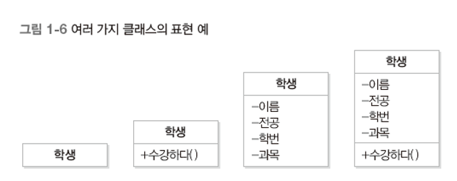
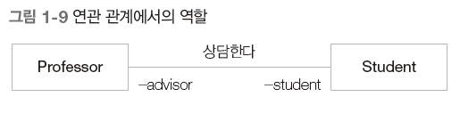
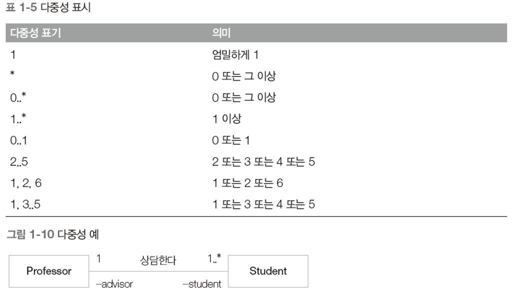
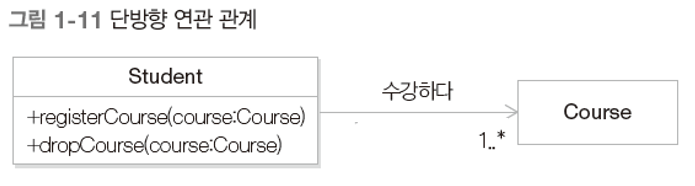
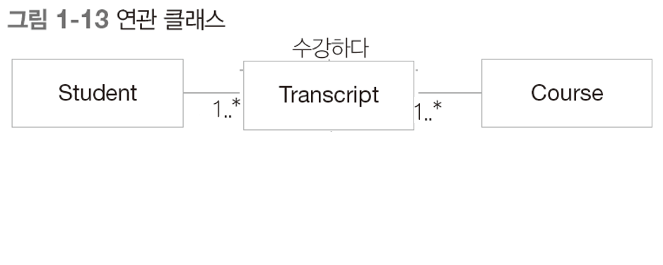

# 객체지향 모델링

## 1. 모델링

- 소프트웨어 모델의 역할
  - 서로의 해석을 공유해 합의를 이루거나 해석의 타당성을 검토한다.
  - 현재 시스템 또는 앞으로 개발할 시스템의 원하는 모습을 가시화하는데 도움을 준다.
  - 시스템의 구조와 행위를 명세할 수 있으며 시스템을 구축하는 틀과 구축된 시스템의 문서화 기능을 제공한다.
- 모델은 추상화(Abstraction)에 바탕을 두고 만들어져야 한다.
  - 추상화 : 대상을 표현할 때, 특정 관점에서 관련이 있는 점은 부각시키고 관련이 없는 면은 무시하여 표현한다.

## 2. UML (Unified Modeling Language)

요구 분석, 시스템 설계, 시스템 구현 등의 시스템 개발 과정에서 개발자 사이의 의사소통이 원활하게 이루어지도록 표준화한 통합 모델링 언어

- 구조(structure) 다이어그램
  - 클래스(class) 다이어그램 : 시스템을 구성하는 클래스들 사이의 관계를 표현한다.
  - 객체(object) 다이어그램 : 객체 정보를 보여준다.
  - 복합체 구조(composite structure) 다이어그램 : 복합 구조의 클래스와 컴포넌트 내부 구조를 표현한다.
  - 배치(deployment) 다이어그램 : 소프트웨어, 하드웨어, 네트워크를 포함한 실행 시스템의 물리 구조를 표현한다.
  - 컴포넌트(component) 다이어그램 : 컴포넌트 구조 사이의 관계를 표현한다.
  - 패키지(package) 다이어그램 : 클래스나 유즈 케이스 등을 포함한 여러 모델 요소들을 그룹화해 패키지를 구성하고 패키지들 사이의 관계를 표현한다.
- 행위(behavior) 다이어그램
  - 활동(activity) 다이어그램 : 업무 처리 과정이나 연산이 수행되는 과정을 표현한다.
  - 상태 머신(state machine) 다이어그램 : 객체의 생명 주기를 표현한다.
  - 유즈 케이스(use case) 다이어그램 : 사용자 관점에서 시스템 행위를 표현한다.
  - 상호작용(interaction) 다이어그램
    - 순차(sequence) 다이어그램 : 시간 흐름에 따른 객체 사이의 상호작용을 표현한다.
    - 상호작용 개요(interaction overview) 다이어그램 : 여러 상호작용 다이어그램 사이의 제어 흐름을 표현한다.
    - 통신(communication) 다이어그램 : 객체 사이의 관계를 중심으로 상호작용을 표현한다.
    - 타이밍(timing) 다이어그램 : 객체 상태 변화와 시간 제약을 명시적으로 표현한다.

## 3. 클래스 다이어그램

시스템을 구성하는 클래스와 그들 사이의 관계를 보여준다. 주요 구성 요소는 클래스와 관계

### 1) 클래스

동일한 속성과 행위를 수행하는 객체의 집합.

- UML 클래스의 표현 예
  - 
  - 위 - 클래스 이름
  - 중간 - 클래스 특징(속성)
  - 마지막 - 클래스가 수행하는 책임(연산)
  - 경우에 따라 속성이나 연산 부분은 생략 가능하다.
  - 속성과 연산의 가시화(visibility)는 '-', '+', '#', '~'로 표현할 수 있다. (접근 제어자)
    - '-' : private
    - '+' : public
    - '#' : protected : 이 클래스와 동일 패키지에 있거나 상속 관계에 있는 하위 클래스의 객체들만 접근 가능
    - '~' : package : 동일 패키지에 있는 클래스의 객체들만 접근 가능

### 2) 관계

- 연관(Association) 관계 : 클래스들이 개념상 서로 연결되었음을 나타낸다. 실선이나 화살표로 표시하며, 보통은 한 클래스가 다른 클래스에서 제공하는 기능을 사용하는 상황일 때 표시한다. (+ 현재 사용하는 클래스가 유지되는 동안 다른 클래스를 지속적으로 갖고 있을 때)
  - 연관 관계에서 각 클래스 객체의 역할은 클래스 바로 옆 연관 관계를 나타내는 선 가까이 기술
  - 역할 이름은 연관된 클래스의 객체들이 서로를 참조할 수 있는 속성의 이름으로 활용
  - 
  - 재귀적 연관 관계 : 동일한 클래스에 속한 객체들 사이의 연관 관계
    - 역할을 클래스로 할 때 문제가 발생한다. (역할은 관계로 만들어야 한다.)
    - 
    -  

- 일반화(Generalization) 관계 : 객체지향 개념에서는 상속 관계라고 한다. 한 클래스가 다른 클래스를 포함하는 상위 개념일 때 이를 IS-A 관계라고 하며 UML에서는 일반화 관계로 모델링한다. 속이 빈 화살표를 사용해 표시한다.
- 집합(Composition, Aggregation) 관계 : 클래스들 사이의 전체 또는 부분 같은 관계를 나타낸다. 집약(Aggregation) 관계와 합성(Composition) 관계가 존재한다. (ex : 전체가 죽으면 남는 부분이 없어야 한다.)
- 의존(Dependency) 관계 : 연관 관계와 같이 한 클래스가 다른 클래스에서 제공하는 기능을 사용할 때를 나타낸다. 차이점은 두 클래스의 관계가 한 메서드를 실행하는 동안과 같은, 매우 짧은 시간만 유지된다는 점이다. 점선 화살표를 사용해 표시한다.
- 실체화(Realization) 관계 : 책임들의 집합인 인터페이스와 이 책임들을 실제로 실현한 클래스들 사이의 관계를 나타낸다. 상속과 유사하게 빈 삼각형을 사용하며 머리에 있는 실선 대신 점선을 사용해 표시한다. (ex : 인터페이스와 인터페이스를 구현한 구현 클래스 사이의 관계)

- 다중성
  - 
- 양방향, 단방향 연관 관계
  - 양방향 연관 관계
    - 두 클래스를 연결한 선에 화살표를 사용하지 않음.
    - 서로의 존재를 인지
  - 단방향 연관 관계
    - 한 쪽으로만 방향성이 있는 관계
    - 한 쪽은 알지만 다른 쪽은 상대방의 존재를 모른다는 의미
    - 
- 연관 클래스 : 연관 관계에 추가할 속성이나 행위가 있을 때 사용
  - 
  - 위의 연관 클래스는 이처럼 변환 가능하다.
- 