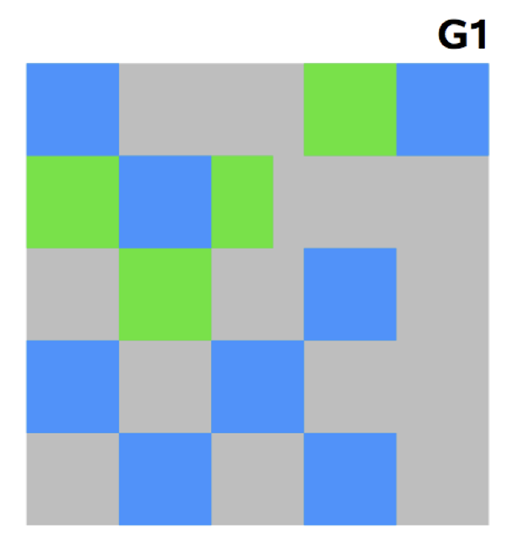

# [Java]

# 1. Java의 실행 과정

자바 프로그램(.java)을 클래스 파일(.class)로 컴파일 (Byte Code 생성)하여 JVM 명령으로 변환하여 JVM에서는 JIT 컴파일을 통해 기계어로 컴파일한다.

- 실행 환경에 따라 별도의 컴파일을 하지 않아도 모든 실행 환경에서 JVM만 있다면 실행할 수 있게 하기 위함.
- JIT Compile (Just-In-Time Compile) : 프로그램을 실제 실행하는 시점에 기계어로 번역하는 컴파일 기법

# 2. Grammar

## 2.1 표준 입출력

### 2.1.1 출력

```System.out.println();```

```
* Console에서의 출력은 java.lang 패키지에 있는 System 클래스에 접근하여 Console을 타깃으로 하는 PrintStream 객체로  
    선언한 정적 변수 out을 통해 println() 메소드 호출  
	out : 표준 출력 메소드를 갖고 있는 추상 클래스 OutputStream을 상속받아 FilterOutputStream 클래스에서  
	    필터링을 거치고 상속받은 PrintStream 객체
```

### 2.1.2 입력

```
Scanner input = new Scanner(System.in);
input.next...();
```

```
* java.util 패키지를 참조하여 Scanner 객체 이용  
	in : 출력과 마찬가지로 System 클래스에 선언되어 있는 정적 변수 in
	     표준 입력 메소드를 갖고 있는 추상 클래스 InputStream을 상속받은 PrintStream 객체
```

## 2.2 클래스, 객체와 인스턴스

1. 클래스 : 구현할 대상의 설계도
2. 객체 : 구현할 대상
3. 인스턴스 : 구현된 실체 (객체에 해당하는 인스턴스의 메모리를 힙 영역에 할당하고 객체는 이 힙 영역의 메모리를 가리킨다. 이를 인스턴스화라고 한다.)

## 2.3 자료형과 클래스

```Java에서는 변수를 클래스 형태로 선언이 가능하다. 기본 자료형의 첫 문자를 대문자로 쓰면 된다. 이를 통해 클래스로서 변수를 관리하면 변수를 통해 관련 메소드들을 사용 가능하다는 장점이 있다.```

## 2.4 Garbage Collection

Java는 프로그램 코드 내부에서 메모리를 명시적으로 직접 해제하지 않는다. 때문에 Garbage Collector가 더 이상 필요없는 사용되지 않는 객체를 찾아 지우는 작업을 한다.  
stop-the-world 이후에 Garbage Collection 작업을 완료한다. 때문에 Java를 이용해 개발하게 된다면 프로그램의 성능을 높이기 위해서는 직접 Java의 Garbage Collection 상황을 모니터링해 튜닝이 필요하다.  

- stop-the-world : JVM이 애플리케이션을 실행 중지하는 것을 말한다. Garbage Collection을 실행하는 쓰레드 외에 나머지 쓰레드는 모두 작업을 멈추게 된다.  
- Garbage Collector가 더 이상 필요없는 객체를 찾는 알고리즘
  - Young Generation 영역 : 새롭게 생성한 객체의 대부분이 이 영역에 위치한다.
    - 대부분의 객체가 금방 접근 불가 상태가 되기 때문에 매우 많은 객체가 이 영역에 생성되었다가 사라진다.
    - 이 영역에서 객체가 사라질 때 Minor GC가 발생한다고 한다.
    - Eden 영역과 2개의 Survivor 영역으로 나뉜다.
      - 새로 생성한 대부분의 객체는 Eden 영역에 위치
      - Eden 영역에서 GC가 한 번 발생한 후 살아남은 객체는 Survivor 영역 중 하나로 이동
      - Eden 영역에서 GC가 발생하면 살아남아 있는 객체가 존재하는 Survivor영역으로 객체가 계속 쌓인다.
      - 하나의 Survivor영역이 가득 차게 되면 그 중에서 살아남은 객체를 다른 Survivor 영역으로 이동
      - 가득 차 있던 Survivor 영역은 빈 상태가 된다.
      - 위 과정을 반복하다가 계속해서 살아남아 있는 객체는 Old 영역으로 이동된다.
      - Survivor 영역 중 하나는 반드시 빈 상태여야 한다. 만약에 그렇지 않다면 시스템 상태가 비정상이라는 것
  - Old Generation 영역 : 접근 불가능 상태로 되지 않아 Young 영역에서 살아남은 객체가 이 영역으로 복사된다.
    - 대부분 Young 영역보다 크게 할당하며, 크기가 큰 만큼 Young 영역보다 GC는 적게 발생한다.
    - 이 영역에서 객체가 사라질 때 Major GC가 발생한다고 한다.
    - Old 영역의 기본적으로 데이터가 가득 차면 GC를 실행한다.
    - JDK 7 기준 5가지의 GC 방식이 있다.
      - Serial GC
        - Old 영역의 GC는 mark-sweep-compact 알고리즘을 사용한다.
          - Old 영역의 살아 있는 객체를 식별(Mark)
          - 힙의 앞 부분부터 확인하여 살아 있는 것만 남긴다.(Sweep)
          - 각 객체들이 연속되게 쌓이도록 힙의 가장 앞 부분부터 채워서 객체가 있는 부분과 없는 부분으로 나눈다.(Compaction)
        - 메모리가 적고 싱글 코어일 때 적합한 방식
      - Parallel GC
        - 기본적인 알고리즘은 Serial GC와 같다.
        - GC를 처리할 때 다수의 스레드를 이용하기 때문에 Serial GC보다 빠르게 처리할 수 있다.
        - 메모리가 충분하고 코어의 개수가 많을 때 유리하다.
        - Throughput GC라고도 한다.
        - 
      - Parallel Old GC
        - JDK 5 update 6부터 제공한 GC 방식
        - Parallel GC와 Old 영역의 GC 알고리즘만 다르다.
        - Mark-Summary-Compaction 알고리즘을 사용
          - 앞서 GC를 수행한 영역에 대해서 별도로 살아 있는 객체를 식별(Summary)
      - Concurrent Mark & Sweep GC
        - Initial Mark 단계 : ClassLoader에서 가장 가까운 객체 중 살아 있는 객체만 찾는다.
        - Concurrent Mark 단계 : 살아있음을 확인한 객체에서 참조하고 있는 객체들을 따라가면서 확인, 다른 스레드가 실행 중인 상태에서 동시에 진행된다.
        - Remark 단계 : Concurrent Mark 단계에서 새로 추가되거나 참조가 끊긴 객체를 확인
        - Concurrent Sweep 단계 : 쓰레기 정리, 다른 스레드가 실행 중인 상태에서 동시 진행
        - stop-the-world 시간(멈추는 시간)이 매우 짧다.
        - 애플리케이션의 응답 속도가 매우 중요할 때 사용하며, Low Latency GC라고도 부른다.
        - 다른 GC 방식보다 메모리와 CPU를 많이 사용한다.
        - Compaction 단계가 기본적으로 제공되지 않기 떄문에 조각난 메모리가 많아 Compaction 작업 시에 stop-the-world 시간이 다른 GC 방식보다 길기 때문에 Compaction 작업에 대한 모니터링이 필요하다.
        - 
      - Garbage First(G1) GC
        - 바둑판의 각 영역에 객체를 할당하고 GC를 실행한다.
        - 해당 영역이 꽉 차면 다른 영역에서 객체를 할당하고 GC를 실행한다.
        - 다른 방식에 적용된 Young, Old 영역의 개념이 없다.
        - 이전의 GC 방식들보다 빠르다.
        - 
  - 영역 별 데이터 흐름
    - 
    - 
  - Permanent Generation 영역 : Method Area라고도 한다. 객체나 억류(intern)된 문자열 정보를 저장하는 곳
    - 이 영역에서 GC가 발생해도 Major GC의 횟수에 포함된다.
  - Old 영역의 객체가 Young 영역의 객체를 참조하는 경우
    - Old 영역에는 512 byte의 덩어리(chunk)로 되어 있는 card table이 존재한다.
    - 이 Card table을 통해 Old 영역의 객체가 Young 영역의 객체를 참조할 때마다 정보를 표시한다.
    - Young 영역의 GC를 실행할 때에는 Old 영역에 있는 모든 객체의 참조를 확인하는 것이 아니라 이 Card table만 탐색해서 GC 대상인지 식별한다.
    - 
    - Card table은 Write Barrier를 사용하여 관리한다.
      - Write Barrier : Minor GC를 빠르게 할 수 있도록 하는 장치
        - 약간의 오버헤드는 발생하지만 전반적인 GC 시간은 감소

## 2.5 Thread

- Multi-tasking

  - 여러 개의 어플리케이션을 동시에 실행해서 컴퓨터 시스템의 성능을 높이기 위한 기법
  - 운영체제가 CPU의 시간을 쪼개서 각 작업에 할당하여 작업들이 동시에 수행되는 것처럼 보이게 한다.

- Multi-threading : 하나의 프로그램이 동시에 여러 작업을 할 수 있도록 하는 것

  - 
  - 

- Process는 자신만의 데이터를 갖고 Thread는 동일한 하나의 데이터를 공유한다.

- 스레드는 하나의 프로세스 안에 존재한다.

- ```java
  class Horse extends Thread {
      private String name;
      private int pos;
  
      public Horse(String name) {
          this.name = name;
      }
  
      public void run() {
          golloc();
      }
  
      public void golloc() {
          for (int  i = 0; i <= 10; i++) {
              pos = pos + (int)(Math.random() * 100);
              System.out.println(name + " : " + pos);
          }
      }
  }
  
  public class Test01 {
      public static void main(String[] args) {
          Horse h1 = new Horse("1번말");
          Horse h2 = new Horse("2번말");
          Horse h3 = new Horse("3번말");
          h1.start();
          h2.start();
          h3.start();
      }
  }
  ```

- Thread Scheduling

  - CPU 스케줄링에 의하여 하나의 CPU를 여러 스레드가 나누어 사용하기 때문에 하나의 CPU를 여러 스레드가 나누어 쓰기 위해 스레드 실행 순서를 결정하는 스레드 스케줄링이 필요하다.
  - Java Runtime System에서는 우선순위 스케줄링을 이용
  - Scheduler는 현재 실행 가능한 스레드 중에서 우선순위가 가장 높은 스레드를 먼저 실행한다.
  - Method
    - sleep() : ms 단위로 스레드를 쉬게 할 수 있으며, 스레드가 수면 상태에서 interrupt되면 InterruptedException이 발생한다.
      - CPU의 시간을 다른 스레드에게 넘겨주는 효율적인 방법
      - 다른 스레드와 보조를 맞추는 용도로 사용될 수 있음
      - ms, ns 단위로 지정할 수 있다.
    - join() : 해당 스레드가 소멸될 때까지 기다리게 한다.
    - yield() : CPU를 다른 스레드에게 양보하는 메소드, 동일한 우선순위를 갖고 있는 다른 스레드를 실행시키고자 할 때 사용한다.
  - Interrupt : 하나의 스레드가 실행하고 있는 작업을 중지하도록 하는 메커니즘

- Thread State

  - 
  - 생성 상태
    - Thread 클래스를 이용하여 새로운 스레드를 생성
    - start() : 생성된 스레드를 시작
    - stop() : 생성된 스레드를 정지
  - 실행 가능 상태
    - 스레드가 스케줄링 큐에 넣어지고 스케줄러에 의해 우선순위에 따라 실행
  - 실행 중지 상태
    - 실행 가능 상태 - > 실행 중지 상태
      - 현재 스레드나 다른 스레드가 suspend()를 호출
      - 현재 스레드가 wait()을 호출
      - 현재 스레드가 sleep()을 호출
      - 현재 스레드가 입출력 작업을 하기 위해 대기하는 경우

- Synchronization (동기화)

  - 스레드는 동일한 데이터를 공유하기 때문에 매우 효율적으로 작업할 수 있으나, 스레드 간섭, 메모리 일치 오류 문제가 발생할 수 있다.

  - 동기화 : 공유된 메모리의 불일치가 나타나는 현상을 방지하는 방법으로 한 번에 하나의 스레드만이 공유 데이터에 접근할 수 있도록 제어하는 것이 필요하다.

  - 공유된 자원 중에서 동시에 사용하면 안 되는 자원(임계영역)을 보호하는 방법

  - ```java
    class Ex1 implements Runnable {
        private StringBuffer buffer = new StringBuffer();
    
        @Override
        public void run() {
            doA();
        }
    
        public void doA() {
            for (int i = 0; i < 5; i++) {
                buffer.append(Thread.currentThread().getName());
                System.out.println(buffer);
                try {
                    Thread.sleep(1000);
                }
                catch (InterruptedException e) {}
            }
        }
    }
    
    public class Test02 {
        public static void main(String[] args) {
            Ex1 obj = new Ex1();
            Thread t0 = new Thread(obj, "A");
            Thread t1 = new Thread(obj, "B");
            Thread t2 = new Thread(obj, "C");
            t0.start();
            t1.start();
            t2.start();
        }
    }
    // 임계영역 지정 전에는 우선순위에 따라 스레드가 실행되었다.
    ```

  - ```java
    class Ex1 implements Runnable {
        private StringBuffer buffer = new StringBuffer();
    
        @Override
        public void run() {
            doA();
        }
    
        public void doA() {
            synchronized (buffer) {
                for (int i = 0; i < 5; i++) {
                    buffer.append(Thread.currentThread().getName());
                    System.out.println(buffer);
                    try {
                        Thread.sleep(1000);
                    }
                    catch (InterruptedException e) {}
                }
            }
        }
    }
    
    public class Test02 {
        public static void main(String[] args) {
            Ex1 obj = new Ex1();
            Thread t0 = new Thread(obj, "A");
            Thread t1 = new Thread(obj, "B");
            Thread t2 = new Thread(obj, "C");
            t0.start();
            t1.start();
            t2.start();
        }
    }
    // 임계영역 지정 후에는 하나의 스레드의 실행이 끝난 후 다음 스레드를 실행한다.
    ```

  - 동기화 메소드와 동기화 블록 두 가지 방법이 있다.

    - 동기화 블록을 이용하면 동기화의 대상이 되는 영역(임계영역)을 세밀하게 제한할 수 있다.

    - ```java
      synchronized(this) {}
      // 여기서는 this가 동기화의 대상이 된다.
      // 메소드가 호출된 인스턴스 자신을 대상으로 동기화한다는 의미.
      // 매개변수에 동기화의 대상으로 지정할 것을 전달하면 된다.
      ```

- 스레드 간의 조정

  - 두 개의 스레드가 데이터를 주고 받는 경우에 발생한다.

  - Polling : 조건을 반복문에서 무한정 기다리게 하는 것 (즉, 조건이 만족되지 않는다면 무한 루프 상태)

    - ```java
      public void badMethod() {
          while (!condition) {}
      }
      // CPU 시간을 엄청나게 낭비하므로 가급적 피해야 할 코드
      ```

  - Event-driven : 조건이 만족될 때까지 현재 스레드를 일시 중지시킨다.

    - ```java
      public synchronized goodMethod() {
          while (!condition) {
              try {
                  wait(); // 이벤트가 발생할 때까지 기다린다. 하지만 이벤트가 발생하면 깨어나서 다시 조건을 체크한다.
              }
              catch (InterruptedException e) {}
          }
      }
      ```

  - wait() : 이벤트가 일어나기를 기다릴 때 사용

  - notify() : 이벤트가 일어났을 때, wait() 메소드를 통해 블로킹 상태에 놓여 있는 스레드 하나를 깨운다.

  - notifyAll() : 이벤트가 일어났을 때, wait() 메소드를 통해 블로킹 상태에 놓여 있는 모든 스레드를 깨운다.

- 생산자/소비자 문제

  - 생산자는 데이터를 생산하고, 소비자는 데이터를 갖고 어떤 작업을 수행

  - 생산자가 생산하기 전에 소비자는 물건을 가져가면 안 된다.

  - 생산된 물건이 있다면 소비하기 전에 물건을 생산할 수 없다.

  - -> 동기화된 메소드를 사용하여 두 개의 스레드가 동시에 객체에 접근하는 것을 막는다.

  - 스레드 간의 동작을 일치시키기 위하여 wait(), notify() 메소드를 통해 생산되었다는 사실을 소비자가 알 수 있고, 소비되었다는 사실이 생산자가 알 수 있도록 한다.

  - 

  - ```java
    class Producer extends Thread {
        private Buffer blank;
    
        public Producer(Buffer blank) {
            this.blank = blank;
        }
    
        public void run() {
            for (int i = 0; i < 10; i++) {
                blank.put(i);
                try {
                    Thread.sleep(300);
                }
                catch (InterruptedException e) {}
            }
        }
    }
    
    class Consumer extends Thread {
        private Buffer blank;
    
        public Consumer(Buffer blank) {
            this.blank = blank;
        }
    
        public void run() {
            int value = 0;
            for (int i = 0; i < 10; i++) value = blank.get();
        }
    }
    
    class Buffer {
        private int contents;
        private boolean available = false;
    
        public synchronized int get() {
            while (!available) {
                try {
                    wait();
                }
                catch (InterruptedException e) {}
            }
            System.out.println("소비자 : " + contents + " 소비");
            notify();
            available = false;
            return contents;
        }
    
        public synchronized void put(int value) {
            while (available) {
                try {
                    wait();
                }
                catch (InterruptedException e) {}
            }
            contents = value;
            System.out.println("생산자 : " + contents + " 생산");
            notify();
            available = true;
        }
    }
    
    public class Main {
        public static void main(String[] args) {
            Buffer c = new Buffer();
            Producer p1 = new Producer(c);
            Consumer c1 = new Consumer(c);
            p1.start();
            c1.start();
        }
    }
    ```

## 2.6 Network Programming

- 네트워크를 통해서 데이터를 주고 받는 프로그래밍

- Server & Client

  - 서버 : 사용자들에게 서비스를 제공하는 컴퓨터
  - 클라이언트 :  서버에게 서비스를 요청해서 사용하는 컴퓨터

- IP Address : 인터넷에서 사용하는 컴퓨터의 주소

- Port :  가상의 통신 선로

- 

- Host Name, DNS, URL

  - DNS (Domain Name System) : 숫자 대신 기호를 사용하는 주소
  - DNS 서버 : 기호 주소를 숫자 주소로 변환해주는 서버
  - URL (Uniform Resource Locator) : 인터넷 상의 자원을 나타내는 약속
  - 

- Protocol

  - 통신을 하기 위한 약속, 컴퓨터 사이의 약속(프로토콜)을 자세히 정하고, 이를 지킴으로써 통신이 성립된다.

  - 프로토콜을 통해 무엇을 어떻게 언제 통신할 것인가를 규정

  - 

  - TCP (Transmission Control Protocol) : 신뢰성있게 통신하기 위하여 먼저 서로 간의 연결을 설정한 후에 데이터를 보내고 받는 방식

    - 

    - 연결지향형 소켓의 데이터 전송 특성

      - 중간에 데이터가 소멸되지 않는다.
      - 전송 순서대로 데이터가 수신된다.
      - 데이터의 경계가 존재하지 않는다.
      - Socket : Socket의 연결은 반드시 1 : 1의 구조

    - Socket : TCP를 사용하여 응용 프로그램끼리 통신을 하기 위한 End Point

      - 
      - ServerSocket : 서버를 위한 소켓
      - Socket : 클라이언트를 위한 소켓

    - ```java
      import java.io.FileInputStream;
      import java.io.InputStream;
      import java.io.OutputStream;
      import java.net.ServerSocket;
      import java.net.Socket;
      
      public class ServerEx1 {
          public static void main(String[] args) throws Exception {
              ServerSocket server = new ServerSocket(5555);
              System.out.println("read...........!");
              Socket clientSocket = server.accept();
              OutputStream out = clientSocket.getOutputStream();
              InputStream fin = new FileInputStream("C:\\java\\sung.jpg");
              while (true) {
                  int data = fin.read();
                  out.write(data);
                  if (data == -1) break;
              }
              fin.close();
              out.close();
              clientSocket.close();
              server.close();
          }
      }
      
      import java.io.FileOutputStream;
      import java.io.InputStream;
      import java.io.OutputStream;
      import java.net.Socket;
      
      public class ClientEx {
          public static void main(String[] args) throws Exception {
              Socket socket = new Socket("127.0.0.1", 5555);
              System.out.println("연결되었음 : " + socket);
              InputStream in = socket.getInputStream();
              OutputStream fout = new FileOutputStream("C:\\java\\get.jpg");
              while (true) {
                  int data = in.read();
                  if (data == -1) break;
                  fout.write(data);
              }
              fout.close();
              in.close();
              socket.close();
          }
      }
      ```

  - UDP (User Datagram Protocol) : 데이터를 일정 개수, 고정 길이를 가진 패킷으로 분할하여 전송한다.

    

    - 비연결지향형 소켓의 데이터 전송 특성

      - 전송 순서 상관없이 빠른 속도의 전송을 지향
      - 데이터 손실의 우려가 있다.
      - 데이터의 경계가 존재한다.
      - 한 번에 전송할 수 있는 데이터의 크기가 제한된다.

    - DatagramSocket : UDP 프로토콜을 사용하는 소켓을 생성

    - DatagramPacket : UDP 패킷 생성

    - MulticastSocket

    - ```java
      import javax.swing.*;
      import java.awt.*;
      import java.awt.event.ActionEvent;
      import java.awt.event.ActionListener;
      import java.io.IOException;
      import java.net.DatagramPacket;
      import java.net.DatagramSocket;
      import java.net.InetAddress;
      
      public class MessengerA {
          protected JTextField textField;
          protected JTextArea textArea;
          DatagramSocket socket;
          DatagramPacket packet;
          InetAddress address = null;
          final int myPort = 5000;
          final int otherPort = 6000;
      
          public MessengerA() throws IOException {
              MyFrame f = new MyFrame();
              address = InetAddress.getByName("127.0.0.1");
              socket = new DatagramSocket(myPort);
          }
      
          public void process() {
              while (true) {
                  try {
                      byte[] buf = new byte[256];
                      packet = new DatagramPacket(buf, buf.length);
                      socket.receive(packet);
                      textArea.append("RECEIVED : " + new String(buf) + "\n");
                  }
                  catch (IOException e) {
                      e.printStackTrace();
                  }
              }
          }
      
          class MyFrame extends JFrame implements ActionListener {
              public MyFrame() {
                  super("MessengerA");
                  setDefaultCloseOperation(JFrame.EXIT_ON_CLOSE);
                  textField = new JTextField(30);
                  textField.addActionListener(this);
                  textArea = new JTextArea(10, 30);
                  textArea.setEditable(false);
                  add(textField, BorderLayout.PAGE_END);
                  add(textArea, BorderLayout.CENTER);
                  pack();
                  setVisible(true);
              }
      
              @Override
              public void actionPerformed(ActionEvent e) {
                  String s = textField.getText();
                  byte[] buffer = s.getBytes();
                  DatagramPacket packet = new DatagramPacket(buffer, buffer.length, address, otherPort);
                  try {
                      socket.send(packet);
                  }
                  catch (IOException ioe) {
                      ioe.printStackTrace();
                  }
                  textArea.append("SENT: " + s + "\n");
                  textField.selectAll();
                  textArea.setCaretPosition(textArea.getDocument().getLength());
              }
          }
      
          public static void main(String[] args) throws IOException {
              MessengerA m = new MessengerA();
              m.process();
          }
      }
      
      import javax.swing.*;
      import java.awt.*;
      import java.awt.event.ActionEvent;
      import java.awt.event.ActionListener;
      import java.io.IOException;
      import java.net.DatagramPacket;
      import java.net.DatagramSocket;
      import java.net.InetAddress;
      
      public class MessengerB {
          protected JTextField textField;
          protected JTextArea textArea;
          DatagramSocket socket;
          DatagramPacket packet;
          InetAddress address = null;
          final int myPort = 6000;
          final int otherPort = 5000;
      
          public MessengerB() throws IOException {
              MyFrame f = new MyFrame();
              address = InetAddress.getByName("127.0.0.1");
              socket = new DatagramSocket(myPort);
          }
      
          public void process() {
              while (true) {
                  try {
                      byte[] buf = new byte[256];
                      packet = new DatagramPacket(buf, buf.length);
                      socket.receive(packet);
                      textArea.append("RECEIVED : " + new String(buf) + "\n");
                  }
                  catch (IOException e) {
                      e.printStackTrace();
                  }
              }
          }
      
          class MyFrame extends JFrame implements ActionListener {
              public MyFrame() {
                  super("MessengerB");
                  setDefaultCloseOperation(JFrame.EXIT_ON_CLOSE);
                  textField = new JTextField(30);
                  textField.addActionListener(this);
                  textArea = new JTextArea(10, 30);
                  textArea.setEditable(false);
                  add(textField, BorderLayout.PAGE_END);
                  add(textArea, BorderLayout.CENTER);
                  pack();
                  setVisible(true);
              }
      
              @Override
              public void actionPerformed(ActionEvent e) {
                  String s = textField.getText();
                  byte[] buffer = s.getBytes();
                  DatagramPacket packet = new DatagramPacket(buffer, buffer.length, address, otherPort);
                  try {
                      socket.send(packet);
                  }
                  catch (IOException ioe) {
                      ioe.printStackTrace();
                  }
                  textArea.append("SENT: " + s + "\n");
                  textField.selectAll();
                  textArea.setCaretPosition(textArea.getDocument().getLength());
              }
          }
      
          public static void main(String[] args) throws IOException {
              MessengerB m = new MessengerB();
              m.process();
          }
      }
      ```

# 3. Object-Oriented Programming - 객체지향에 대한 이해

```
'객체'라는 여러 개의 독립된 단위들의 모임을 중점으로 하는 프로그래밍 패러다임.
기존의 절차 지향 프로그래밍의 단점을 보완하기 위해 데이터와 함수를 하나의 덩어리(객체)로 묶어서 생각하게 되었다.
 * 절차 지향 프로그래밍의 단점 : 함수 작성에만 신경 쓰게 되고 전역 변수가 과도하게 사용되어 데이터가 함수와 분리된다.  
    그로 인해 프로그램의 이해가 어려워지고 차후에 변경하거나 확장하기 어려워진다.

```

- 장점 : 프로그램이 유연하다. 이는 변경하기 용이하다는 말과 상통한다. 간편한 소프트웨어 개발 및 보수, 보다 직관적인 코드 분석이 가능.    
  소프트웨어 공학의 관점에서 볼 때 S/W의 질을 향상하기 위해 강한 응집력(Strong Cohesion)과 약한 결합력(Weak Coupling)을 지향해야 하는데,    
   OOP의 경우 클래스에 하나의 문제 해결을 위한 데이터를 모아 놓은 데이터형을 사용함으로써 응집력을 강화하고, 클래스간에 독립적으로 디자인함으로써 결합력을 약하게 할 수 있다.
- 특징 : 캡슐화(<=정보은닉), 추상화, (다중)상속, 다형성, 동적 바인딩