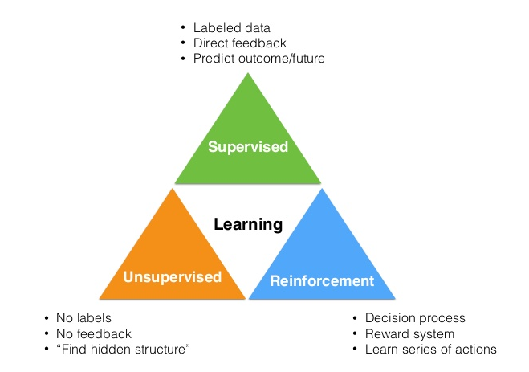
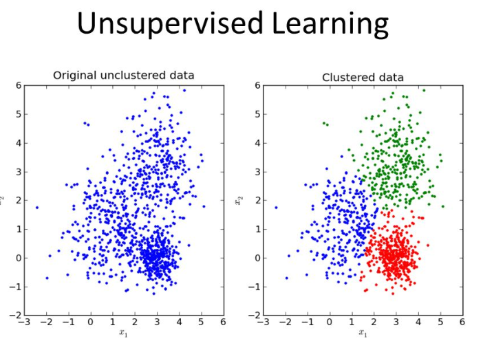
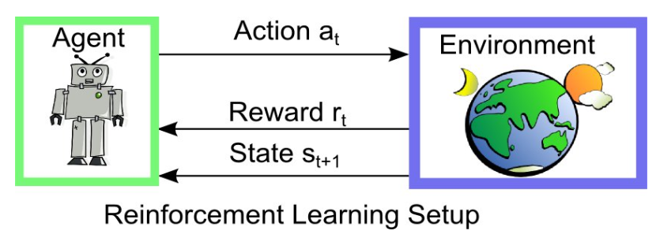

# Machine Learning

컴퓨터가 학습할 수 있도록 하는 알고리즘과 기술에 관한 인공지능의 한 분야

- 기계 학습의 핵심은 '표현(representation)'과 '일반화(generalization)'
  - 표현(representation) : 데이터의 평가
  - 일반화(generalization) :  아직 알 수 없는 데이터에 대한 처리
- 기계 학습과 데이터 마이닝은 종종 같은 방법을 사용하기 때문에 중첩되는 부분이 많다.
  - 기계 학습과 데이터 마이닝의 차이
    - 기계 학습 : 훈련 데이터를 통해 학습된 알려진 속성을 기반으로 예측에 초점을 두고 있다.
    - 데이터 마이닝 : 데이터의 숨겨진 속성을 발견하는 것에 초점을 두고 있다.
- 

## 1. Supervised Learning (지도 학습)

데이터에 대한 레이블(명시적인 정답)이 주어진 상태에서 기계를 학습시키는 방법

- (Data, Label) 형태로 학습을 진행
- 학습이 끝나면 레이블이 지정되지 않은 데이터셋을 이용해서 학습된 알고리즘이 얼마나 정확히 예측(prediction)하는지를 측정할 수 있다.
- 이 때, 예측하는 결과 값이 이산 값(discrete value)이면 분류(classification) 문제가 되고 연속 값(continuous value)이면 회귀(regression) 문제가 된다.

### (1) Naive Bayes (베이지안 분류기)

특성들 사이의 독립을 가정하는 베이즈 정리를 이용하여 분류하고자 하는 대상의 각 분류별 확률을 측정하여, 그 확률이 큰 쪽으로 분류하는 방법 (확률 분류기)

- 베이즈 정리
  - 매개 변수 x, y가 있을 때, 분류 1에 속할 확률이 p1(x, y)이고 분류 2에 속할 확률이 p2(x, y)일 때,
  - p1(x, y) > p2(x, y)이면, 이 값은 분류 1에 속한다.
  - p1(x, y) < p2(x, y)이면, 이 값은 분류 2에 속한다.
- 조건부 확률
  - 사건 A에 대해서 사건 A가 일어났을 때, 사건 B가 일어날 확률 -> 사건 A에 대한 사건 B의 조건부 확률
  - P(B|A)
  - 조건부 확률을 이용하면 모르는 값에 대한 확률을 구할 수 있다.

### (2) Decision Tree (의사결정 트리)

목표 변수가 유한한 값을 가지는 분류 트리를 이용하여 어떤 항목에 대한 관측값과 목표값을 연결시켜주는 예측 모델로써 사용된다.

- 트리 구조에서 잎(leaf node)은 클래스 레이블을 나타내고 가지는 클래스 레이블과 관련있는 특징들의 논리곱을 나타낸다.
- 의사결정 트리 중 목표 변수가 연속값(일반적으로 실수)을 가지는 것은 회귀 트리라고 한다.
- 의사결정 트리를 이용함으로써 시각적이고 명시적인 방법으로 의사 결정 과정과 결정된 의사를 보여줄 수 있다.

### (3) Artificial Neural Network (인공 신경망)

생물학의 신경망(동물의 중추신경계 중 특히 뇌)에서 영감을 얻은 통계학적 학습 알고리즘

- 시냅스의 결합으로 네트워크를 형성한 인공 뉴런(노드)이 학습을 통해 시냅스의 결합 세기를 변화시켜, 문제 해결 능력을 가지는 모델
- 지도 학습과 비지도 학습으로 나뉜다.
- 많은 입력들에 의존하면서 일반적으로 베일에 싸인 함수를 추측하고 근사치를 낼 경우 사용
- 입력으로부터 값을 계산하는 뉴런 시스템의 상호연결로 표현되고 적응성이 있어 패턴 인식과 같은 기계 학습을 수행할 수 있다.

## 2. Unsupervised Learning (비지도 학습)

데이터에 대한 레이블이 주어지지 않은 상태에서 기계를 학습시키는 방법

- (Data) 형태로 학습을 진행하는 방법
  - 무작위로 분포되어 있는 데이터를 비슷한 특성을 가진 부류로 분류하는 군집화(clustering) 알고리즘이 있다.
- 데이터의 숨겨진 특징이나 구조를 발견하는데 사용된다.
- 

지도 학습과 비지도 학습은 데이터가 정적인 상태(state environment)에서 학습을 진행하는 알고리즘이다.

### (1) 클러스터 분석 (Cluster analysis)

주어진 데이터들의 특성을 고려해 데이터 집단(클러스터)을 정의하고 데이터 집단의 대표할 수 있는 대표점을 찾는 것으로 데이터 마이닝의 한 방법

- 클러스터 : 비슷한 특성을 가진 데이터의 집단

## 3. Reinforcement Learning (강화 학습)

에이전트(Agent)가 주어진 환경(state)에 대해 어떤 행동(action)을 취하고 이로부터 어떤 보상(reward)을 얻으면서 학습을 진행한다.

- 에이전트는 보상을 최대화(maximize)하도록 학습이 진행된다.
- 강화 학습은 일종의 동적인 상태(dynamic environment)에서 데이터를 수집하는 과정까지 포함되어 있는 알고리즘
- 

## * Why TensorFlow?

- Data Flow Graph를 통한 풍부한 표현력
- 코드 수정 없이 CPU/GPU 모드 동작
- 아이디어 테스트에서 서비스 단계까지 이용 가능
- 계산 구조와 목표 함수만 정해주면 자동적으로 미분 계산을 처리할 수 있다.
- Tensor Board를 통해서 파라미터의 변화 양상이나 DNN(Deep Neural Network)에 대한 구조도를 그려줌으로써 Tensor들과의 연결 관계, Tensor의 Flowing Status를 잘 보여줄 수 있다.