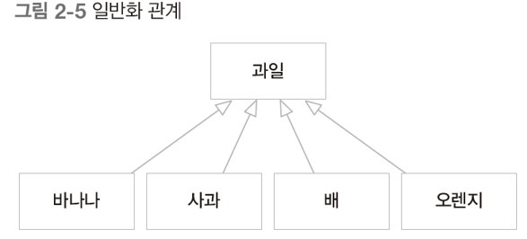
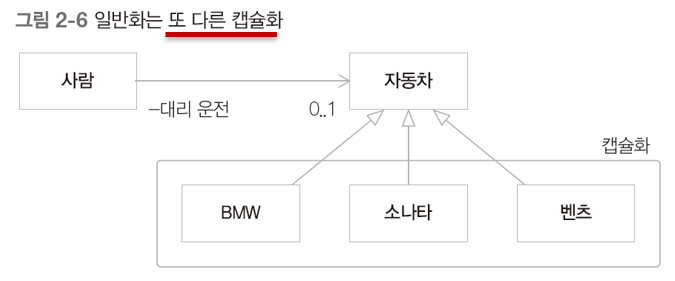
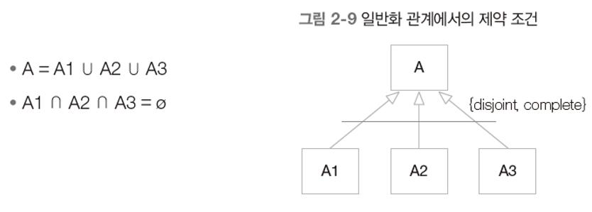
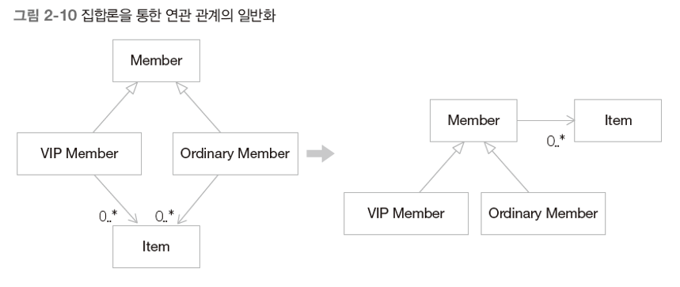
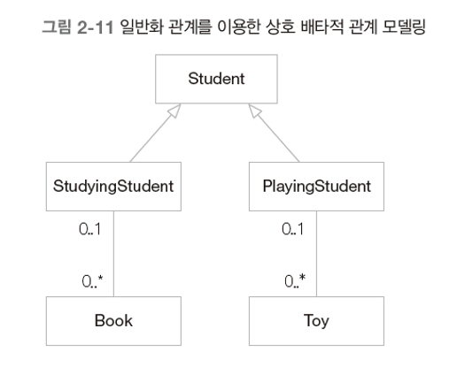
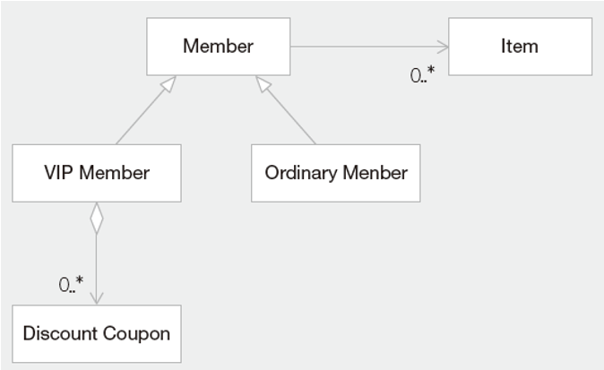
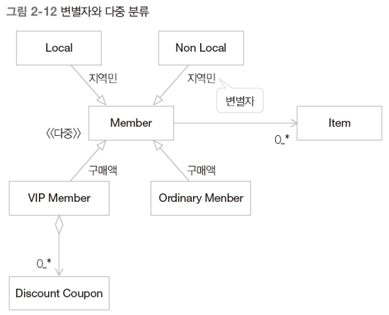
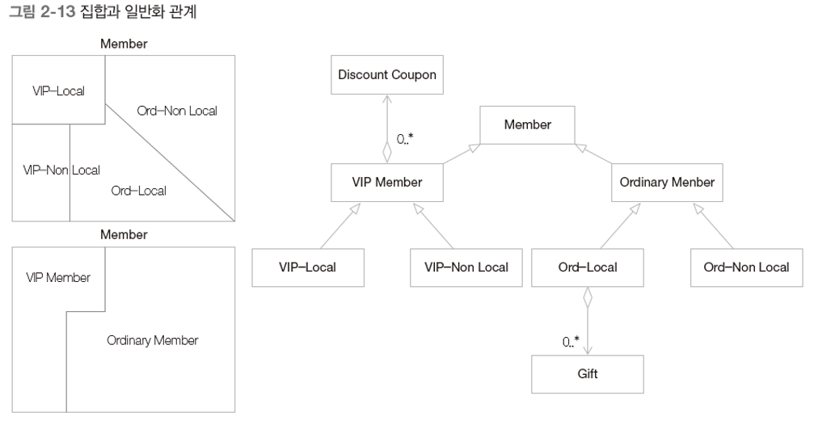

# 객체지향 원리

## 1. 추상화

어떤 영역에서 필요로 하는 속성이나 행위를 추출하는 작업

- 관심 있는 부분에 더욱 집중할 수 있다.
- ex) 학사 지원 시스템 vs 병원 지원 시스템 : 사람
- 추상화가 가능한 개체들은 개체가 소유한 특성의 이름으로 하나의 집합 클래스를 이룬다.
  - 추상화한다는 것 = 여러 개체들을 집합으로 파악한다는 것
- 추상적 특성은 집합을 구성하는 개체들을 일반화하는 것이므로 집합의 요소들에 보편적인 것
- 사물들의 공통적인 특징을 파악하여 사물을 그룹화하는 수단
  - ex) 자동차 그룹화
    - 승합차/승용차 (승객 수)
    - 세단/쿠페 (문 수)
- 추상화 개념을 사용하지 않는다면 각각의 개체를 구분지어야 한다.

## 2. 캡슐화

- 요구사항의 변경
  - 소프트웨어 개발의 골칫거리
  - 해결책은 요구사항 변경을 당연한 것으로 받아들이고 이에 대비하는 것이다.
  - 높은 응집도와 낮은 결합도를 갖는 설계를 해야한다.
- 캡슐화 : 정보 은닉을 통해 낮은 결합도를 가능하게 한다.
  - ex) 자동차의 내부 동작 원리를 몰라도 자동차의 사용법을 익히면 운전이 가능하다.
  - 결합이 많을수록(강할수록) 변경 시 문제가 많이 발생한다.

## 3. 일반화

- 일반화는 또 다른 캡슐화?!

  - 일반화(상속)를 속성이나 기능의 재사용 관점에서만 보는 것은 극히 제한된 관점
  - 자식 클래스를 캡슐화한다.
  - 
  - 

- 철학에서의 일반화 : 여러 개체들이 가진 공통된 특성을 부각시켜 하나의 개념이나 법칙으로 성립시키는 과정

- 일반화는 자식 클래스를 캡슐화하여 변경에 대비할 수 있는 설계를 가능하게 한다.

  - 새로운 클래스가 추가되더라도 클라이언트는 영향을 받지 않는다.

- 일반화와 위임

  - 두 자식 클래스 사이에 'is a kind of' 관계가 성립되지 않을 때 상속을 사용하면 불필요한 속성이나 연산도 물려받게 된다. (일반화의 오남용)

  - 이와 같이 어떤 클래스의 일부 기능만을 재사용하고 싶을 때에는 위임을 사용한다.

  - 일반화를 위임으로 변환하는 과정

    1) 자식 클래스에 부모 클래스의 인스턴스를 참조하는 속성을 만든다. 이 속성 필드는 this로 초기화한다.

    2) 서브 클래스에 정의된 각 메서드에 1번에서 만든 위임 속성 필드를 참조하도록 변경한다.

    3) 서브 클래스에서 일반화 관계 선언을 제거하고 위임 속성 필드에 슈퍼 클래스의 객체를 생성해 대입한다.

- 집합과 일반화
  - 제약(disjoint)은 자식 클래스 객체가 동시에 두 클래스에 속할 수 없다는 의미이다.
  - Complete는 자식 클래스의 객체에 해당하는 부모 클래스의 객체와 부모 클래스의 객체에 해당하는 자식 클래스의 객체가 하나만 존재한다는 의미이다.
  - 
  - 연관 관계의 일반화 : 일반화는 연관 관계를 단순하게 만들 수 있다.
    - 
  - 상호배타적 상태
    - ex) 공부하고 있는 중에는 책만 볼 수 있다. 장난감을 가지고 공부할 수 없다.
    - 마찬가지로 노는 중에는 장난감만 갖고 놀 수 있다. 책을 가지고 놀지 않는다.
    - 
  - 특수화 : 어떤 속성/관계가 특정 자식 클래스에만 관련될 때
    - ex) VIP 멤버에게만 할인 쿠폰이 발행되는 경우
    - 
  - 변별자와 다중 분류
    - 변별자 : 인스턴스 분류 기준
    - 다중 분류 : 한 인스턴스가 동시에 여러 클래스에 속한다.
    - ex) 지역 주민이든 아니든 VIP 멤버에게는 할인 쿠폰이 지급된다.
    - 
  - 문제는 일반화 관계가 독립적이지 않을 때 일어난다.
    - 일반 회원이지만 지역 주민에게는 경품을 제공하도록 시스템에 새로운 요구사항을 추가한다.
    - 그렇게 가능한 조합에 대응하는 클래스를 만들게 된다면...
    - 
    - 경우의 수는 2^10....
  - 다형성 : 서로 다른 클래스의 객체가 같은 메시지를 받았을 때 각자의 방식으로 동작하는 능력
  - 상속 규칙 : 상속의 사용을 엄격하게 제한
    - 자식 클래스와 부모 클래스 사이는 '역할 수행(is role-played by)' 관계가 아니어야 한다.
    - 한 클래스의 인스턴스는 다른 서브 클래스의 객체로 변환할 필요가 절대 없어야 한다.
    - 자식 클래스가 부모 클래스의 책임을 무시하거나 재정의하지 않고 확장만 수행하는 클래스를 상속하지 않아야 한다.
    - 자식 클래스가 '역할(Role)', '트랜잭션(Transaction)', '디바이스(Device)' 등을 특수화(Specialization)해야 한다.
    - 