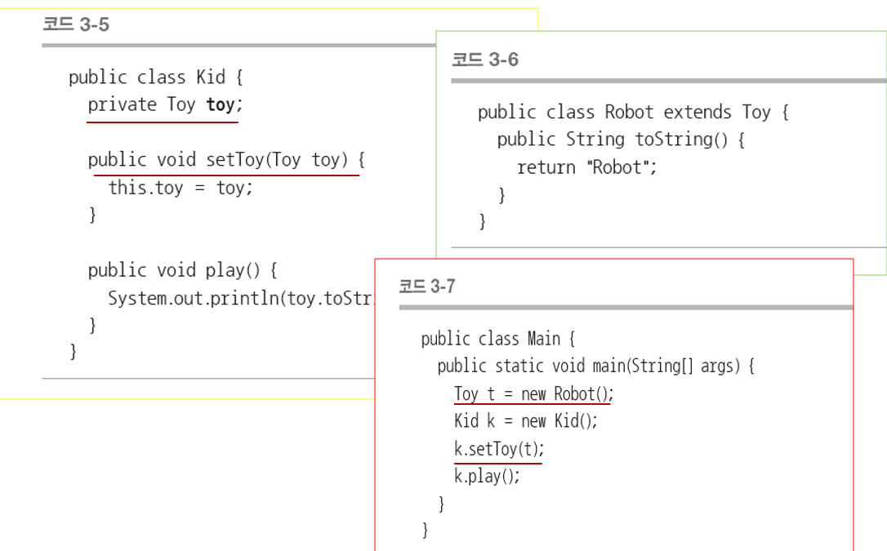

# SOLID 원칙

## 1. SRP (Single Resposibility Principle)

- 단일 책임의 원칙
- 객체는 단 하나의 책임만을 가져야 한다.
  - 책임 : 해야 하는 것, 할 수 있는 것, 해야 하는 것을  잘 할 수 있는 것
- 
  - 변경
    - 책임은 변경의 이유
      - 책임이 많다는 것은 변경될 여지가 많다는 것을 의미한다.
      - 책임을 많이 질수록 클래스 내부에서 서로 다른 역할을 수행하는 코드끼리 강하게 결합될 가능성이 높아진다.
  - 책임 분리
    - 
  - 학생 클래스
    - 변경 사유
      - 학생의 고유 정보
      - 데이터베이스 스키마
      - 출력 형식의 변화
    - 변경 사유에 따라 책임을 분리하여 여러 클래스 생성
      - 
- 산탄총 수술
  - 하나의 책임이 여러 곳에 분산
    - 변경 이유가 발생했을 때 변경할 곳이 많음
    - 변경될 곳을 빠짐없이 찾아 일관되게 변경해야 함.
  - 

## 2. OCP (Open-Closed Principle)

- 개방폐쇄원칙
  - 기존의 코드를 변경하지 않으면서 기능을 추가할 수 있도록 설계되어야 한다.
  - 클래스를 변경하지 않고도(closed) 대상 클래스의 환경을 변경할 수 있도록 설계
  - 

## 3. LSP (Liskov Substitution Principle)

- 리스코프 치환 원칙
  -  LSP는 부모 클래스와 자식 클래스 사이의 행위가 일관성이 있어야 한다는 의미
  - 자식 클래스는 자신의 부모 클래스에서 가능한 행위는 수행할 수 있어야 한다.
- LSP를 만족하면 프로그램에서 부모 클래스의 인스턴스 대신에 자식 클래스의 인스턴스로 대체해도 프로그램의 의미는 변화되지 않는다.
- 
- 
- LSP를 만족하는 가장 단순한 방법은 재정의를 하지 않는 것
  - 
  - 
  - 
    - 이 경우에는 행위 일관성이 지켜지지 않기 때문에 리스코프 치환 원칙에 위배된다.

## 4. ISP (Interface Seperated Principle)

- 인터페이스 분리 원칙
  - 인터페이스를 클라이언트에 특화되도록 분리시키라는 원칙
  - 클라이언트의 관점에서 클라이언트 자신이 이용하지 않는 기능에는 영향을 받지 않아야 한다는 것
  - 

## 5. DIP (Dependency Inversion Principle)

- DIP는 의존 관계를 맺을 때 변화하기 쉬운 것 또는 자주 변화하는 것보다는 변화하기 어려운 것, 거의 변화가 없는 것에 의존하라는 원칙
  - 정책, 전략과 같은 어떤 큰 흐름이나 개념 같은 추상적인 것은 변하기 어려운 것에 해당하고 구체적인 방식, 사물 등과 같은 것은 변하기 쉬운 것으로 구분한다.
  - 
- 의존성 주입 예시