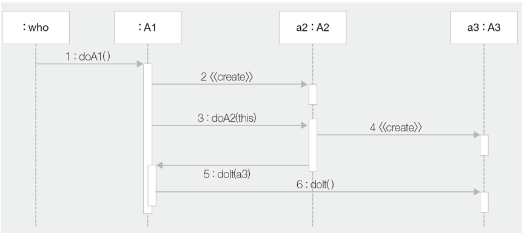

# 디자인 패턴

## 1. 순차 다이어그램

* 객체들 사이의 메시지 송신과 그들의 순서
  * 
* 메시지
  * 
* 
* 프레임
  * 
* alt
  * 
* loop
  * 
* 순차 다이어그램과 클래스 다이어그램
  * 

## 2. 디자인 패턴의 이해

소프트웨어를 설계할 때 특정 맥락에서 자주 발생하는 고질적인 문제들이 발생했을 때 재사용할 수 있는 훌륭한 해결책

- 디자인 패턴 구조
  - Context : 문제가 발생하는 여러 상황을 기술한다. 즉, 패턴이 적용될 수 있는 상황을 나타낸다. 경우에 따라서는 패턴이 유용하지 못한 상황을 나타내기도 한다.
  - 문제 : 패턴이 적용되어 해결될 필요가 있는 여러 디자인 이슈들을 기술한다. 이 때 여러 제약 사항과 영향력도 문제 해결을 위해 고려해야 한다.
  - 해결 : 문제를 해결하도록 설계를 구성하는 요소들과 그 요소들 사이의 관계, 책임, 협력 관계를 기술한다. 해결은 반드시 구체적인 구현 방법이나 언어에 의존적이지 않으며 다양한 상황에 적용할 수 있는 일종의 템플릿이다.
  - 

- GoF(Gang of Four) 디자인 패턴

  - 감마/리차드 헬름/랄프 존슨/존 블리시디시
  - 생성 패턴 : 객체의 생성에 관련된 패턴
  - 구조 패턴 : 클래스를 조합해 더 큰 구조를 만드는 패턴
  - 행위 패턴 : 알고리즘이나 책임의 분배에 관한 패턴

- 

- UML과 디자인 패턴

  - Collaboration을 통해 디자인 패턴 기술
  - 역할들의 상호작용을 추상화
  - Collaboration Occurance

  - 