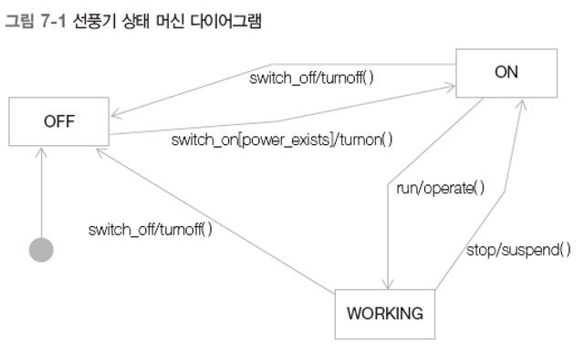
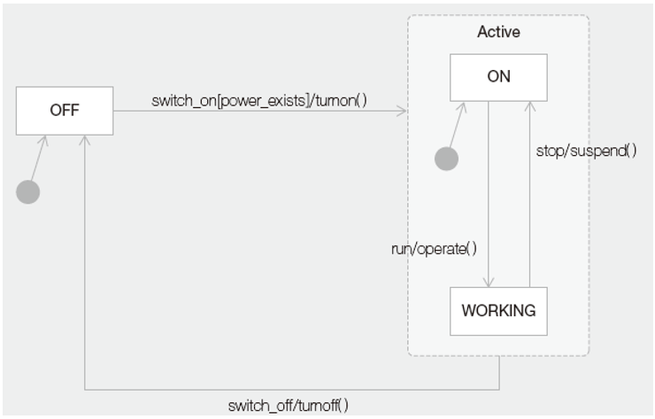
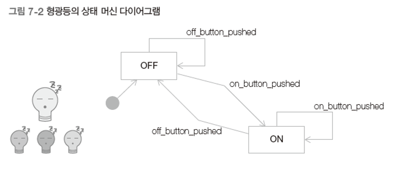
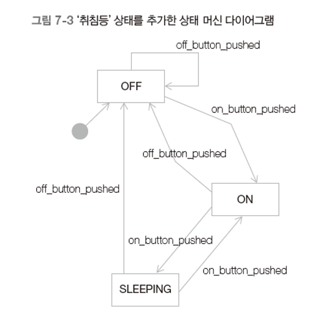

# 스테이트 패턴

## 1. 상태 머신 다이어그램




## 2. 형광등 만들기



```java
public class Light {
    private static final int ON = 0;
    private static final int OFF = 1;
    private int state;
    
    public Light() {
        state = OFF;
    }
    
    public void on_button_pushed() {
        if (state == ON) System.out.println("반응 없음");
        else {
            state = ON;
            System.out.println("Light On!");
        }
    }
    
    public void off_button_pushed() {
        if (state == OFF) System.out.println("반응 없음");
        else {
            state = OFF;
            System.out.println("Light Off!");
        }
    }
}

public class Client {
    public static void main(String[] args) {
        Light light = new Light();
        light.off_button_pushed();
        light.on_button_pushed();
        light.off_button_pushed();
    }
}
```


## 3. 문제점

- 형광등에 새로운 상태를 추가할 때 (ex : 형광등에 '취침등' 상태를 추가)
  - 
  - 

## 4. 해결책

- 무엇이 변하는가?
  - 상태 추가/삭제
  - 상태 전이 추가/삭제, 상태 의존적인 행동 변화

- 상태를 캡슐화
  - 각 상태와 이 상태에 의존적인 해위를 하나의 클래스로 캡슐화
  - 모든 상태를 아우르는(캡슐화하는) 상위 클래스(or interface) 생성

- 

- ```java
  public class Light {
      private State state;
  
      public Light() {
          state = new OFF();
      }
  
      public void setState(State state) {
          this.state = state;
      }
  
      public void on_button_pushed() {
          state.on_button_pushed(this);
      }
  
      public void off_button_pushed() {
          state.off_button_pushed(this);
      }
  }
  
  public interface State {
      public void on_button_pushed(Light light);
      public void off_button_pushed(Light light);
  }
  
  public class ON implements State {
      @Override
      public void on_button_pushed(Light light) {
          light.setState(new SLEEPING());
          System.out.println("취침등...");
      }
  
      @Override
      public void off_button_pushed(Light light) {
          light.setState(new OFF());
          System.out.println("Light Off!");
      }
  }
  
  public class OFF implements State {
      @Override
      public void on_button_pushed(Light light) {
          light.setState(new ON());
          System.out.println("Light On!");
      }
  
      @Override
      public void off_button_pushed(Light light) {
          System.out.println("반응 없음");
      }
  }
  
  public class SLEEPING implements State {
      @Override
      public void on_button_pushed(Light light) {
          light.setState(new ON());
          System.out.println("Light On!");
      }
  
      @Override
      public void off_button_pushed(Light light) {
          light.setState(new OFF());
          System.out.println("Light Off");
      }
  }
  
  public class Client {
      public static void main(String[] args) {
          Light light = new Light();
          light.off_button_pushed();
          light.on_button_pushed();
          light.on_button_pushed();
          light.on_button_pushed();
          light.off_button_pushed();
          light.on_button_pushed();
          light.on_button_pushed();
          light.off_button_pushed();
      }
  }
  ```

## 5. 스테이트 패턴