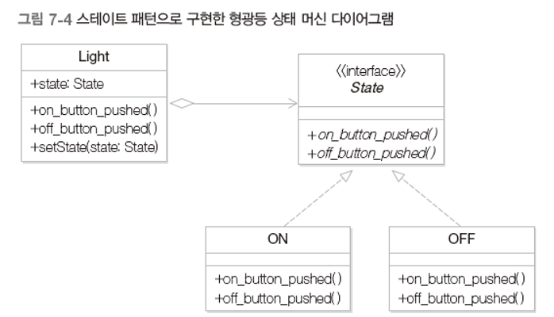
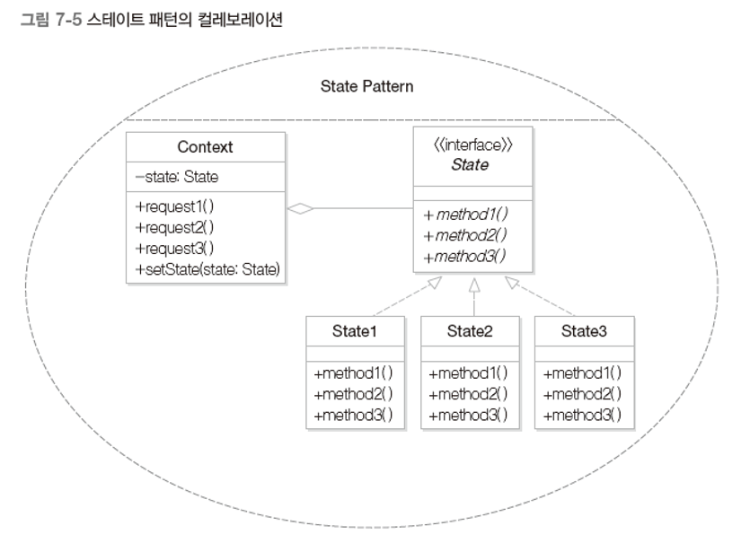
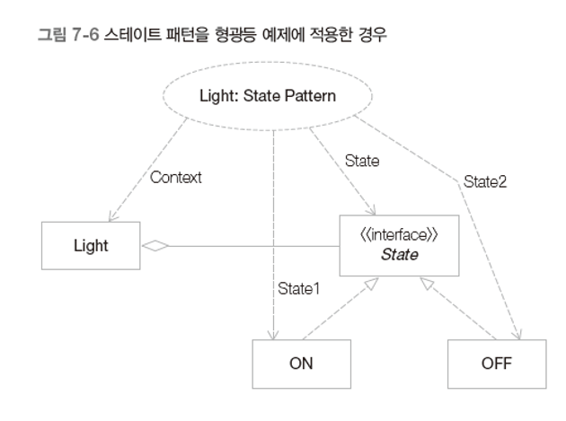

# 스테이트 패턴

## 1. 상태 머신 다이어그램

- 실세계의 많은 시스템은 다양한 상태가 있고 동일한 자극에 대해 상태에 따라 다른 행위를 한다.
- 상태 머신 다이어그램 : 상태와 상태 변화를 모델링 하는 UML 도구
  - 상태 : 객체가 가질 수 있는 어떤 조건이나 상황
  - 상태 전이/진입 :  객체의 한 상태에서 다른 상태로의 이동
    - 특정 이벤트 발생 후 명세된 조건을 만족한 경우 전이가 이루어진다.
    - 이벤트[조건]/액션 (ex : switch_on[power_exists]/turnOn())

- 
  - 선풍기는 기본적으로 OFF 상태에서 시작
  - OFF 상태에서 사용자가 선풍기 스위치를 켜면 switch_on 이벤트를 발생시킨다. 이 때 전원이 들어온 상태(power_exists 조건)라면 ON 상태로 진입한다. 이 때 turnon 액션을 실행하게 된다.
  - OFF 상태에서 사용자가 선풍기 스위치를 켜면 switch_on 이벤트를 발생시킨다. 이 때 전원이 들어오지 않은 상태(power_exists 조건)라면 OFF 상태에 머무른다.
  - 사용자가 ON 상태에서 동작 버튼을 누르면 run 이벤트를 발생시키고 WORKING 상태로 진입한다. 이 때 operate 액션을 실행하게 된다.
  - 선풍기가 ON 상태나 WORKING 상태에 머무를 때 사용자가 스위치를 끄면 switch_off 이벤트를 발생하고 이 이벤트로 인해 OFF 상태로 진입한다.
- Composite state
  - 
    - Active 상태에서는 ON 상태나 WORKING 상태 중 어떤 상태에 있든 switch_off 이벤트가 발생하면 OFF 상태로 진입한다. 이와 같이 복합 상태는 동일한 진입으로 인한 상태 머신의 복잡성을 줄일 수 있다.
    - 복합 상태 안에서도 시작 상태가 존재한다. OFF 상태에서 switch_on 이벤트가 발생했을 때는 Active 복합 상태로 진입하는데, 이 때 묵시적으로 ON 상태로 진입이 일어난다.

## 2. 형광등 만들기


```java
public class Light {
    private static final int ON = 0;
    private static final int OFF = 1;
    private int state;
    
    public Light() {
        state = OFF;
    }
    
    public void on_button_pushed() {
        if (state == ON) System.out.println("반응 없음");
        else {
            state = ON;
            System.out.println("Light On!");
        }
    }
    
    public void off_button_pushed() {
        if (state == OFF) System.out.println("반응 없음");
        else {
            state = OFF;
            System.out.println("Light Off!");
        }
    }
}

public class Client {
    public static void main(String[] args) {
        Light light = new Light();
        light.off_button_pushed();
        light.on_button_pushed();
        light.off_button_pushed();
    }
}
```


## 3. 문제점

- 형광등에 새로운 상태를 추가할 때 (ex : 형광등에 '취침등' 상태를 추가)
  - 

  - 잘못된 코드

    - ```java
      public class Light {
          private static final int ON = 0;
          private static final int OFF = 1;
          private static final int SLEEPING = 2;
          private int state;
          
          public Light() {
              state = OFF;
          }
          
          public void on_button_pushed() {
              if (state == ON) {
                  state = SLEEPING;
                  System.out.println("취침등 상태");
              }
              else if (state == SLEEPING) {
                  state = ON;
                  System.out.println("Light On!");
              }
              else {
                  state = ON;
                  System.out.println("Light On!");
              }
          }
          
          public void off_button_pushed() {
              if (state == OFF) System.out.println("반응 없음");
              else if (state == SLEEPING) {
                  state = OFF;
                  System.out.println("Light Off!");
              }
              else {
                  state = OFF;
                  System.out.println("Light Off!");
              }
          }
      }
      ```

## 4. 해결책

- 무엇이 변하는가?
  - 상태 추가/삭제
  - 상태 전이 추가/삭제, 상태 의존적인 행동 변화

- 상태를 캡슐화
  - 각 상태와 이 상태에 의존적인 해위를 하나의 클래스로 캡슐화
  - 모든 상태를 아우르는(캡슐화하는) 상위 클래스(or interface) 생성

- 

- ```java
  public class Light {
      private State state;
  
      public Light() {
          state = new OFF();
      }
  
      public void setState(State state) {
          this.state = state;
      }
  
      public void on_button_pushed() {
          state.on_button_pushed(this);
      }
  
      public void off_button_pushed() {
          state.off_button_pushed(this);
      }
  }
  
  public interface State {
      public void on_button_pushed(Light light);
      public void off_button_pushed(Light light);
  }
  
  public class ON implements State {
      @Override
      public void on_button_pushed(Light light) {
          light.setState(new SLEEPING());
          System.out.println("취침등...");
      }
  
      @Override
      public void off_button_pushed(Light light) {
          light.setState(new OFF());
          System.out.println("Light Off!");
      }
  }
  
  public class OFF implements State {
      @Override
      public void on_button_pushed(Light light) {
          light.setState(new ON());
          System.out.println("Light On!");
      }
  
      @Override
      public void off_button_pushed(Light light) {
          System.out.println("반응 없음");
      }
  }
  
  public class SLEEPING implements State {
      @Override
      public void on_button_pushed(Light light) {
          light.setState(new ON());
          System.out.println("Light On!");
      }
  
      @Override
      public void off_button_pushed(Light light) {
          light.setState(new OFF());
          System.out.println("Light Off");
      }
  }
  
  public class Client {
      public static void main(String[] args) {
          Light light = new Light();
          light.off_button_pushed();
          light.on_button_pushed();
          light.on_button_pushed();
          light.on_button_pushed();
          light.off_button_pushed();
          light.on_button_pushed();
          light.on_button_pushed();
          light.off_button_pushed();
      }
  }
  ```

- 현재 코드에서도 문제점이 있다.

  - 상태 변화 시 항상 새로운 상태 객체를 생성한다.

  - 해결책은 싱글턴 패턴!

  - ```java
    public class Light {
        private State state;
    
        public Light() {
            state = new OFF();
        }
    
        public void setState(State state) {
            this.state = state;
        }
    
        public void on_button_pushed() {
            state.on_button_pushed(this);
        }
    
        public void off_button_pushed() {
            state.off_button_pushed(this);
        }
    }
    
    public interface State {
        public void on_button_pushed(Light light);
        public void off_button_pushed(Light light);
    }
    
    public class ON implements State {
        private static ON on = null;
    
        private ON() {}
    
        public static ON getInstance() {
            if (on == null) return new ON();
            return on;
        }
    
        @Override
        public void on_button_pushed(Light light) {
            light.setState(SLEEPING.getInstance());
            System.out.println("취침등...");
        }
    
        @Override
        public void off_button_pushed(Light light) {
            light.setState(OFF.getInstance());
            System.out.println("Light Off!");
        }
    }
    
    public class OFF implements State {
        private static OFF off = null;
    
        private OFF() {}
    
        public static OFF getInstance() {
            if (off == null) return new OFF();
            return off;
        }
    
        @Override
        public void on_button_pushed(Light light) {
            light.setState(ON.getInstance());
            System.out.println("Light On!");
        }
    
        @Override
        public void off_button_pushed(Light light) {
            System.out.println("반응 없음");
        }
    }
    
    public class SLEEPING implements State {
        private static SLEEPING sleeping = null;
    
        private SLEEPING() {}
    
        public static SLEEPING getInstance() {
            if (sleeping == null) return new SLEEPING();
            return sleeping;
        }
    
        @Override
        public void on_button_pushed(Light light) {
            light.setState(ON.getInstance());
            System.out.println("Light On!");
        }
    
        @Override
        public void off_button_pushed(Light light) {
            light.setState(OFF.getInstance());
            System.out.println("Light Off");
        }
    }
    
    public class Client {
        public static void main(String[] args) {
            Light light = new Light();
            light.off_button_pushed();
            light.on_button_pushed();
            light.on_button_pushed();
            light.on_button_pushed();
            light.off_button_pushed();
            light.on_button_pushed();
            light.on_button_pushed();
            light.off_button_pushed();
        }
    }
    ```


## 5. 스테이트 패턴



