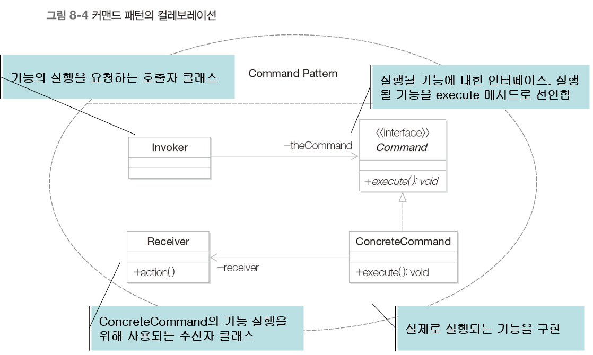

# 커맨드 패턴

- 기능을 캡슐화로 처리하는 방법
- 커맨드 패턴을 통한 기능의 캡슐화 방법
- 커맨드 패턴의 핵심

## 1. 만능 버튼 만들기

- 만능 버튼 : 눌리면 특정 기능을 수행
- ex) 램프를 켜는 버튼
  - Button 클래스 : 버튼이 눌렸음을 인식하는 클래스
  - Lamp 클래스 : 불을 켜는 기능을 제공
- 

```java
public class Lamp {
    public void turnOn() {
        System.out.println("Lamp On");
    }
}

public class Button {
    private Lamp lamp;
    public Button(Lamp lamp) {
        this.lamp = lamp;
    }
    public void pressed() {
        theLamp.turnOn();
    }
}

public class Client {
    public static void main(String[] args) {
        Button lampButton = new Button(new Lamp);
        lampButton.pressed();
    }
}
```

- 버튼을 눌렀을 때 알람을 시작하게 하려면?

  - 

  - ```java
    public class Alarm {
        public void start() {
            System.out.println("Alarming...");
        }
    }
    
    public class Button {
        private Alarm alarm;
        public Button(Alarm alarm) {
            this.alarm = alarm;
        }
        public void pressed() {
            alarm.start();
        }
    }
    
    public class Client {
        public static void main(String[] args) {
            Button alarmButton = new Button(new Alarm());
            alarmButton.pressed();
        }
    }
    ```

# 2. 문제점

- 버튼이 눌렸을 때 램프를 켜는 대신에 다른 기능을 수행하기 위해서는 어떤 변경 작업을 해야하는가?

  - ex) 버튼이 눌리면 알람을 시작

    - Lamp가 들어갔던 모든 부분의 코드들이 Alarm으로 바뀐다.

    - ```java
      public class Alarm {
          public void start() {
              System.out.println("Alarming...");
          }
      }
      
      public class Button {
          private Alarm alarm;
          public Button(Alarm alarm) {
              this.alarm = alarm;
          }
          public void pressed() {
              alarm.start();
          }
      }
      
      public class Client {
          public static void main(String[] args) {
              Button alarmButton = new Button(new Alarm());
              alarmButton.pressed();
          }
      }
      ```

- 버튼이 눌렸을 때 수행되는 기능을 프로그램이 동작할 때 결정하기 위해서는 어떤 변경 작업을 해야하는가?

  - ex) 버튼이 처음 눌렸을 때는 램프를 켜고 두번째 눌리면 알람을 동작

    - Mode라는 열거형 자료형을 추가하여 Mode의 값에 따라서 동작을 다르게 한다.

    - ```java
      public class Lamp {
          public void turnOn() {
              System.out.println("Lamp On");
          }
      }
      
      public class Alarm {
          public void start() {
              System.out.println("Alarming...");
          }
      }
      
      enum Mode { LAMP, ALARM };
      public class Button {
          priavte Lamp lamp;
          private Alarm alarm;
          private Mode mode;
          public Button(Lamp lamp, Alarm alarm) {
              this.lamp = lamp;
              this.alarm = alarm;
          }
          public void setMode(Mode mode) { this.mode = mode; }
          public void pressed() {
              switch (mode){
                  case LAMP : lamp.turnOn(); break;
                  case ALARM : alarm.start(); break;
              }
              alarm.start();
          }
      }
      
      public class Client {
          public static void main(String[] args) {
              Lamp lamp = new Lamp();
              Alarm alarm = new Alarm();
              Button button = new Button(lamp, alarm);
              button.setMode(Mode.LAMP);
              button.pressed();
              button.setMode(Mode.ALARM);
              button.pressed();
          }
      }
      ```

    - 기능의 변경 또는 새로운 기능이 추가될 때마다 Button 클래스를 수정해야 함 -> OCP를 위반

# 3. 해결책

- 버튼이 눌렸을 때 수행될 기능을 캡슐화
  - 버튼은 수행될 기능을 캡슐화된 객체로서 전달받음
  - 버튼이 눌리면 전달받은 객체를 호출함으로써 구체적 기능을 수행
- 

```java
public interface Command {
    public void execute();
}

public class Lamp {
    public void turnOn() {
        System.out.println("Lamp On");
    }
}

public class LampOnCommand implements Command {
    private Lamp lamp;

    public LampOnCommand(Lamp lamp) {
        this.lamp = lamp;
    }

    @Override
    public void execute() {
        lamp.turnOn();
    }
}

public class Alarm {
    public void start() {
        System.out.println("Alarming...");
    }
}

public class AlarmOnCommand implements Command {
    private Alarm alarm;

    public AlarmOnCommand(Alarm alarm) {
        this.alarm = alarm;
    }

    @Override
    public void execute() {
        alarm.start();
    }
}

public class Button {
    private Command command;

    public Button(Command command) {
        setCommand(command);
    }

    public void setCommand(Command command) {
        this.command = command;
    }

    public void pressed() {
        command.execute();
    }
}

public class Client {
    public static void main(String[] args) {
        Command alarmOnCommand = new AlarmOnCommand(new Alarm());
        Command lampOnCommand = new LampOnCommand(new Lamp());
        Button button = new Button(alarmOnCommand);
        button.pressed();
        button.setCommand(lampOnCommand);
        button.pressed();
        button.setCommand(alarmOnCommand);
        button.pressed();
    }
}
```

# 4. 램프를 켜거나 끄는 기능을 가질 때

```java
public interface Command {
    public void execute();
}

public class Lamp {
    public void turnOn() {
        System.out.println("Lamp On");
    }
    public void turnOff() {
        System.out.println("Lamp Off");
    }
}

public class LampOnCommand implements Command {
    private Lamp lamp;

    public LampOnCommand(Lamp lamp) {
        this.lamp = lamp;
    }

    @Override
    public void execute() {
        lamp.turnOn();
    }
}

public class LampOffCommand implements Command {
    private Lamp lamp;

    public LampOffCommand(Lamp lamp) {
        this.lamp = lamp;
    }

    @Override
    public void execute() {
        lamp.turnOff();
    }
}

public class Button {
    private Command command;

    public Button(Command command) {
        setCommand(command);
    }

    public void setCommand(Command command) {
        this.command = command;
    }

    public void pressed() {
        command.execute();
    }
}

public class Client {
    public static void main(String[] args) {
        Lamp lamp = new Lamp();
        Command lampOnCommand = new LampOnCommand(lamp);
        Command lampOffCommand = new LampOffCommand(lamp);
        
        Button button = new Button(lampOnCommand);
        button.pressed();
        button.setCommand(lampOffCommand);
        button.pressed();
    }
}
```

# 5. 커맨드 패턴

- 이벤트가 발생했을 때 실행될 기능이 다양하면서 변경이 필요한 경우 이벤트를 발생시키는 클래스의 변경없이 재사용하고자 할 때
- 커맨드 패턴은 실행될 기능을 캡슐화함으로써 기능의 실행을 요구하는 호출자 클래스(Invoker)와 실제 기능을 실행하는 수신자 클래스(Receiver) 사이의 의존성을 제거한다. 따라서 실행될 기능의 변경에도 호출자 클래스를 수정없이 그대로 사용할 수 있도록 해준다.
- 
- 
- 

