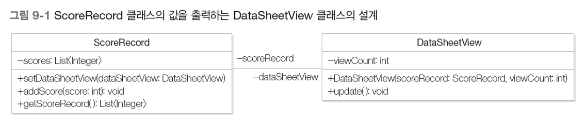

# 옵서버 패턴

- 데이터의 변화를 통보하는 방법
- 옵서버 패턴을 통한 통보의 캡슐화 방법
- 사례 연구를 통한 옵서버 패턴의 핵심 특징

## 1. 여러 가지 방식으로 성적 출력하기

- 성적 출력 프로그램

  - ScoreRecord 클래스 : 점수를 저장/관리하는 클래스
  - DataSheetView 클래스 : 점수를 목록 형태로 출력하는 클래스

- ScoreRecord 클래스의 값을 출력하는 DataSheetView 클래스의 설계

  - 

- 성적 출력 프로그램 순차 다이어그램

  - 

- ```java
  public class ScoreRecord {
      private List<Integer> scores = new ArrayList<Integer>();
      private DataSheetView dataSheetView;
      
      public void setDataSheetView(DataSheetView dataSheetView) {
          this.dataSheetView = dataSheetView;
      }
      public void addScore(int score) {
          scores.add(score);
          dataSheetView.update();
      }
      public List<Integer> getScoreRecord() {
          return scores;
      }
  }
  
  public class DataSheetView {
      private ScoreRecord scoreRecord;
      private int viewCount;
      
      public DataSheetView(ScoreRecord scoreRecord, int viewCount) {
          this.scoreRecord = scoreRecord;
          this.viewCount = viewCount;
      }
      public void update() {
          List<Integer> record = scoreRecord.getScoreRecord();
          displayScores(record, viewCount);
      }
      private void displayScores(List<Integer> record, int viewCount) {
          System.out.println("List of " + viewCount + " entries : ");
          for (int i = 0; i < viewCount && i < record.size(); i++)
              System.out.println(record.get(i) + " ");
          System.out.println();
      }
  }
  
  public class Client {
      public static void main(String[] args) {
          ScoreRecord scoreRecord = new ScoreRecord();
          DataSheetView dataSheetView = new DataSheetView(scoreRecord, 3);
          scoreRecord.setDataSheetView(dataSheetView);
          for (int i = 1; i <= 5; i++) {
              int score = i * 10;
              System.out.println("Adding " + score);
              scoreRecord.addScore(score);
          }
      }
  }
  ```

## 2. 문제점

- 성적을 다른 방식으로 출력하고 싶다면 어떤 변경 작업을 해야 하는가?

  - ex : 성적을 목록으로 출력하지 않고 최소/최대값만을 출력하려면?

  - ```java
    public class MinMaxView {
        private ScoreRecord scoreRecord;
        
        public MinMaxView(ScoreRecord scoreRecord) {
            this.scoreRecord = scoreRecord;
        }
        public void update() {
            List<Integer> record = scoreRecord.getScoreRecord();
            displayMinMax(record);
        }
        private void displayMinMax(List<Integer> record) {
            int min = Collections.min(record, null);
            int max = Collections.max(record, null);
            System.out.println("Min : " + min + " Max : " + max);
        }
    }
    
    public class ScoreRecord {
        private List<Integer> scores = new ArrayList<Integer>();
        private MinMaxView minMaxView;
        
        public void setMinMaxView(MinMaxView minMaxView) {
            this.minMaxView = minMaxView;
        }
        public void addScore(int score) {
            scores.add(score);
            minMaxView.update();
        }
        public List<Integer> getScoreRecord() {
            return scores;
        }
    } // MinMaxView를 이용하도록 코드를 수정하였다.
    // 기능 변경을 위해서 기존의 소스 코드를 수정하였으므로 OCP에 위배
    
    public class Client {
        public static void main(String[] args) {
            ScoreRecord scoreRecord = new ScoreRecord();
            MinMaxView minMaxView = new MinMaxView(scoreRecord);
            scoreRecord.setMinMaxView(minMaxView);
            for (int i = 1; i <= 5; i++) {
                int score = i * 10;
                System.out.println("Adding " + score);
                scoreRecord.addScore(score);
            }
        }
    }
    ```

- 성적을 동시에 여러 가지 형태로 출력하려면 어떤 변경 작업을 해야 하는가?

  - ex : 성적이 입력되면 최대 3개 목록으로 출력, 최대 5개 목록으로 출력, 최소/최대값 출력

  - ```java
    public class ScoreRecord {
        private List<Integer> scores = new ArrayList<Integer>();
        private List<DataSheetView> dataSheetViews = new ArrayList<DataSheetView>();
        private MinMaxView minMaxView;
        
        public void addDataSheetView(DataSheetView dataSheetView) {
            dataSheetViews.add(dataSheetView);
        }
        public void setMinMaxView(MinMaxView minMaxView) {
            this.minMaxView = minMaxView;
        }
        public void setDataSheetView(MinMaxView minMaxView) {
            this.minMaxView = minMaxView;
        }
        public void addScore(int score) {
            scores.add(score);
            for (DataSheetView dataSheetView : dataSheetViews)
                dataSheetView.update();
            minMaxView.update();
        }
        public List<Integer> getScoreRecord() {
            return scores;
        }
    } // 기능 변경을 위해서 기존의 소스 코드를 수정하였으므로 OCP에 위배
    
    public class Client {
        public static void main(String[] args) {
            ScoreRecord scoreRecord = new ScoreRecord();
            DataSheetView dataSheetView3 = new DataSheetView(scoreRecord, 3);
            DataSheetView dataSheetView5 = new DataSheetView(scoreRecord, 5);
            MinMaxView minMaxView = new MinMaxView(scoreRecord);
            scoreRecord.addDataSheetView(dataSheetView3);
            scoreRecord.addDataSheetView(dataSheetView5);
            scoreRecord.setMinMaxView(minMaxView);
            for (int i = 1; i <= 5; i++) {
                int score = i * 10;
                System.out.println("Adding " + score);
                scoreRecord.addScore(score);
            }
        }
    }
    ```

- 프로그램이 실행 시에 성적의 출력 방식이 변경되는 것을 지원한다면 어떤 변경 작업을 해야 하는가?

  - ex : 처음에는 목록으로 출력, 나중에는 최소/최대값 출력

## 3. 해결책

- 성적 출력 방식(통보 받을 객체)이 변경되더라도 ScoreRecord 클래스를 그대로 재사용할 수 있어야 한다.
- 

- ```java
  public interface Observer { // 추상화된 통보 대상
      public void update();
  }
  
  public abstract class Subject { // 추상화된 변경 관심 데이터
      private List<Observer> observers = new ArrayList<>();
  
      public void attach(Observer observer) { // 옵저버(통보 대상) 추가
          observers.add(observer);
      }
      public void detach(Observer observer) { // 옵저버(통보 대상) 제거
          observers.remove(observer);
      }
      
      public void notifyObservers() { // 통보 대상 목록에 있는 각 옵저버에게 변경을 통보한다.
          for (Observer observer : observers) observer.update();
      }
  }
  
  public class ScoreRecord extends Subject { // 구체적인 변경 감시 대상 데이터
      private List<Integer> scores = new ArrayList<>();
  
      public void addScore(int score) {
          scores.add(score);
          notifyObservers(); // 데이터가 변경되면 Subject 클래스의 notifyObservers 메소드를 호출해 각 옵저버(통보 대상 객체)에게 데이터의 변경을 통보한다.
      }
      public List<Integer> getScoreRecord() {
          return scores;
      }
  }
  
  public class DataSheetView implements Observer {
      private ScoreRecord scoreRecord;
      private int viewCount;
  
      public DataSheetView(ScoreRecord scoreRecord, int viewCount) {
          this.scoreRecord = scoreRecord;
          this.viewCount = viewCount;
      }
      @Override
      public void update() {
          List<Integer> record = scoreRecord.getScoreRecord();
          displayScores(record, viewCount);
      }
      private void displayScores(List<Integer> record, int viewCount) {
          System.out.println("List of " + viewCount + " entries : ");
          for (int i = 0; i < viewCount && i < record.size(); i++)
              System.out.println(record.get(i) + " ");
          System.out.println();
      }
  }
  
  public class MinMaxView implements Observer {
      private ScoreRecord scoreRecord;
  
      public MinMaxView(ScoreRecord scoreRecord) {
          this.scoreRecord = scoreRecord;
      }
      @Override
      public void update() {
          List<Integer> record = scoreRecord.getScoreRecord();
          displayMinMax(record);
      }
      private void displayMinMax(List<Integer> record) {
          int min = Collections.min(record, null);
          int max = Collections.max(record, null);
          System.out.println("Min : " + min + " Max : " + max);
      }
  }
  
  public class Client {
      public static void main(String[] args) {
          ScoreRecord scoreRecord = new ScoreRecord();
          DataSheetView dataSheetView3 = new DataSheetView(scoreRecord, 3);
          DataSheetView dataSheetView5 = new DataSheetView(scoreRecord, 5);
          MinMaxView minMaxView = new MinMaxView(scoreRecord);
  
          scoreRecord.attach(dataSheetView3);
          scoreRecord.attach(dataSheetView5);
          scoreRecord.attach(minMaxView);
  
          for (int i = 1; i <= 5; i++) {
              int score = i * 10;
              System.out.println("Adding " + score);
              scoreRecord.addScore(score);
          }
      }
  }
  ```

## 4. 옵서버 패턴

- 데이터 공급 객체에서 데이터 변경 시 공급 객체가 데이터 이용 객체에 의존하지 않으면서 데이터 변경을 이용 객체에게 통보하고자 할 때
- 옵서버 패턴은 통보 대상 객체의 관리를 Subject 클래스와 Observer 인터페이스로 일반화한다.
  - 데이터 변경을 통보하는 클래스(ConcreteObserver)에 대한 의존성을 제거할 수 있다.
  - 결과적으로 옵서버 패턴은 통보 대상 클래스나 대상 객체의 변경에도 ConcreteSubject 클래스를 수정할 필요없이 그대로 사용할 수 있게 된다.


