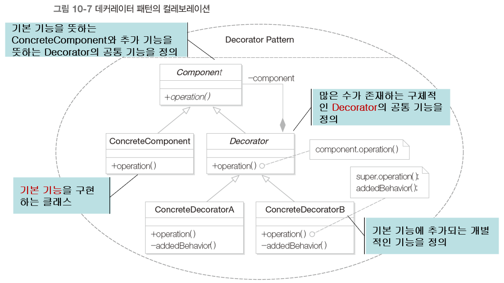

# 데커레이터 패턴

- 독립적인 추가 기능의 조합 방법
- 데커레이터 패턴을 통한 기능의 조합 방법
- 데커레이터 패턴의 핵심 특징

## 1. 도로 표시 방법 조합하기

- 도로 표시

  - RoadDisplay 클래스 : 기본 도로 표시 기능을 제공하는 클래스

  - RoadDisplayWithLane 클래스 : 기본 도로 표시에 추가적으로 차선을 표시하는 클래스

  - 

  - ```java
    public class RoadDisplay {
        public void draw() {
            System.out.println("도로 기본 표시");
        }
    }
    
    public class RoadDisplayWithLane extends RoadDisplay {
        public void draw() {
            super.draw();
            drawLane();
        }
        public void drawLane() {
            System.out.println("차선 표시");
        }
    }
    
    public class Client {
        public static void main(String[] args) {
            RoadDisplay roadDisplay = new RoadDisplay();
            roadDisplay.draw();
            RoadDisplayWithLane roadDisplayWithLane = new RoadDisplayWithLane();
            roadDisplayWithLane.draw();
        }
    }
    ```

## 2. 문제점

- 또 다른 도로 표시 기능을 추가로 구현하는 경우

  - 기본 도로 표시에 추가적으로 교통량을 표시하는 경우

  - 

  - ```java
    public class RoadDisplayWithTraffic extends RoadDisplay {
        public void draw() {
            super.draw();
            drawTraffic();
        }
        public void drawTraffic() {
            System.out.println("교통량 표시");
        }
    }
    ```

- 여러 가지 추가 기능을 조합해야 하는 경우

  - 
  - 

## 3. 해결책

- 추가 기능 별로 개별적인 클래스를 설계하고 이를 조합

  - 

  - ```java
    public abstract class Display {
        public abstract void draw();
    }
    
    public class RoadDisplay extends Display {
        public void draw() {
            System.out.println("도로 기본 표시");
        }
    }
    
    public class DisplayDecorator extends Display {
        private Display decoratedDisplay;
        public DisplayDecorator(Display decoratedDisplay) {
            this.decoratedDisplay = decoratedDisplay;
        }
        public void draw() {
            decoratedDisplay.draw();
        }
    }
    
    public class LaneDecorator extends DisplayDecorator {
        public LaneDecorator(Display decoratedDisplay) {
            super(decoratedDisplay);
        }
        public void draw() {
            super.draw();
            drawLane();
        }
        public void drawLane() {
            System.out.println("\t차선 표시");
        }
    }
    
    public class TrafficDecorator extends DisplayDecorator {
        public TrafficDecorator(Display decoratedDisplay) {
            super(decoratedDisplay);
        }
        public void draw() {
            super.draw();
            drawTraffic();
        }
        public void drawTraffic() {
            System.out.println("\t교통량 표시");
        }
    }
    
    public class Client {
        public static void main(String[] args) {
            Display road = new RoadDisplay();
            road.draw();
            Display roadWithLane = new LaneDecorator(new RoadDisplay());
            roadWithLane.draw();
            Display roadWithTraffic = new TrafficDecorator(new RoadDisplay());
            roadWithTraffic.draw();
            Displat roadWithLaneAndTraffic = new TrafficDecorator(new LaneDecorator(new RoadDisplay()));
            roadWithLaneAndTraffic.draw();
        }
    }
    ```

  - 

- 교차로 기능 추가 시

  - 

  - ```java
    public class CrossingDecorator extends DisplayDecorator {
        public CrossingDecorator(Display decoratedDisplay) {
            super(decoratedDisplay);
        }
        public void draw() {
            super.draw();
            drawCrossing();
        }
        public void drawCrossing() {
            System.out.println("/t횡단보도 표시");
        }
    }
    
    public class Client {
        public static void main(String[] args) {
            Display roadWithLaneAndTrafficAndCrossing = new LaneDecorator(new TrafficDecorator(new CrossingDecorator(new RoadDisplay())));
            roadWithLaneAndTrafficAndCrossing.draw();
        }
    }
    ```

## 4. 데커레이터 패턴

- 기본 기능에 추가할 수 있는 기능의 종류가 많은 경우
- 데커레이터 패턴은 기본 기능에 추가될 수 있는 많은 수의 부가 기능에 대해서 다양한 조합을 동적으로 구현할 수 있는 패턴이다.
- 
- 
- 

