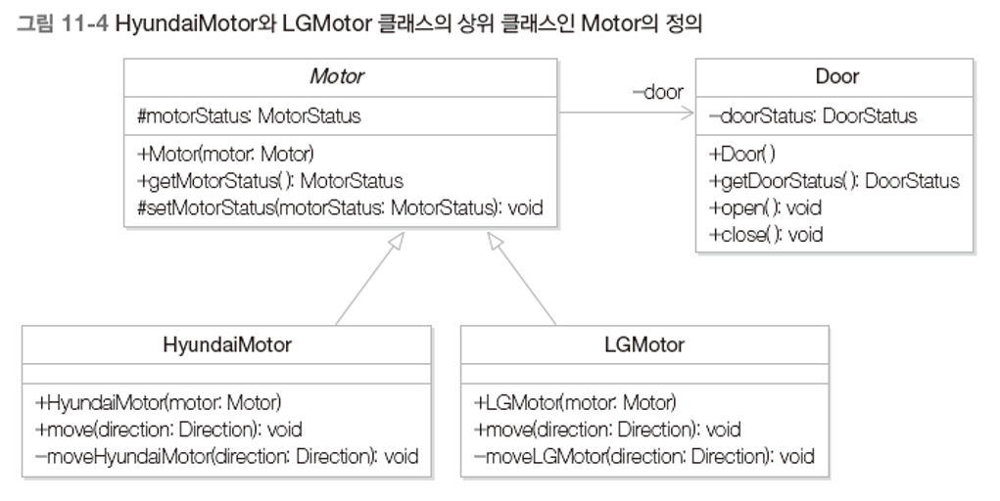

# 템플릿 메소드 패턴

- 공통 코드의 재사용 방법
- 템플릿 메소드 패턴의 핵심 특징

## 1. 여러 회사의 모터를 지원하자

- 엘리베이터 제어 시스템에서 모터를 구동시키는 기능

  - HyundaiMotor 클래스 : 모터를 제어하여 엘리베이터를 이동시키는 클래스

  - Door 클래스 : 문을 열거나 닫는 기능을 제공하는 클래스

  - 

  - 

  - 

  - ```java
    public enum DoorStatus { CLOSED, OPENED }
    
    public enum MotorStatus { MOVING, STOPPED }
    
    public enum Direction { UP, DOWN }
    
    public class Door {
        private DoorStatus doorStatus;
        public Door() {
            doorStatus = DoorStatus.CLOSED;
        }
        public DoorStatus getDoorStatus() {
            return doorStatus;
        }
        public void close() {
            doorStatus = DoorStatus.CLOSED;
        }
        public void open() {
            doorStatus = DoorStatus.OPENED;
        }
    }
    
    public class HyundaiMotor {
        private Door door;
        private MotorStatus motorStatus;
        public HyundaiMotor(Door door) {
            this.door = door;
            motorStatus = MotorStatus.STOPPED;
        }
        private void moveHyundaiMotor(Direction direction) {
            System.out.println("현대 모터 구동 " + direction);
        }
        public MotorStatus getMotorStatus() {
            return motorStatus;
        }
        private void setMotorStatus(MotorStatus motorStatus) {
            this.motorStatus = motorStatus;
        }
        public void move(Direction direction) {
            MotorStatus motorStatus = getMotorStatus();
            if (motorStatus == MotorStatus.MOVING) return;
            DoorStatus doorStatus = door.getDoorStatus();
            if (doorStatus == DoorStatus.OPENED) door.close();
            moveHyundaiMotor(direction);
            setMotorStatus(MotorStatus.MOVING);
        }
    }
    
    public class Client {
        public static void main(String[] args) {
            Door door = new Door();
            HyundaiMotor hyundaiMotor = new HyundaiMotor(door);
            hyundaiMotor.move(Direction.UP);
        }
    }
    ```

## 2. 문제점 & 해결책

- 다른 회사의 모터를 제어해야 하는 경우

  - ```java
    public class LGMotor {
        private Door door;
        private MotorStatus motorStatus;
        public LGMotor(Door door) {
            this.door = door;
            motorStatus = MotorStatus.STOPPED;
        }
        private void moveLGMotor(Direction direction) {
            System.out.println("엘지 모터 구동 " + direction);
        }
        public MotorStatus getMotorStatus() {
            return motorStatus;
        }
        private void setMotorStatus(MotorStatus motorStatus) {
            this.motorStatus = motorStatus;
        }
        public void move(Direction direction) {
            MotorStatus motorStatus = getMotorStatus();
            if (motorStatus == MotorStatus.MOVING) return;
            DoorStatus doorStatus = door.getDoorStatus();
            if (doorStatus == DoorStatus.OPENED) door.close;
            moveLGMotor(direction);
            setMotorStatus(MotorStatus.MOVING);
        }
    }
    // moveLGMotor 메소드를 제외하면 HyundaiMotor 클래스와 동일하다.
    ```

  - 유사한 기능, 중복된 코드를 상속을 활용하여 효율적으로 설계한다.

  - 

  - ```java
    public abstract class Motor {
        protected Door door;
        private MotorStatus motorStatus;
        public Motor(Door door) {
            this.door = door;
            motorStatus = MotorStatus.STOPPED;
        }
        public MotorStatus getMotorStatus() {
            return motorStatus;
        }
        protected void setMotorStatus(MotorStatus motorStatus) {
            this.motorStatus = motorStatus;
        }
    }
    
    public class HyundaiMotor extends Motor {
        public HyundaiMotor(Door door) {
            super(door);
        }
        private void moveHyundaiMotor(Direction direction) {
            System.out.println("현대 모터 구동 " + direction);
        }
        public void move(Direction direction) {
            MotorStatus motorStatus = getMotorStatus();
            if (motorStatus == MotorStatus.MOVING) return;
            DoorStatus doorStatus = door.getDoorStatus();
            if (doorStatus == DoorStatus.OPENED) door.close;
            moveHyundaiMotor(direction);
            setMotorStatus(MotorStatus.MOVING);
        }
    }
    
    public class LGMotor extends Motor {
        public LGMotor(Door door) {
            super(door);
        }
        private void moveLGMotor(Direction direction) {
            System.out.println("엘지 모터 구동 " + direction);
        }
        public void move(Direction direction) {
            MotorStatus motorStatus = getMotorStatus();
            if (motorStatus == MotorStatus.MOVING) return;
            DoorStatus doorStatus = door.getDoorStatus();
            if (doorStatus == DoorStatus.OPENED) door.close;
            moveLGMotor(direction);
            setMotorStatus(MotorStatus.MOVING);
        }
    }
    ```

  - 그러나 여전히 move 메소드에도 중복 코드가 존재한다.

  - move 메소드의 공통 부분을 상위 클래스인 Motor로 이동시키자.

  - 

  - ```java
    public abstract class Motor {
        protected Door door;
        private MotorStatus motorStatus;
        public Motor(Door door) {
            this.door = door;
            motorStatus = MotorStatus.STOPPED;
        }
        public MotorStatus getMotorStatus() {
            return motorStatus;
        }
        private void setMotorStatus(MotorStatus motorStatus) {
            this.motorStatus = motorStatus;
        }
        protected abstract void moveMotor(Direction direction);
        public void move(Direction direction) {
            MotorStatus motorStatus = getMotorStatus();
            if (motorStatus == MotorStatus.MOVING) return;
            DoorStatus doorStatus = door.getDoorStatus();
            if (doorStatus == DoorStatus.OPENED) door.close;
            moveMotor(direction);
            setMotorStatus(MotorStatus.MOVING);
        }
    }
    
    public class HyundaiMotor extends Motor {
        public HyundaiMotor(Door door) {
            super(door);
        }
        protected void moveMotor(Direction direction) {
            System.out.println("현대 모터 구동 " + direction);
        }
    }
    
    public class LGMotor extends Motor {
        public LGMotor(Door door) {
            super(door);
        }
        protected void moveMotor(Direction direction) {
            System.out.println("엘지 모터 구동 " + direction);
        }
    }
    ```

## 3. 템플릿 메소드 패턴

- 전체적으로 동일하면서 부분적으로 상이한 문장을 가지는 메소드의 코드 중복을 최소화할 때 유용
- 전체적인 알고리즘을 구현하면서 상이한 부분은 하위 클래스에서 구현할 수 있도록 해주는 디자인 패턴으로서 전체적인 알고리즘의 코드를 재사용하는데 유용하다.
- 
- 
- 
- 