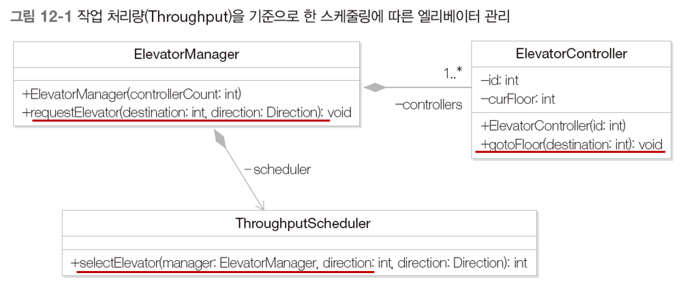
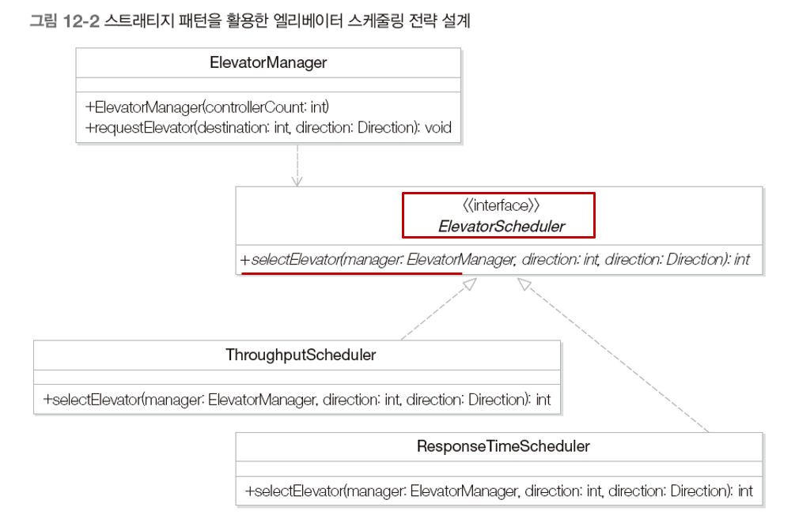
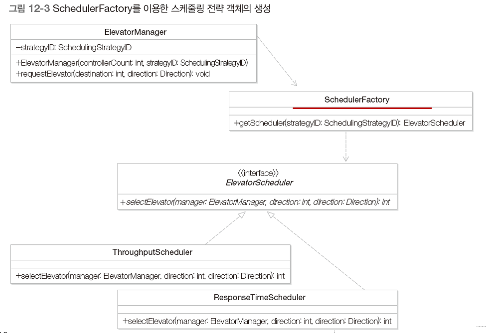
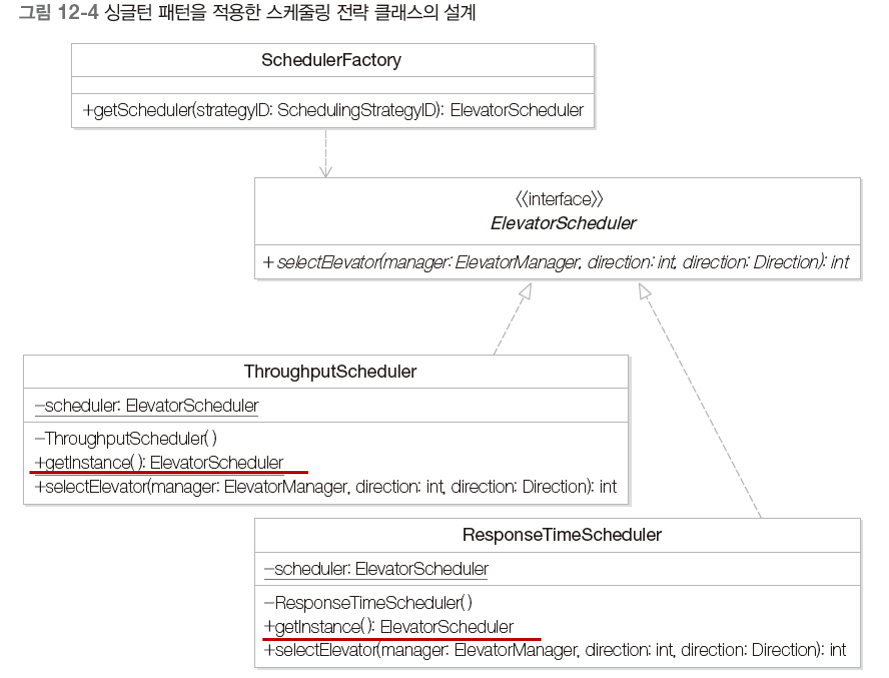
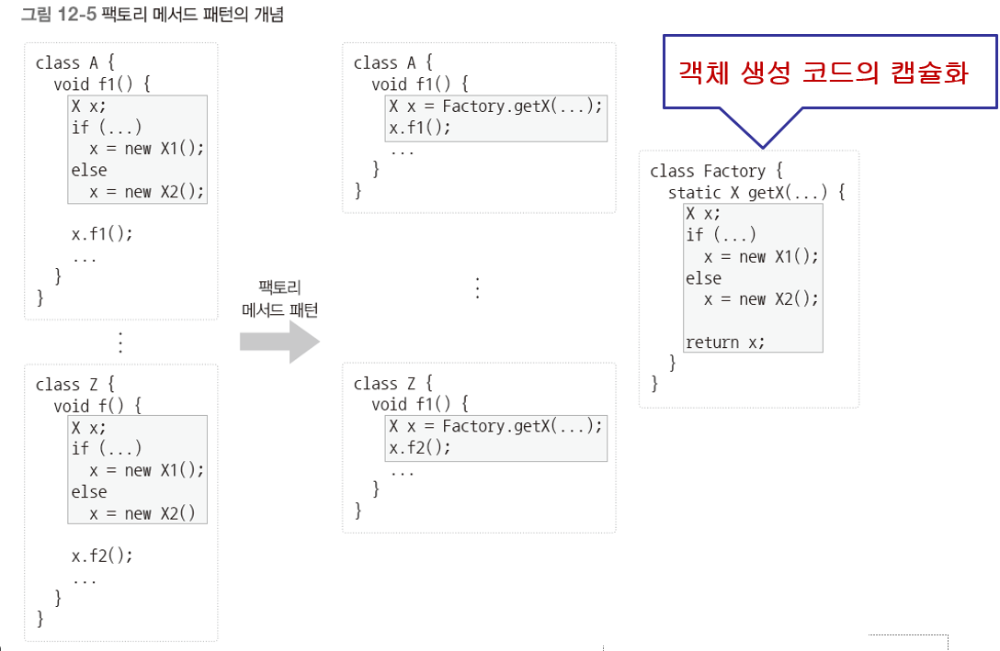
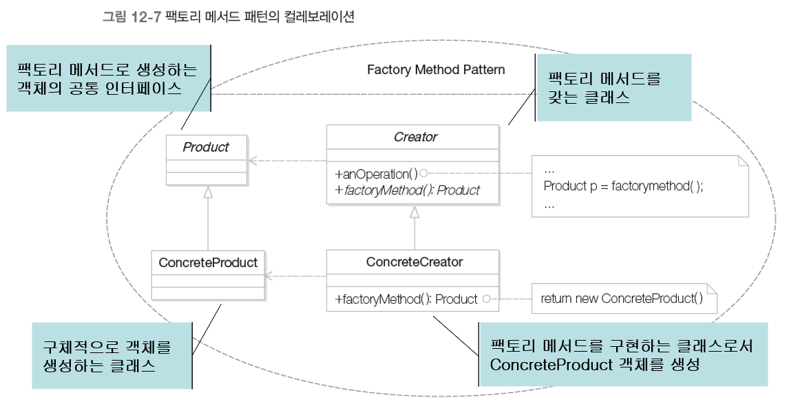
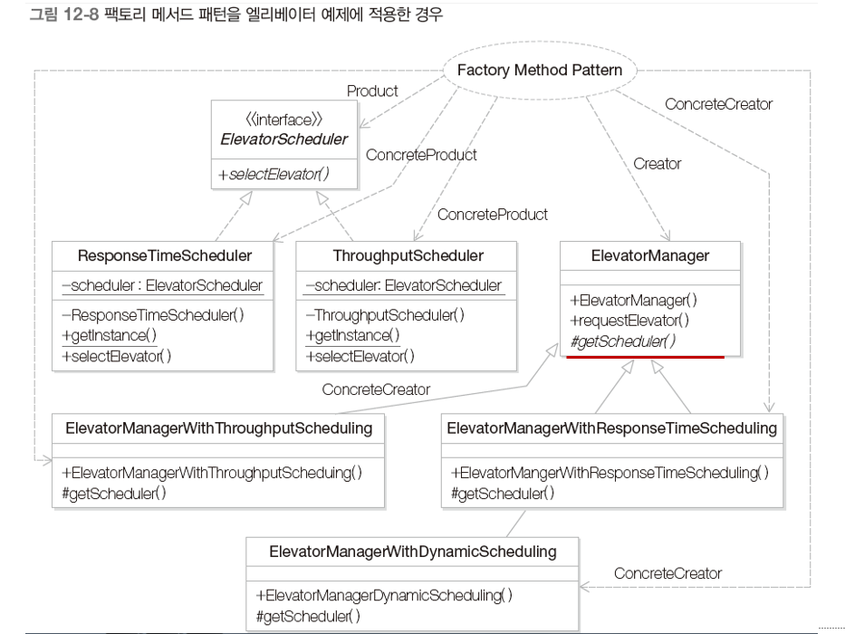

# 팩토리 메소드 패턴

- 적합한 클래스의 객체를 생성하는 코드의 캡슐화 방법
- 팩토리 메소드 패턴을 통한 객체 생성 방법
- 팩토리 메소드 패턴의 핵심 특징

## 1. 여러 방식의 엘리베이터 스케줄링 방법 지원하기

- 엘리베이터 제어 시스템에서 다양한 엘리베이터 스케줄링을 지원

  - ElevatorManager : 여러 엘리베이터 중에서 스케줄링에 따라서 하나의 엘리베이터를 선택하고 이동시킴

  - ThroughputScheduler : 처리량을 기준으로 엘리베이터 선택

  - ElevatorController : 하나의 엘리베이터 이동을 제어하는 클래스

  - 

  - ```java
    public class ElevatorManager {
        private List<ElevatorController> controllers;
        private ThroughputScheduler scheduler;
        public ElevatorManager(int controllerCount) {
            controllers = new ArrayList<>(controllerCount);
            for (int i = 0; i < controllerCount; i++) {
                ElevatorController controller = new ElevatorController(i + 1);
                controllers.add(controller);
            }
            scheduler = new ThroughputScheduler();
        }
        void requestElevator(int destination, Direction direction) {
            int selectedElevator = scheduler.selectElevator(this, destination, direction);
            controllers.get(selectedElevator).gotoFloor(destination);
        }
    }
    
    public class ThroughputScheduler {
        public int selectElevator(ElevatorManager manager, int destination, Direction direction) {
            return 0;
        }
    }
    
    public class ElevatorController {
        private int id;
        private int curFloor;
        public ElevatorController(int id) {
            this.id = id;
            curFloor = 1;
        }
        public void gotoFloor(int destination) {
            System.out.println("Elevator [" + id + "] Floor : " + curFloor);
            curFloor = destination;
            System.out.println(" ==> " + curFloor);
        }
    }
    ```

## 2. 문제점

- 다른 스케줄링 전략을 사용할 경우

  - 현재는 엘리베이터의 처리량을 최대화하는 전략을 사용하는데 사용자의 대기 시간을 최소화시키는 엘리베이터를 선택하는 전략을 사용한다면?
  - 

- 스케줄링 전략을 프로그램 실행 중에 변경해야 하는 경우 (동적 스케줄링)

  - 오전에는 대기 시간 최소화 전략을 사용하고 오후에는 처리량 최대화 전략을 사용한다면?

  - 전략/알고리즘 변화의 캡슐화 => Strategy Pattern

  - 스트래티지 패턴을 활용한 엘리베이터 스케줄링 전략 설계

    - 

    - ```java
      public class ElevatorManager {
          private List<ElevatorController> controllers;
          public ElevatorManager(int controllerCount) {
              controllers = new ArrayList<>(controllerCount);
              for (int i = 0; i < controllerCount; i++) {
                  ElevatorController controller = new ElevatorController(i + 1);
                  controllers.add(controller);
              }
          }
          void requestElevator(int destination, Direction direction, ElevatorScheduler scheduler) {
              int hour = Calendar.getInstance().get(Calendar.HOUR_OF_DAY);
              if (hour < 12) scheduler = new ResponseTimeScheduler();
              else scheduler = new ThroughputScheduler();
              int selectedElevator = scheduler.selectElevator(this, destination, direction);
              controllers.get(selectedElevator).gotoFloor(destination);
          }
      }
      ```

## 3. 해결책

- 스케줄링 전략에 맞는 객체를 생성하는 코드를 별도로 정의

  - 

  - ```java
    public enum Direction {
        UP, DOWN
    }
    
    public enum SchedulingStrategyID {
        RESPONSE_TIME, THROUGHPUT, DYNAMIC
    }
    
    public class ElevatorController {
        private int id;
        private int curFloor;
        public ElevatorController(int id) {
            this.id = id;
            curFloor = 1;
        }
        public void gotoFloor(int destination) {
            System.out.print("Elevator [" + id + "] Floor : " + curFloor);
            curFloor = destination;
            System.out.println(" ==> " + curFloor);
        }
    }
    
    public interface ElevatorScheduler {
        public int selectElevator(ElevatorManager manager, int destination, Direction direction);
    }
    
    public class ResponseTimeScheduler implements ElevatorScheduler {
        @Override
        public int selectElevator(ElevatorManager manager, int destination, Direction direction) {
            return 1;
        }
    }
    
    public class ThroughputScheduler implements ElevatorScheduler {
        @Override
        public int selectElevator(ElevatorManager manager, int destination, Direction direction) {
            return 0;
        }
    }
    
    public class SchedulerFactory {
        public static ElevatorScheduler getScheduler(SchedulingStrategyID strategyID) {
            ElevatorScheduler scheduler = null;
            switch (strategyID) {
                case RESPONSE_TIME: scheduler = new ResponseTimeScheduler(); break;
                case THROUGHPUT: scheduler = new ThroughputScheduler(); break;
                case DYNAMIC: {
                    int hour = Calendar.getInstance().get(Calendar.HOUR_OF_DAY);
                    if (hour < 12) scheduler = new ResponseTimeScheduler();
                    else scheduler = new ThroughputScheduler();
                    break;
                }
            }
            return scheduler;
        }
    }
    
    public class ElevatorManager {
        private List<ElevatorController> controllers;
        private SchedulingStrategyID strategyID;
    
        public ElevatorManager(int controllerCount, SchedulingStrategyID strategyID) {
            controllers = new ArrayList<>(controllerCount);
            for (int i = 0; i < controllerCount; i++) {
                ElevatorController controller = new ElevatorController(i + 1);
                controllers.add(controller);
            }
            setStrategyID(strategyID);
        }
    
        public void setStrategyID(SchedulingStrategyID strategyID) {
            this.strategyID = strategyID;
        }
    
        public void requestElevator(int destination, Direction direction) {
            ElevatorScheduler scheduler = SchedulerFactory.getScheduler(strategyID);
            System.out.println(scheduler);
            int selectedElevator = scheduler.selectElevator(this, destination, direction);
            controllers.get(selectedElevator).gotoFloor(destination);
        }
    }
    
    public class Client {
        public static void main(String[] args) {
            ElevatorManager emWithResponseTimeScheduler = new ElevatorManager(2, SchedulingStrategyID.RESPONSE_TIME);
            emWithResponseTimeScheduler.requestElevator(10, Direction.UP);
    
            ElevatorManager emWithThroughputScheduler = new ElevatorManager(2, SchedulingStrategyID.THROUGHPUT);
            emWithThroughputScheduler.requestElevator(10, Direction.UP);
    
            ElevatorManager emWithDynamicScheduler = new ElevatorManager(2, SchedulingStrategyID.DYNAMIC);
            emWithDynamicScheduler.requestElevator(10, Direction.UP);
        }
    }
    ```

- 싱글턴 패턴을 적용한 스케줄링 전략 클래스 설계

  - 

  - ```java
    public class ResponseTimeScheduler implements ElevatorScheduler {
        private static ElevatorScheduler scheduler;
    
        private ResponseTimeScheduler() {}
    
        public static ElevatorScheduler getInstance() {
            if (scheduler == null) scheduler = new ResponseTimeScheduler();
            return scheduler;
        }
    
        @Override
        public int selectElevator(ElevatorManager manager, int destination, Direction direction) {
            return 1;
        }
    }
    
    public class ThroughputScheduler implements ElevatorScheduler {
        private static ElevatorScheduler scheduler;
    
        private ThroughputScheduler() {}
    
        public static ElevatorScheduler getInstance() {
            if (scheduler == null) scheduler = new ThroughputScheduler();
            return scheduler;
        }
    
        @Override
        public int selectElevator(ElevatorManager manager, int destination, Direction direction) {
            return 0;
        }
    }
    
    public class SchedulerFactory {
        public static ElevatorScheduler getScheduler(SchedulingStrategyID strategyID) {
            ElevatorScheduler scheduler = null;
            switch (strategyID) {
                case RESPONSE_TIME: scheduler = ResponseTimeScheduler.getInstance(); break;
                case THROUGHPUT: scheduler = ThroughputScheduler.getInstance(); break;
                case DYNAMIC: {
                    int hour = Calendar.getInstance().get(Calendar.HOUR_OF_DAY);
                    if (hour < 12) scheduler = ResponseTimeScheduler.getInstance();
                    else scheduler = ThroughputScheduler.getInstance();
                    break;
                }
            }
            return scheduler;
        }
    }
    ```

## 4. Factory Method Pattern

- 객체 생성 코드를 별도의 클래스/메소드로 분리함으로써 객체 생성의 변화를 대비하는데 유용하다.
- 
- 상속을 이용해서도 팩토리 메소드 패턴을 적용할 수 있다.
- 
- 

