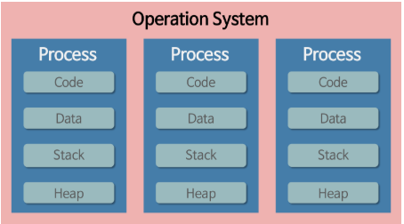
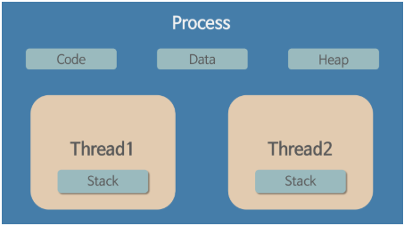

# Operating System

## 1. Process & Thread

* Program : 어떤 작업을 위해 실행할 수 있는 파일

### (1) Process

- 컴퓨터에서 연속적으로 실행되고 있는 프로그램
- 메모리에 적재되어 실행되고 있는 프로그램의 인스턴스(독립적인 개체)
- 운영체제로부터 시스템 자원을 할당받는 작업의 단위
- 동적인 개념으로는 실행 중인 프로그램이라고 할 수 있다.
- 할당받는 시스템 자원 : CPU 시간, 운영되기 위해 필요한 주소 공간, 독립된 메모리 영역(Code, Data, Stack, Heap 4가지로 구분되어 있다.)
- 
- 특징
  - 프로세스는 각각 독립된 메모리 영역을 할당받는다.
  - 기본적으로 프로세스 당 최소 1개의 스레드(메인 스레드)를 갖고 있다.
  - 각 프로세스는 별도의 주소 공간에서 실행되며, 한 프로세스는 다른 프로세스의 변수나 자료 구조에 접근할 수 없다.
  - 한 프로세스가 다른 프로세스에 접근하기 위해서는 프로세스 간 통신(IPC, Inter-Process Communication)을 사용해야 한다.
    - ex) 파이프, 파일, 소켓 등을 이용
- Multi Processing : 하나의 응용프로그램을 여러 개의 프로세스로 구성하여 각 프로세스가 하나의 작업(task)을 처리하도록 하는 것
  - 장점 : 여러 개의 자식 프로세스 중 하나에 문제가 발생하면 다른 프로세스에 영향을 미치지 않는다.
  - 단점
    - Context Switching(문맥 교환) 과정에서 생기는 오버헤드
      - Context Switching(문맥 교환)
        - CPU에서 여러 프로세스를 돌아가면서 작업을 처리하는 과정
        - 동작 중인 프로세스가 대기를 하면서 해당 프로세스의 상태(Context)를 보관하고, 대기하고 있던 다음 순서의 프로세스가 동작하면서 이전에 보관했던 프로세스의 상태를 복구하는 작업
      - Cache Memory 초기화 등 무거운 작업이 진행되고 많은 시간이 소모되는 등의 오버헤드가 발생하게 된다.
      - 프로세스는 각각 독립된 메모리 영역을 할당받았기 때문에 프로세스 사이에서 공유하는 메모리가 없어, 문맥 교환이 발생하면 캐시에 있는 모든 데이터를 리셋하고 다시 캐시 정보를 불러와야 한다.
      - 프로세스 사이의 어렵고 복잡한 통신 기법(IPC)
      - 프로세스는 각각의 독립된 메모리 영역을 할당받았기 때문에 하나의 프로그램에 속하는 프로세스들 사이의 변수를 공유할 수 없다.

### (2) Thread

- 프로세스 내에서 실행되는 여러 흐름의 단위
- 프로세스의 특정한 수행 경로
- 프로세스가 할당받은 자원을 이용하는 실행의 단위
- 
- 특징
  - 스레드는 프로세스 내에서 각각 Stack 메모리 영역만 따로 할당받고 Code, Data Heap 영역은 공유한다.
  - 스레드는 한 프로세스 내에서 동작되는 동작되는 여러 실행의 흐름으로, 프로세스 내의 주소 공간이나 자원들(스택 영역을 제외한 메모리)을 같은 프로세스 내의 스레드끼리 공유하면서 실행된다.
  - 각각의 스레드는 별도의 레지스터와 스택을 갖고 있다. 힙은 같이 읽고 쓸 수 있다.
  - 한 스레드가 프로세스 자원을 변경하면 다른 스레드도 그 변경 결과를 즉시 알 수 있다.
- Multi Threading
  - 하나의 응용프로그램을 여러 개의 스레드로 구성하고 각 스레드로 하여금 하나의 작업을 처리하도록 하는 것
  - 윈도우, 리눅스 등 많은 운영체제들이 멀티 프로세싱을 지원하고 있지만 멀티 스레딩을 기본으로 하고 있다.
  - 대표적인 멀티 스레드 응용프로그램으로 웹 서버가 있다.
  - 장점
    - 시스템 자원 소모 감소 (자원의 효율성 증대) : 프로세스를 생성하여 자원을 할당하는 System Call이 줄어들어 자원을 효율적으로 관리할 수 있다.
    - 시스템 처리량 증가 (처리 비용 감소)
      - 스레드 간 데이터를 주고 받는 것이 간단해지고 시스템 자원 소모가 줄어들게 된다.
      - 스레드 사이의 작업량이 작아 문맥 교환이 빠르다.
    - 스레드는 프로세스 내의 스택 영역을 제외한 모든 메모리를 공유하기 때문에 통신이 간단해 프로그램 응답 시간이 단축된다.
  - 단점
    - 주의 깊은 설계 필요
    - 까다로운 디버깅
    - 단일 프로세스 시스템에서는 효과를 기대할 수 없다.
    - 다른 프로세스에서 스레드를 제어할 수 없다.
    - 자원 공유의 문제 (동기화)
    - 하나의 스레드에 문제가 생기면 전체 프로세스에 영향을 미친다.

## * Thread in Java

- 일반적인 스레드와 거의 차이는 없지만, JVM이 운영체제의 역할을 한다고 볼 수 있다.
- 자바에서는 프로세스가 존재하지 않고 스레드만이 존재하며, JVM에 의해 스케줄되는 실행 단위 코드 블럭이다.
- JVM에 의해 관리되는 스레드 관련 정보
  - 스레드의 개수
  - 스레드로 실행되는 프로그램 코드의 메모리 위치
  - 스레드의 상태
  - 스레드의 우선순위
- 개발자의 역할은 작동할 스레드 코드를 작성하고, 스레드가 생명 주기를 갖고 실행을 시작하도록 JVM에 요청하는 것