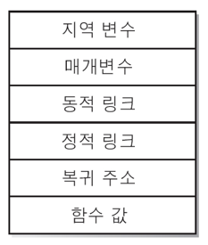
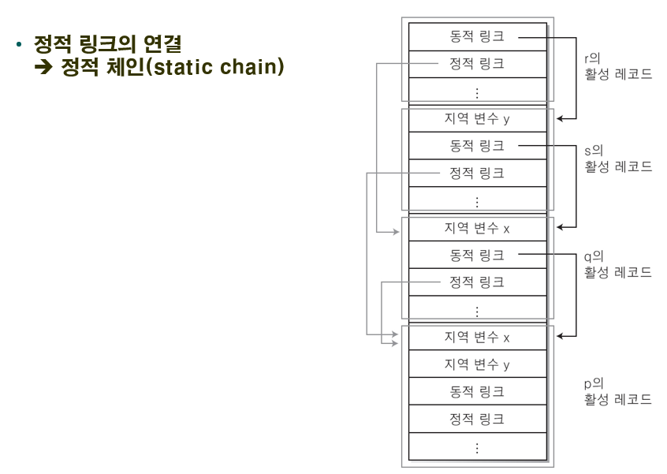

# Programming Languages

[TOC]

## 1. 프로그래밍 언어란?

- 프로그래밍 언어 : 동작시키는 프로그램을 작성하기 위한 인공적인 언어
- 프로그래밍 언어의 분류 : 사용하기 편리한 정도에 따라 분류
  - 저급 언어 : 하드웨어 지향의 기계 중심 언어, 하드웨어와 밀접한 기능 제어
    - 기계어, 어셈블리어
  - 고급 언어
    - 컴퓨터 기종에 따라 다르게 표현되는 저급 언어의 문제점 해결
    - 사람이 사용하는 기호 체계와 유사
    - C, C++, Java 등 대부분의 언어

## 2. 프로그래밍 언어의 설계 원칙

- 언어 설계의 기본 원칙 : 효율성(Efficiency), 일반성(Generality), 직교성(Orthogonality), 획일성(Uniformity)
- 기타 설계 원칙 : 간결성(Simplicity), 표현력(Expressiveness), 정확성(Preciseness), 기계 독립성(Machine Independence), 안전성(Security), 기존 표기나 규칙과의 일관성, 확장성(Extensibility), 제약성(restrictability), 부분성(Subset)
- 일반성, 직교성, 획일성은 매우 밀접한 관계이다.

- 효율성

  - 목적 코드의 효율성 : 번역기가 효율적인 실행 코드를 생성할 수 있어야함을 의미
    - 번역기의 효율적 실행 코드 생성 -> 최적화
      - ex) Pascal에서 상수는 수식으로 표현되지 않고 번역 과정에서 배정된 값으로 대체된다.
  - 번역의 효율성 : 번역기가 효율적으로 실행 코드를 생성할 수 있어야함을 의미
    - 적절한 크기의 번역기로 빠르게 번역할 수 있는 것
      - ex) 언어 번역의 단계 구성 문제 - Pascal : 단일 패스, Modula-2 : 2 패스
  - 구현 용이성 : 번역기를 효율적으로 작성할 수 있어야 한다.
    - 번역기의 효율적인 구현 문제
      - ex) ALGOL 60은 번역기 구현이 어렵거나 번역 수행 알고리즘이 충분히 이해되지 않아 언어가 성공하지 못했다.
  - 프로그래밍 효율성 : 설계된 언어로 얼마나 빠르고 쉽게 프로그램을 작성할 수 있어야 함을 의미
    - 프로그램 작성의 단순성, 용이성 문제
    - 언어의 표현성, 추상화 메커니즘과 관련
    - 이상적인 언어 - LISP, PROLOG

- 일반성

  - 특별한 경우를 피하고 밀접하게 관련있는 개념들을 하나의 더 일반적인 것으로 결합하는 성질
  - 대입 연산자(=, :=)가 배열과 레코드를 비롯한 모든 데이터 타입에 적용되는 경우
  - 
  - 비일반성 :  문맥과 관계없는 제한
  - 일반성이 부족한 예
    - 프로시저
      - Pascal : 프로시저 선언과 매개 변수 허용, 프로시저형 변수 불허
      - Modula-2 : 일반성을 갖는다.
      - Ada : 매개 변수에 프로시저를 사용할 수 없다.
    - 배열
      - Pascal : 가변 배열 불허
      - C, Ada : 가변 배열 허용
      - Modula-2, FORTRAN : 가변 배열 전달 능력, 가변 배열 선언 불허
    - 동등 연산자, 배정 연산자 (=, :=) : 대부분의 언어는 배열, 레코드에 적용하지 않지만 Ada는 적용했다.
    - 매개 변수
      - FORTRAN : call-by-reference만 허용
      - ALGOL 68, C, Java : call-by-value, 객체에 대한 포인터를 값으로 전달 가능, 일반성 제공
      - Ada : 일반성 제공
    - 상수
      - FORTRAN : 상수 이름 부재
      - Pascal : 상수 표현에 수식 사용 불가
      - Ada : 일반성 갖춘 상수 제공
  - 일반성이 갖는 문제점
    - 언어의 간결성, 판독성, 신뢰성 저하
    - ex) C언어의 포인터(일반성 제공) - 문제점 제기
      - Java는 포인터 불허를 통해 신뢰성과 판독성 문제 해결
      - Pascal에서는 이명(Aliasing)과 위험을 줄이기 위해 포인터가 본질적으로 제한된다.

- 직교성

  - '직각 또는 완전히 독립적인 방향'을 의미하는 수학의 직교성 새념에서 유래
  - 언어의 구성자들이 각각의 의미를 가진 채 결합하는 성질
  - 한 언어의 구성자가 문맥이 다르다고 다른 의미를 가져서는 안 된다는 성질
  - 구성자 간의 상호작용 또는 문맥의 사용이 예상 밖의 행위를 야기하지 않아야 한다.
  - 매개변수 전달에 있어서 데이터 타입에 상관없이 동일한 전달 방식을 지원하는 경우
  - 비직교성 : 문맥에 의존하는 제한
  - 직교성이 부족한 예
    - 함수 반환값 자료형
      - Pascal : 스칼라형, 포인터형만 허용
      - C : 배열형만 제외
      - Ada : 완벽한 직교성 제공 (모든 자료형 허용)
    - 파일
      - Pascal : 파일형은 특별한 상태 취급 (파일을 프로시저 매개 변수로 전달 금지, 파일 변수는 배정 금지)
      - 대부분의 언어는 파일을 라이브러리로 취급한다.(비직교성 탈피)
    - 문자열
      - Modula-2 : 문자열 배정 (작은 문자열 -> 더 큰 문자열)
      - 크기가 다른 객체에 대한 유일한 배정
    - 매개변수 전달 기법
      - C : 배열 - call-by-reference, 배열 이외의 모든 자료형 - call-by-value
      - Ada : 모든 자료형 - call-by-value, result, value-result 허용(직교성 보장)

  * ALGOL 68의 중요 설계 목표는 직교성 보장이었다.

- 획일성

  - 비슷한 것은 비슷하게 보이고 비슷한 의미를 가져야 하며, 다른 것은 다르게 보이고 다른 의미를 가져야 한다는 원칙

  - 언어 구조들의 외모와 행동에서의 조화에 중점을 둔다.

  - 획일성이 부족한 예 : C++에서 클래스 정의와 함수 정의

    - 

  - 획일성이 부족한 비조화의 예 (Pascal)

    - if문, while문 : begin-end 구조 요구

    - repeat문 : begin-end 구조 비요구

    - 가변 레코드에서 case문, case 제어문 : 구문 상이 (Modula-2에서 해결)

    - 함수 값의 반환 방법 - 배정문과 유사 (타 언어들은 return으로 해결)

      - ```pascal
        function f : boolean;
        begin
        	...
        	f := true;
        end;
        ```

    - ↑ : 포인터 선언(↑integer)과 포인터 값(x↑)에 똑같은 문자로 쓰인다.(Modula-2는 POINTER TO로 해결)

    - 세미콜론(;) : Modula-2, Pascal에서 문장 구분자와 선언 종결자로 사용한다.(C언어에서는 종결자로만 쓰인다.)

      - ```pascal
        procedure p; (* terminator *)
        	var x : integer; (* seperator *)
        		y : real; (* seperator *)
        begin
        	x := 0; (* seperator *)
        	y := 1.0; (* seperator *)
        end;  (* terminator *)
        ```

  - 비획일성은 특별한 문맥에서만 발생되고 구성자들 간의 상호작용을 볼 수 있으므로 비직교성으로 간주될 수도 있다.

- 간결성

  -  언어가 복잡하지 않고 간결해야함을 의미
  -  LISP와 Prolog 등은 단지 몇 개의 기본 구성자를 가지고 있다.
  -  Pascal의 주된 설계 원칙은 간결성이다.
  -  직교성, 일반성, 획일성 : 간결성을 보장하지 못한다. (ex : ALGOL 68)
  -  구성자의 수가 적다고 언어가 간결한 것은 아니다. (ex : LISP, PROLOG는 적은 수의 구성자를 가지지만 복잡한 실행 시간과 시스템에 의존적이다.)
  -  과다한 단순성은 언어 사용에 방해되고, 표현력이 부족하며, 많은 제한이 발생된다.

- 표현력

  - 언어가 복잡한 과정이나 구조를 얼마나 쉽게 표현할 수 있는가를 의미

  - 표현력은 강하나 단순하지 않은 언어 - LISP, PROLOG, ALGOL 68

  - 표현력이 강하면서 단순한 언어 - C

    - ex)

      - ```C
        while(*s++ == *t++);
        ```

  - LISP와 ALGOL 60 등의 재귀(Recursion)

    - ```lisp
      (defun factorial (n)
          (if (= n 0) 1 (* n (factorial (- n 1)))))
      ```

  - 표현력은 간결성과 상충될 수 있다.

- 확장성 (Extensibility)

  - 사용자가 언어에 새로운 기능을 추가할 수 있도록 하는 성질
  - 사용자가 새로운 타입을 정의하는 것, 라이브러리에 새로운 함수를 추가하는 것, 번역기에 새로운 키워드를 추가하는 것 등등
  - 확장성을 가진 언어의 예 - LISP
  - 명령형 언어는 함수형 언어보다 언어 확장이 어려움
  - 추상화 개념(자료 추상화, 제어 추상화)은 확장성을 지원한다.

- 정확성

  - 프로그램의 실행을 예측할 수 있도록 하는 언어에 대한 정확한 정의가 있는지를 의미한다.
  - 언어에 대한 정확한 정의는 프로그램과 번역기의 신뢰성과 언어의 행위가 예측 가능한 정의의 존재 여부에 영향을 미친다.

- 기계 독립성

  - 언어가 특정 기계에 의존적이지 않고 독립적인 것을 의미한다.
  - 메모리 할당이나 기계 구조 등의 내용과는 독립적인 미리 정의된 데이터 타입을 제공하는 것.
  - 기계 독립적인 언어 정의를 통하여 보장한다. (호환성 제공)

- 제약성(Restrictabliity), 부분성(Subset)

  - 언어에 대한 최소한의 지식과 일부 언어 구조만을 알고 있더라도 프로그램을 작성할 수 있다는 성질
  - 언어 제한성의 장점
    - 프로그래머는 언어의 효과적인 사용을 위해 언어 전체를 배울 필요가 없다.
    - 번역기 작성자가 언어 일부분만을 선택하여 구현하고 사용이 가능하다.(부분 언어 지원)
    - ex) SP/1, SP/2, ..., SP/K : PL/I의 부분 언어들

- 보안성(안전성, Security)

  - 프로그래밍 오류를 줄이고 오류 발견을 쉽게 하는 언어를 설계하는 원칙
  - 신뢰성과 정확성에 밀접한 연관을 가지고 프로그래머가 범할 수 있는 오류의 수를 최소화하자는 것
  - 언어 설계 시 자료형, 형 검사, 변수 선언을 도입

- 기존 표기나 규칙과의 일관성

  - 언어 설계 시 표준화된 특성과 개념을 갖도록 해야 한다.
  - ex) ALGOL 68 - 표준화된 표기를 잘 따르지 않았다. (type 대신 mode 사용)

- 성공적인 언어 설계
  - 신뢰성
    - 프로그램의 신뢰성을 위해 진단 컴파일러 또는 점검 컴파일러 사용
    - Cornell : PL/I diagnostic, C언어 환경(debugger 포함)
  - 효율적인 번역
    - 초기 고급 언어(FORTRAN, COBOL, ...) : 분리 컴파일 제공 -> 효율적 번역 가능, 오류 유발
    - ALGOL 68, Pascal(1970년대 초반) : 신뢰성 강조 -> 통합 컴파일러 -> Ada : 조화 (분리 컴파일의 장점 + 통합 컴파일의 장점), specification part, body part 제공으로 해결
  - 코드 최적화(Optimization)
    - 효율적인 목적 코드
    - 컴파일링 비용 증가
    - 반복 수행부 등 일부분만 최적화 -> 효과 증대
    - 실제 컴파일러들은 여러 최적화 단계를 제공한다.
  - 신뢰성
    - 언어 구문의 과다한 간결성과 생략은 프로그램 판독성을 저하
    - 적절한 수준의 간결성은 프로그래머에게 좋은 훈련이 되며 프로그램의 신뢰성을 증가시킨다.
    - APL과 4세개 언어는 짧은 프로그램이지만 신뢰성을 증진시켰다.
- C. A. R. Hoare의 성공적인 프로그래밍 언어 설계를 위한 충고
  - 언어의 특정한 특성(feature) 고안
    - 새 특성의 설계자는 한 번에 한 가지 특성에 집중
    - 잘 알려진 언어의 특성 구현
    - 이미 존재하는 언어의 장점을 해치지 않고, 언어의 단점과 불완전성을 해결, 완화한다.
    - 이 특성들이 어떻게 단순하고, 효율적으로 구현되는지 보여야 한다.
    - 사용자 지침서 작성
    - 많은 예제 프로그램들을 작성해서 다른 방법들과 비교 평가한다.
  - 새로운 언어 설계 (기존 특성들을 선택, 조합)
    - 기존의 많은 특성들 : 숙지, 선택, 판단력 구비
    - 특성들 사이의 불일치를 제거하고 중첩 부분을 조정해야 한다.
    - 새 언어의 영역, 목적, 범위, 복잡성, 확장성에 대한 명확한 개념이 필요하다.
    - 실제 구현과 사용자 지침서(초보자용, 고급용)를 제공해야 한다.
  - 새 언어 설계 작업은 단지 기존의 개념을 통합하는 것
- 

## 3. 프로그램 처리 기법

- 고급 언어로 작성된 프로그램이 실행되도록 처리하는 방법
  - 컴파일 기법, 해석 기법, 하이브리드 기법
- 컴파일 기법
  - 고급 언어로 작성된 프로그램을 컴퓨터가 바로 실행할 수 있는 프로그램으로 변환하는 방식
  - 컴파일러(Compiler) : 컴파일 하는 프로그램
  - 번역이 완료되면 빠르게 프로그램을 실행시킬 수 있는 장점이 있다.
  - 원시 프로그램
  - -> 컴파일러(컴파일 단계 : 어휘 분석 -> 구문 분석 -> 중간 코드 생성 -> 최적화 -> 코드 생성)
    - 어휘 분석 단계 : 원시 프로그램을 토큰 단위로 자르고, 토큰과 관련된 관련 정보를 구문 분석 단계로 전달
      - 
    - 구문 분석 단계 : 어휘 분석 단계에서 전달받은 토큰들이 문법적으로 옳은지를 검사하고, 오류가 없으면 파스 트리라 불리는 구조를 생성
      - 파스 트리
      - 
    - 중간 코드 생성 단계
      - 기계어는 아니지만 어느 기계에도 의존적이지 않으면서도 기계어에 가까운 중간 코드로 된 프로그램을 생성
      - 문법적인 오류가 아닌 의미적인 오류를 검사
      - 
    - 최적화 단계 : 중간 코드에서 불필요한 코드를 제거하거나 더 효율적인 코드로 개선하여 중간 코드의 크기를 줄이고 실행 속도를 빠르게 한다.
      - 
    - 코드 생성 단계 : 최적화된 중간 코드로부터 해당 컴퓨터가 인식할 수 있는 목적 프로그램을 생성한다.
  - -> 목적 프로그램 -> 컴퓨터 + 입력 -> 결과
- 해석 기법
  - 고급 언어로 작성된 프로그램을 바로 실행
    - 인터프리터(Interpreter) : 해석하는 프로그램
      - 고급 언어를 자신의 기계어로 취급하는 컴퓨터를 시뮬레이션한 것
      - Scheme Interpreter
        - 
    - 원시 프로그램 + 입력 -> 인터프리터 -> 결과
- 하이브리드 기법
  - 컴파일 기법과 해석 기법을 혼합한 형태
    - 고급 언어로 작성된 프로그램을 쉽게 해석할 수 있도록 중간 코드 형태로 번역 -> 번역된 중간 코드 형태의 프로그램을 해석하여 실행
    - 원시 프로그램 -> 어휘 분석 -> 구문 분석 -> 중간 코드 생성 + 입력 -> 인터프리터 -> 결과
    - 예 : Java
      - Byte Code라고 하는 중간 코드로 번역
      - 운영체제마다 별도로 존재하는 자바 가상 기계(JVM)가 바이트 코드를 실행

## 4. 프로그래밍 패러다임

- 패러다임

  - 계산의 본질을 보는 관점에 따라 프로그래밍 언어를 분류
  - 명령형 언어, 함수 언어, 논리 언어, 객체지향 언어

- 명령형 언어

  - 폰 노이만 구조라 불리는 컴퓨터 구조를 기반

    - 명령의 순차적인 실행, 메모리 위치를 의미하는 변수의 사용, 변수의 값을 바꾸는 배정문의 사용

    - 변수 x와 y를 사용하고, 배정문 '='를 사용하며, 위에서부터 아래로 순차적으로 실행

      - ```c
        int main(void) {
            int x, y;
            x = 10;
            y = x + 20;
            return 0;
        }
        ```

- 함수 언어

  - 수학 함수와 같은 원리의 함수들로 프로그램을 구성

  - 변수, 배정문 등을 사용하지 않는다.

  - LISP

    - ```lisp
      (first (sort '(3 9 7 5)))
      // first와 sort는 함수로 미리 정의되어 있어야 한다.
      ```

- 논리 언어

  - 기호 논리의 원리를 기반

  - 개체에 대한 사실과 개체 사이의 관계 규칙을 이용해 원하는 결과를 얻어낸다.

  - Prolog

    - ```
      father(a, c).
      male(X) :- father(X, Y).
      // male(a). -> 질의어
      ```

- 객체지향 언어

  - 명령형 언어, 함수 언어, 논리 언어 어느 것과도 결합이 가능하다.

  -  C++과 같이 명령형 언어를 확장한 객체지향 언어가 일반적

  - 객체(Object) 단위로 모든 처리를 기술

  - 객체는 데이터들과 연관된 동작들이 하나로 묶인 개념

  - 객체지향 언어는 추상 데이터 타입, 상속, 동적 바인딩 개념을 지원

  - C++

    - ```c++
      class Employee {
          private:
          char *name;
          public:
          Employee(char *na) {
              name = new char [strlen(na) + 1];
              strcpy(name, na);
          }
          ~Employee() {
              delete []name;
          }
          char* getName() {
              return name;
          }
      };
      Employee emp("abc");
      ```

    - emp의 구조

      -  

## 5. 역사 및 개요

- 디지털 컴퓨터 이전의 언어
  - 최초의 알고리즘
    - 찰흙판, B.C. 1500~3000, 바빌론 근처 메소포타미아
    - 60진법 사용(현재 시, 분, 초 개념에 사용), 부동 소수점, 가감승제 가능
    - 대수학 방정식 해결
    - 조건문, 분기, 음수, 0 개념 X
    - 알고리즘 반복 작성, 우수한 표기법이었음.
  - Euclid
    - B.C. 300, 최대공약수 알고리즘
    - 0 개념 없음, 1이 제수로 인식되지 않았다.
    - 특수한 경우 반복
    - 바빌로니아 사람들에 비해 크게 진보되지 못하였다.
  - Charles Babbage (1792 ~ 1871)
    - Difference Engine : 유한 차(Finite Difference)의 원리를 기본으로 하여 계산 처리를 위한 기계
    - Analytical Engine : 현 디지털 컴퓨터의 원리를 포함하고 있다.
      - 현재 컴퓨터와 유사한 구조지만 프로그램과 자료를 주기억장치에 저장시키는 개념이 없다. (연산 카드와 변수 카드 사용)
    - Ada Augusta(Charles Babbage의 조수)
      - 최초의 컴퓨터 프로그래머(Analytical Engine 프로그래머)
      - 알고리즘 분석에 대한 견해 : 거의 모든 계산에서 성공적인 수행을 할 수 있는 매우 다양한 배치 방법들이 가능하다. 그리고 이들 배치 방법을 선택하는데 있어서 계산을 수행하는 기계 목적에 맞도록 여러 가지 고려해야 할 점들이 있다. 한 가지 중요한 고려 대상은 계산하는데 필요한 시간을 최소로 줄이는 배치 방법을 선택하는 것이다.
  - 1930 ~ 1940년대
    - 프로그래밍 표기에서 창조적인 것들이 급격히 증가했다.
      - Zuse - Placn Calculus
      - Turing - Turing Machine
      - Church - Lambda Calculus
      - Aiken - Mark 1
      - von Neumann - Flow Diagrams
    - 하지만 디지털 컴퓨터의 초기 개발자들에게 알려지지 않았다.
- 프로그래밍 언어의 역사
  - 1940년대 말 폰 노이만에 의해 세계 최초로 프로그램 내장 방식의 컴퓨터가 등장
  - 일반적으로 말하는 프로그래밍 언어는 프로그램 내장 방식 컴퓨터에 대한 계산 과정을 기술할 수 있을 때부터 시작
- 시기에 따른 프로그래밍 언어의 특징과 언어의 종류
  - 1950년대 이전 : 디지털 컴퓨터 이전의 언어
    - Plankalkül (1943)
      - 체스에 적용
      - 궁극적인 개발 목적은 2진 산술 연산에 사용된 Konrad Z 시리즈 컴퓨터를 위해서였다.
      - 단일 비트를 제공하고 정수 타입과 부동 소수점 수치 타입을 지원
      - 배열과 레코드도 제공하는데 다른 레코드를 레코드의 원소로 포함 가능하다.
      - 이 언어는 실제로 구현되지 않았다.
    - 폰 노이만 개념 (1945)
      - 프로그램 내장 방식
        - 메모리에 프로그램을 저장하고 프로그램 명령어들을 차례대로 실행
        - 현재 대부분의 컴퓨터들에 이 방식이 적용되었다.
  - 1950년대 : 최초의 프로그래밍 언어
    - 어셈블리어
      - 어려운 기계어의 코드를 move, jump, branch 등과 같은 쉬운 명령어로 나타냄
      - 기계어와 어셈블리 언어는 저급 언어다.
    - 초반 : 기계어 사용 (프로그램 저장 방식) + 기호화 -> 어셈블리 언어(기계 의존적, 자연어와 상이한 구문)
      - Autocode (1952)
        - Mark 1 컴퓨터에서 사용
        - 저장이 가능하였으며, 사용할 때 불러오기 가능
        - 서브루틴이라는 개념이 처음 생겼다.
    - 중반
      - FORTRAN (FORmula TRANslation)
        - 1954 ~ 1957, John Backus에 의해 고안된 최초의 고급 언어
        - FORTRAN 1의 개발 (1957)
          - 최초의 대중 컴퓨터 언어
          - 과학 계산 목적으로 IBM에서 설계
          - 구성 요소는 매우 단순, 데이터 형식
          - 호환성
        - FORTRAN 2 (1958)
          - FORTRAN 1 컴파일러에 포함된 버그를 수정해서 개발
          - 서브루틴을 분리해서 컴파일
        - FORTRAN 4, FORTRAN 66, FORTRAN 77, FORTRAN 90
        - FORTRAN 컴파일러는 효율적인 기계어 코드를 생성했다. -> 언어의 긴 생명
        - 배열, 반복 구조, 분기문, 부프로그램 등의 특징은 이후의 언어에 큰 영향을 미쳤다.
    - 후반
      - FLOW-MATIC과 최초의 컴파일러 (1957)
        - 1951년 A-0라고 불리는 최초의 컴파일러
        - 1957년에는 공동 개발한 A-0 컴파일러의 새 버전을 발표 : Math-Matic이라 불려지는 최초의 영문 데이터 처리 컴파일러
        - Flow-Matic : 데이터 이름을 이용, 명령에 영어 단어를 이용
      - COBOL (COmmon Business-Oriented Language) : 상업 자료 처리용
        - 1959 ~ 1960, 미국방성의 Grace Hopper에 의해 고안되었다.
        - 설계 목적 : 사용자들이 프로그램을 읽기 쉽고, 이해하기 쉽게 하자.
        - 특징
          - 레코드 구조 도입
          - 자료 구조와 실행 부분을 분리
          - 'PICTURE'를 써서 원하는 출력 양식의 가변성 부가
      - ALGOL 60 (ALGOrithmic Language 60) : 알고리즘 기술, 범용
        - 1958 ~ 1960, 알고리즘 서술을 위한 일반적인 표현 언어
        - 특징
          - 양식의 자유화(Free Format), 구조적 명령문, begin-end 블록, 변수 타입 선언, 되부름, call-by-value 매개 변수 등의 개념을 소개 했다.
          - 스택 기반 실행 환경 도입
          - Backus-Naur Forms(BNF)를 최초로 사용
      - LISP (LISt Processor) : 기호 연산, 리스트 처리용
        - 1950년대 후반, MIT의 John McCarthy에 의해 고안되었다.
        - 일반적인 리스트 구조와 함수의 적용을 기본으로 한다.
        - 인공지능 분야에 응용
        - 특징
          - 통일된 자료구조, S-expression
          - 기본적인 계산 표기법에 함수 적용
          - Garbage Collection 개념 소개
          - 되부름의 원조
      - APL (A Programming Language) : 배열 처리용 (1957)
        - 1950년대 후반 ~ 1960년대 초반
        - 하버드대의 K. lverson에 의해 고안
        - 간결한 체계와 특수한 비 ASCII 성질을 가진 수학적인 언어
        - 수학과 행렬
        - 데이터 집합에 대한 복잡한 연산을 하나의 기호를 사용하여 수행
        - 장점 : 배열과 행렬에 대한 연산이 쉽고, 강력한 프로그래밍
        - 단점
          - 제어 구조가 없음
          - 특정 터미널에만 있는 그리스 기호 사용
          - 프로그램 이해 난이
      - LISP (1959)
        - 인공 지능 분야
        - 함수형 언어로 지식이나 규칙을 절차적으로 기술
        - ex) x OR y -> OR(x, y)
  - 1960년대 : 프로그래밍 언어의 범람
    - 시대적 특징
      - 초기 언어 성공 -> 언어 개발 몰두 -> 수많은 언어 탄생
      - 특별한 관심 분야나 목적 (그래픽, 통신, 보고서 작성 분야 등)
      - 대부분의 언어는 소멸했고 소수의 언어들은 지대한 공헌을 했다.
    - BASIC (Beginners All-purpose Symbolic Instruction Code)
      - 시분할 용도의 간결한 언어
      - 마이크로 컴퓨터에 이식 (교육용, 사무처리용, 가정용)
      - 언어군 (ANSI 표준 : 1978 'minimal BASIC', 1988 'Standard BASIC')
      - 이후에 나온 BASIC : 제어 구조, 변수 선언, 프로시저 추가
    - ALGOL 60 (1960)
      - FORTRAN의 많은 특징을 포함
      - 블록 구조 개념의 도입과 재귀 호출 기능의 도입
      - 구문은 Backus-Naur Form(BNF) 표기법으로 기술
    - Simula 67
      - 객체 지향 언어 (클래스 개념을 최초로 도입)
      - Simula 1 + ALGOL 60
      - 시뮬레이션이 목적
    - ALGOL 68
      - ALGOL 60 + 타 언어의 여러 기능 + 표현력 있고 일관된 구조
      - 새로운 특성의 독자적인 개발
      - 이론적으로 일관성 있는 구조
      - 일반적인 타입 시스템, 직교성 강조(수식 위주)
      - 언어 기술 -> 새로운 용어를 과하게 사용하였다.
      - 디자인 일관성, 파일 시스템, 실행 환경 -> 우수
      - 범용 컴퓨터는 사용이 불가능했다. (비판 多 -> 소수만이 구현)
    - COBOL (1960)
      - 사무 처리용
      - 데이터 타입은 숫자와 문자열이며, 데이터를 찾기 쉽고 잘 정리할 수 있도록 열과 레코드로 분류
      - 식별부(Identification), 표지부(Environment), 데이터부(Data), 절차부(Procedure)의 네 부분으로 구성
    - FORTRAN 4 (1962)
      - FORTRAN 2의 COMMON과 EQUIVALANCE 실행의 향상
      - 변수의 명시적 타입 선언, 논리 IF문, 부프로그램을 매개변수로 다른 부프로그램에 전달할 수 있는 기능
    - SNOBOL (1963)
      - 최초의 문자열 처리 언어, 패턴 매칭 기능이 다양
      - FASBOL, SNOBOL 컴파일러, SPITBOL 개발의 효사
    - PL/I (Programming Language One) (1964)
      - 크고 복잡한 블록 구조 언어
      - FORTRAN, COBOL, ALGOL 60의 장점 모두 수용
      - 새로운 개념 추가 (병행성, 기억 장소 할당, 예외 처리)
      - IBM의 지원
      - 언어의 문제점 : 종합적으로 방대하다는 문제점
        - 번역기가 크고 작성이 어렵다.
        - 실행 효율 저하
        - 배우기 어렵다. -> 오류 발생이 쉽게 일어난다.
        - 언어 특성들의 상호 작용으로 인한 신뢰성 저하
      - 함수와 프로시저, 수치 데이터형, 배열과 레코드 데이터 타입, 재귀 호출 및 제어 구조, 문자열, COBOL 스타일 'PICTURE' 포맷, 스트림, 레코드, 입출력 기능, 비트 문자열, generic, 인터럽트, 동적 메모리 관리, 다중 처리 기능들을 포함
    - BASIC (1964)
      - 간단한 문법 구조로 이루어져 있다.
      - 제어 구조는 GOTO문, GOSUB문, 반복문
      - 수치, 문자열, 배열 데이터 타입을 제공
      - 프로그램 이식성이 부족하며 작성된 프로그램의 구조가 빈약하다는 것이 단점
    - Logo (1966)
      - 아이들에게 프로그래밍과 문제 해결 원리를 가르치기 위해 고안된 교육용 프로그래밍 언어
      - 간단한 문법과 그래픽 지향적 특징
    - BCPL (1967)
      - 초기의 블록 구조 절차 언어와 같았고 규모가 작은 애플리케이션 프로그램 개발에 이용
      - B와 C 프로그래밍 언어에 영향을 미쳤다.
  - 1970년대 : 단순성, 추상화, 프로그래밍 언어에 대한 연구
    - 중, 후반 언어의 특징 : 자료 추상화, 병행성, 증명 등의 메커니즘을 집중적으로 연구했다.
    - Forth (1970)
      -  간단한 문법을 지닌 스택 기반 언어
      - 효율성과 단순성을 목적으로 고안
      - 데이터 조작은 데이터 스택에서 발생
    - Pascal (1971)
      - 성공한 언어
      - 교육용
      - 사용자가 복합적인 구조의 데이터 구조를 정의 가능
      - 별명(Aliasing), 포인터 등의 특징
      - 배열 및 가변 레코드의 정수의 부분집합을 새로운 타입으로 정의할 수 있는 특징
    - C (1971)
      - 초기에는 시스템 프로그래밍을 위해 설계
      - 풍부한 제어문, 간단한 데이터 구조, 풍부한 연산자
      - 함수, 포인터, 간단하면서도 유용하게 사용할 수 있는 입출력 장치, 강력한 매크로 선행처리기
      - 장치 드라이버들을 기록하기에 충분한 저급 언어 이면서 GUI 라이브러리를 기록하기에 충분한 고급 언어이기도 하다.
    - Smalltalk (1972 ~ 1980, Xerox사의 Alan Kay, Dan Ingalls)
      - 순수한 객체 지향 언어 (객체 지향 언어의 모범)
      - 객체는 지역 데이터와 연산들의 모임을 캡슐화하는 구조
      - 애플리케이션 프로그래밍이나 객체지향 프로그래밍 이론을 가르치기 위해 사용
      - 멀티 윈도우와 그래픽 기능을 활용한 사용자 중심의 인터페이스를 지원하는 최초의 언어
    - PROLOG (PROgrammation en LOGique) (1973)
      - 매우 짧은 양의 코드로도 효율성을 지니는 논리 기반 프로그래밍 언어
      - 인공지능 분야에서 많이 사용했던 논리형 언어
    - Scheme (1975 ~ 1978, MIT의 Gerald J. Sussman, Guy L. Steele, Jr. 개발)
      - LISP 언어의 일종 (LISP 언어 개정)
      - LISP 보다 획일적이고, Lambda Calculus에 가깝게 설계되었다.
      - 지원하는 데이터 타입 : 심볼, 다양한 계수 타입, 문자와 문자열, 리스트, 벡터, 비트 문자열, 레코드, 관련 리스트와 해시 테이블, 다양한 함수/람다 형
    - CLU (1975)
      - 추상화 기법을 위한 일관성 있는 접근 방식 : 자료 추상화와 제어 추상화, 예외 처리 방식 등의 추상화 메커니즘으로 이루어져 있다.
      - 자료 추상화 : cluster (Simula의 class와 유사)
      - 제어 구조 : iterator - 일반성
      - 예외 처리 : Ada와 비슷한 구조 제안
    - Euclid (1976 ~ 1977, 토론토 대학)
      - Pascal을 개선한 언어
      - Pascal의 단점인 이명(Aliasing : 별명) 개선, 자료형의 추상화, 프로그램 증명 보조 추가
      - 프로그램의 형식적 검증을 위한 최초의 언어
    - Mesa (1976 ~1979, Xerox사 Palo Alto 연구소)
      - Pascal 구조에 모듈 구조, 예외처리기, 병행성, 병렬 프로그래밍의 개념 추가
      - 시스템 프로그래밍용 -> Modula-2 메커니즘 고안에 지대한 영향
    - Awk (1978)
      - 컴파일 없이 수행되는 언어
      - 입력 파일을 스캔한 후 미리 지정된 레코드 분리자 단위로 읽어 필드 분리자로 필드마다 규칙적인 명칭을 붙임
      - 단순한 구조로 되어 있으며, 데이터 검사, 변환, 여러 포맷으로의 출력, 데이터베이스 구축 등에 활용
    - ML (Meta Language) (1978)
      - 에딘버러(Edinburgh) 대학의 Robin Milner 개발
      - 기존 함수형 언어와 상이하다.
      - Pascal과 유사하나 유연하다.(문법, 타입 체킹 측면)
  - 1980년대 : 새로운 방향과 객체지향의 부상
    - 특징
      - 기존의 개념을 통합한 Ada 등장
      - 함수형 언어에 새로운 관심 부여 - 스킴(Scheme), ML(Meta Language) 개발
      - 논리형 프로그래밍 언어 - PROLOG 등장
      - 객체지향 언어에 대한 활발한 연구 및 개발
    - SETL (뉴욕 대학(NYU)의 J. Schwartz)
      - 집합론을 프로그래밍 언어로 시도한 것(미적분, 수학의 교육 모델로 사용)
      - 구현 결핍
    - Modula 2 (1981)
      - Modula 언어를 기본, 운영체제 구축용으로 개발(N. Wirth)
      - Pascal의 디자인에 결점 보완 (당시에는 실험적인 언어) -> 병행 처리와 메모리 관리는 Pascal보다 뛰어나다.
      - 추상화, 부분적 동시 처리 개념
      - 내장형 시스템 프로그래밍 목적 : 하드웨어 접근이 용이한 다목적 언어
      - 교육 목적으로 인기가 많았다.
      - 가능한 소규모의 간결한 언어로 만들기 시도 -> 예외 처리 기능 등 여러 가지 기능들을 제외했다.
      - 애플리케이션 프로그램 교육용 언어, 산업 응용 분야에서도 사용
      - 주요 특징은 module
      - 추상 데이터 타입은 허용하지만 상속은 지원하지 않는다.
    - Ada (1983)
      - 대규모 프로그래밍과 소프트웨어 신뢰성을 장려하려는 미국 정부에 의해 발표
      - 객체지향 프로그래밍의 특징을 지닌 블록 구조 언어
      - 자료 추상화, 타입 메커니즘(package), 병행 처리(task), 예외 처리기 도입
      - 디자인이 섬세하고 상세하다. 사용 급증
      - 단점 : 복잡하고 방대하다. (제 2의 PL/I가 될 가능성이 있었다.)
      - 중첩 프로시저, 중첩 패키지, 엄격한 데이터 검사, 멀티태스킹, 타입의 안정성, 컬렉션, 제너릭, 예외처리, 그리고 추상 데이터 타입
    - C++ (1983, Bjarne Stroustrup)
      - C로부터 파생된 객체지향 언어
      - 클래스, 상속 그리고 객체지향 특징
      - 다중 상속, 엄격한 타입 검사, 동적 메모리 관리, 템플릿, 다형성, 오버로딩과 예외처리 등의 객체지향 프로그래밍 특징을 지님
      - 병행 처리, 연속성, Garbage Collection 등의 기능은 지원하지 않음
    - Eiffel (1980년대 중반, Bertand Meyer)
      - Pascal에 가까우면서 일관성있는 객체 지향 언어
      - 프로그램 안정성과 순차적 소프트웨어 개발을 목적으로 개발
      - 객체지향 프로그래밍 속성인 상속, 추상 데이터 타입, 동적 바인딩, 예외 처리 등을 지원
    - Miranda (1985 ~ 1986) : 맨체스터 대학의 데이비드 터너(David Turner)가 개발
    - Perl (1986)
      - 블록 구조의 언어로 객체지향 프로그래밍
      - 특징
        - 데이터 타입 : 문자열, 숫자, 리스트, 연상 배열, 참조, 객체
        - 전통적인 수학과 산술 함수들
        - 서브루틴
        - Garbage Collection의 동적 메모리
        - 파일의 입출력 기능
        - 인터페이스 지원 확장 시스템
        - 정규식 데이터 매칭과 서브루틴
        - 다양한 루프
        - 객체 정의와 상속
        - 네임스페이스
        - 오류 처리
    - Oberon (1988)
      - 절차적이며, 객체지향 특징을 지닌 블록 구조의 언어
      - 컴퓨터 공학 교육용, 다용도 애플리케이션 개발
      - 엄격한 데이터 타입 체크, 분리 컴파일이 가능한 모듈, Garbage Collection, 동적 메모리 관리, 문자열, 배열 데이터 타입, 동적 모듈 로딩
    - Python (1989)
      - 객체 지향적 언어
      - 높은 효율, 쉬운 사용법, 확장성
      - 정수, 부동소수점, 복합 문자열, 리스트 등의 데이터 타입과 독립 모듈, 서브루틴, 오브젝트 클래스를 지원
      - 표준 라이브러리가 HTTP, CGI, 윈도우에서 지원하는 라이브러리, Active X Scripting도 지원
  - 1990년대 : 통합, 인터넷, 라이브러리, 스크립트
    - 특징
      - 제 4세대 언어 대두
        - 응용 문제를 빠르게 구현
        - 실사용자가 직접 프로그래밍
        - 데이터베이스를 쉽게 처리
      - HTML, Java 등장
    - Visual Basic (1991)
      - 통합 개발 환경을 위하여 시각적 편리함을 추구하여 BASIC을 GUI적으로 발전시킨 것
      - 구성 요소로는 대화상자, 윈도우 인터페이스, 메뉴 등
      - 정수, 실수, 스트링, 불린, 병행 처리, 개체 참조 등을 지원, 확장이 가능
    - Dylan (1992)
      - 절차적인 함수의 특징과 함께 동적인 객체지향 언어
      - 애플리케이션 개발, 시스템 프로그래밍도 지원
      - 상속, 다형성, Garbage Collection, 매크로, 모듈, 반환, 오류 검출, 다중 메소드, 그리고 확장성을 지원
      - 데이터 타입은 숫자, 스트링, 심볼, 시퀀스, 배열, 벡터와 해시 테이블을 지원
    - Ruby (1993)
      - 교육용 언어를 목적으로 탄생한 스크립트 언어
      - 객체지향적이고 확장 가능성이 뛰어남
    - Java (1995)
      - James Gosling 설계 팀장
      - C++ 기반 : 많은 구조 삭제, 일부 구조 변경 및 추가
        - C++의 강력함과 유연성 제공
        - C++보다 규모는 작아지고, 더 간결하고, 신뢰성이 증가된 언어
      - 단순하고 편리한 객체지향적 언어
      - 처음에는 가전 제품의 소프트웨어를 개발하기 위한 언어로 만들어짐
        - 응용 분야가 확장되면서 Web 프로그래밍도 가능해졌다.(C/C++ 결점 보완)
      - 객체지향적이고, 강력하고 편하며 보안성이 뛰어나는 등 여러 가지 장점을 지닌 언어
      - 기본적인 구성 요소는 클래스
      - 상속, 엄격한 데이터 타입 검사, 모듈 방식, 예외 처리, 다형성, 문자열 처리, Garbage Collection 등의 특징
      - 포인터, 다중 상속, 연산자 오버로딩, 매크로 전처리기를 지원하지 않는다.
      - 특징 : 간결성과 신뢰성 제공 원칙
        - 자료형, 클래스 제공
        - 기본 자료형 : 스칼라 형 제공
        - 배열 - 미리 정의된 클래스 객체로 제공(C++과 구별)
        - 포인터를 삭제하고 참조형 제공 : 포인터 - 기억 장소 지시 -> 참조형 - 객체 지시
        - 논리형 제공 (산술 연산에 사용 불가 : C++과 구별)
        - 부프로그램을 제공하지 않고 클래스 메소드를 제공한다.
        - 초기에는 단일 상속만을 지원하다가 다중 상속을 변칙적으로 사용할 수 있게 인터페이스를 사용했다.
        - 동시성 제공 (synchronize) - Thread
        - Garbage Collection
        - 묵시적 형 변환 - 확대 형변환 (Widenning)
        - 중간 언어 제공 (이식성 증가)
        - Java applet - 클라이언트에서 실행
        - 프로그래머들은 C++보다 Java를 선호했다.
    - 스크립트 언어 (1995)
      - ClientSide Script : 웹 서버에서 다운로드한 스크립트를 클라이언트 웹 브라우저에서 동작 (JavaScript)
      - ServerSide Script : 스크립트를 서버에서 실행하고 실행 결과를 클라이언트에게 전송 (PHP, ASP)

- 프로그래밍 언어의 변천사
  - 

## 6. 설계 기준의 역사적 변천

- 주요 언어 성공 요인 : 언어 자체보다는 외적인 요인이 크다.
  - FORTRAN - 컴퓨터 제조회사 후원
  - COBOL - 미 국방성 지원
  - LISP - 인공지능 분야에서 사용
  - Pascal - 교육용, 마이크로 컴퓨터 표준언어 역할
  - PL/I - IBM의 적극적인 푸원
  - C - UNIX 운영체제의 성공
  - Ada - 미 국방성 지원
- 주요 언어 설계 목적
  - FORTRAN - 실행의 효율성
  - COBOL - 영어와 유사한 문법 구조로 프로그램 판독성 용이
  - ALGOL 60 - 블록 구조 제공으로 알고리즘 작성 용이
  - Pascal - 간단한 명령형 언어, 하향식 설계 증진

- 1950년대
  - 초기에는 실행의 효율성을 중시했다.
    - ex) FORTRAN
  - COBOL과 ALGOL 60의 등장으로 효율성보다 일반적인 원칙을 중시했다.
    - ex) COBOL : 프로그램 판독성 증가 (영어 유사 문법 구조)
    - ex) ALGOL 60 : 블록 구조, 재귀적 용법으로 논리적으로 간결명료한 알고리즘 표현이 용이
- 1960년대 ~ 1980년대 초
  - 간결성(Simplicity)과 추상화(Abstraction)를 강조 (ex : Pascal, C, Euclid, Modula-2, Ada)
  - 언어 구성에 수학적 정의 도입
  - 프로그램의 정확성 증명 기법을 갖춘 언어를 제공함으로써 프로그램의 신뢰성 증진
- 1980년대
  - 언어에 논리 또는 수학 개념의 삽입 증진
  - 논리를 프로그래밍 언어 자체에 포함
  - 함수형 언어에 관심 (ex : ML, Miranda, Scheme)
  - 객체지향 언어에 관심 증가 (ex : C++)

## 7. 프로그래밍 언어 구현 기법

- 컴퓨터 : 프로그램을 저장하여 실행할 수 있는 알고리즘과 자료의 총괄 집합
  - Actual Computer(Hardware), Software Simulated Computer (ex : COBOL Computer(가상 컴퓨터) -> 번역기 구성)
- 번역된 프로그램 실행 -> Hardware + Software (Virture Computer)
- 이론적으로 고급 언어를 기계 언어로 하는 Hardware 구성 가능 (속도, 적응성, 비용 증가)-> 저급 수준의 언어를 기계 언어로 하는 컴퓨터 제공
- 사용자 : 고급 언어 프로그래밍 -> 기계 : 저급 언어 프로그래밍 (언어 구현)
- 번역 기법 : source(원시 언어) -> translator -> target(목적 언어)
  - 고급 언어 -> 컴파일러 -> 목적 모듈 -> 링커 -> 로드 모듈 -> 로더 + 입력 -> 기계어 -> 결과
  - 어셈블리 언어 -> 어셈블러 -> 목적 모듈 -> 링커 -> 로드 모듈 -> 로더 + 입력 -> 기계어 -> 결과

- 번역기의 종류

  - 컴파일러 (Compiler)
    - 원시 언어 : 고급 언어
    - 목적 언어 : 실제 기계 언어에 가까운 저급 언어
    - 저급 언어에는 준기계어 형태 또는 어셈블리 언어
  - 어셈블러 (Assembler)
    - 원시 언어 : 어셈블리 언어
    - 목적 언어 : 준기계어 형태
  - 링키지 에디터 (Linkage editor)
    - 여러 대의 프로그램(재배치 형태 기계어)을 묶어서 로드 모듈을 생성
    - 로드 모듈 : 어느 정도 실행 가능한 하나의 기계어 프로그램
  - 로더 (Loader) : 기계어 프로그램(로드 모듈)을 실제 실행 가능한 기꼐어로 번역해서 주기억장치에 적재
  - 프리프로세서 (Preprocessor)
    - 원시 언어와 목적 언어가 모두 고급 언어인 번역기
    - 고급 언어 프로그램을 다른 고급 언어로 번역 후, 출력된 고급 언어를 이미 구현된 방법으로 실행시킬때 사용
    - 고급언어에 대한 언어를 확장하여 구현 시에 유용하다. (C++, Concurrent C)

- 인터프리터 기법 : 고급 언어 기계를 다른 기계에서 소프트웨어로 시뮬레이션하는 방법

  - 고급 언어 원시 프로그램 + 입력 -> 인터프리터 -> 결과

- 번역기 종류와 인터프리터

  - 번역기
    - 고급 언어 프로그램 -> 컴파일러 -> 기계어, 준기계어(목적 모듈)
    - 어셈블러 프로그램 -> 어셈블러 -> 기계어, 준기계어(목적 모듈)
    - 목적 모듈(준기계어) -> 링커(Linker, Linkage Editor) -> 로드 모듈
    - 로드 모듈 -> 로더(Relocating Loader) -> 실행 가능 기계어
    - 고급 언어 프로그램 -> 프리프로세서 -> 고급 언어 프로그램

  - 인터프리터
    - 고급 언어 프로그램 -> 인터프리터 -> 결과

- 인터프리터 기법과 번역 기법의 비교

  - 번역기 : 입력 프로그램과 동일한 의미의 목적 언어 프로그램 생성
  - 인터프리터 : 직접 입력 프로그램을 실행하는 것
  - 순수 번역 기법 (Assembly 등 저급 언어 가능)
  - 순수 시뮬레이션 기법 (JCL, APL 등)
  - 번역 효율적인 부분(반복 수행부와 수식 계산 등) 존재
  - 원시 코드의 simulation이 효율적인 부분(I/O routine 등) 존재
  - 순수 번역 기법이나 순수 시뮬레이션 기법은 실제로 거의 존재하지 않음.
  - 

- 번역 기법의 장단점

  - 장점 : 실행 시간 효율성 제공 (한 번 디코딩으로 반복 실행)
  - 단점 : 번역된 프로그램이 큰 기억 장치 요구(I/O routine 등)

- 인터프리터 기법의 장단점

  - 번역 기법과 장단점이 반대이다.
  - 사용자 적응성(Flexibility) 제공

- 하이브리드 기법

  - 프로그램을 실행시키기 쉬운 형태로 번역한 후, 그 번역된 형태의 프로그램을 디코드하여 시뮬레이션으로 실행
  - 현 대부분의 인터프리터 언어가 이 방법을 따른다. 중간 형태의 코드가 저급이면 번역 기법으로 간주되기도 한다.
  - 원시 프로그램 -> 중간 번역 -> 중간 코드 + 입력 -> 인터프리터 -> 실행 결과

- 컴파일러 언어

  - FORTRAN, ALGOL, PL/I, Pascal, COBOL, C, Ada
  - 컴파일러 방법의 장점 : 기계어로 번역된 것을 하드웨어 인터프리터가 디코드하여 실행하기 떄문에 프로그램 실행이 빠르다. (효율성)

- 인터프리터 언어

  - LISP, SNOBOL 4, APL, PROLOG
  - 구현 방법
    - 번역기가 중간 언어를 생성 후, 중간 언어로 작성된 프로그램을 소프트웨어 인터프리터로 실행 (하이브리드 방법)
    - 컴파일러 방법보다 실행 시간이 비효율적이나 사용자 적응성을 제공한다.

## 8. 언어 구문

- 언어 정의 - 구문과 의미로 구성되어 있다.

  - 자연어 정의, 형식 정의
  - 구문 형식 정의 - BNF, EBNF, 구문 조표

- 컴퓨터 - 프로그램을 실행할 수 있는 알고리즘 + 자료구조 집합

  - 하드웨어 컴퓨터(실제 컴퓨터), 소프트웨어 시뮬레이터 컴퓨터, 가상 컴퓨터(Virtual Computer)

- 가상 컴퓨터 : 고급언어 프로그래머는 컴퓨터를 가상의 고급 언어 컴퓨터로 간주

  - 

- 프로그래밍 언어의 기본 문자 집합

  - 알파벳 문자(A~Z) 26개 + 아라비아 숫자(0~9) 10개
  - ex) FORTRAN : 기본 문자 집합 + 13개의 특수 문자(+ - * / ( ) , . $ ' : 공백)
  - ex) ALGOL 60 : 알파벳 대소문자 52개 + 아라비아 숫자 10개 + 28개의 특수문자
    - 

- 문자 코드 체계

  - EBCDIC (Extended Binary Coded Decimal Interchange Code) : IBM에서 제안, 8비트 조합 코드
  - ASCII (American Standard Code for Information Interchange)
    - ANSI에서 제안, 7비트 조합 코드(128개의 문자 표현)
    - 영문자 대소문자 52개 + 숫자 10개 + 33개의 특수문자 + 33개의 제어문자
  - 유니코드 (Unicode) : 16bit, ISO 표준 규격, Java에 시행

- 정합 순서 (Collating Sequence) : 언어에 제공된 문자 순서

  - 일반적인 문자의 순서는 지킨다.
  - 구현 시 결정되는 코드 체계를 따른다. (프로그래머가 정의 가능 : RPG, SNOBOL)

- 어휘 구조 용어

  - 어휘 토큰(Lexical Token), 어휘 요소(Lexical Element), 어휘 단위(Lexical Unit)
  - 언어 구성자
  - 식별자(Identifier), 미리 정의된 식별자(Predefined Identifier), 예약어
  - 구분자, 분리자

- 예약어 (Reserved Words / Keywords)

  - 언어 어휘를 구선하는 단어나 기호 형태의 문자 알파벳
  - 프로그램의 변수 이름으로 사용할 수 없다.
  - 장점 : 프로그램 판독성 증가, 컴파일러가 기호 테이블을 빠른 시간에 탐색
  - 단점 : 많은 예약어를 기억하기 어려움, 언어 확장 시 새로운 예약어가 확장 이전에 사용했던 프로그램의 식별자와 중복 우려가 있다.

- BNF(Backus-Naur Form) 표기법

  - 구문(Syntax) 형식을 정의하는 가장 보편적인 표기법
  - 한 언어의 구문에 대한 BNF 정의 : 언어의 문장을 생성하는 생성 규칙(Production Rule) 정의
  - 생성 규칙 : 생성 규칙의 왼쪽(정의될 대상), 오른쪽에는 그 대상에 대한 정의가 표현
  - BNF 표기법에 의한 식별자(Identifier) 정의
  - 

- 문맥 자유 문법

  - Chomsky는 자연 언어에 대해 4가지 언어 유형의 문법을 제안
  - 프로그래밍 언어의 구문을 기술하는데 유용한 것으로 판명
  - 일련의 생성 규칙들로 구성되는 형식 (V -> w)

- Backus-Naur 형식

  - 배커스는 문맥 자유 문법과 유사한 형식의 표기법에 의해 구문이 기술된 ALGOL 58에 대한 논문을 발표
  - 1년 후 배커스의 표기법을 수정하여 ALGOL 60을 기술
  - 프로그래밍 언어의 구문을 기술하는데 매우 자연스러운 표기법

- BNF는 생성 규칙들의 집합 : 배정문에 대한 생성 규칙

  - ```
    <assign> -> <id> = <expr> . <assign> : 정의 되고 있는 구문 구조의 이름 - LHS(Left-Hand Side)
    ```

  - ```<id> = <expr> : LHS의 정의, RHS(Right-Hand Side)
    <id> = <expr> : LHS의 정의, RHS(Right-Hand Side)
    ```

  - ex) A = B + 10

    - ```
      'A'는 <id>에, 'B + 10'은 <expr>에 해당
      ```

  - 하나의 구문 구조는 두 개 이상의 다른 정의를 가질 수 있음.

    - 

- 수에 대한 문법

  - 

  - ```
    비단말 기호 : <number>, <digit>와 같이 '<>'로 묶인 기호, 다시 정의될 대상이라는 의미
    ```

  - 단말 기호 : 0, 1, 2와 같이 프로그램에 직접 나타낼 수 있는 기호, 각 괄호로 묶이지 않으며 알파벳, 숫자 문자 집합, 예약어

  - 메타 기호 : ->, < >, |와 같이 BNF 표기를 위하여 사용되는 특수 기호

- 유도

  - 문장 생성 과정
    - 
    - 

- 간단한 배정문에 대한 문법 (덧셈, 뺄셈 연산자와 괄호를 가진 산술식)

  - 

- 유도 : A = 3 + (5 - 2)

  - 
  - 문법 규칙에 의해 유도되지 않는 문장은 문법에 맞지 않는 것이라고 할 수 있다.
    - AB = 5 + (A * 3)

- 파스 트리

  - 유도 과정을 이해하기 쉬운 트리 형태의 계층적 구조로 나타낸 것
  - 파스 트리의 시작 기호는 루트
  - 123을 유도하는 파스 트리
    - 
  - 파스 트리를 통한 유도에는 좌측 우선 유도와 우측 유선 유도가 있다.
  - A = 3 + 5 * 2
    - 이 식은 서로 다른 파스 트리가 두 개 나올 수 있다.
    - => 모호하다(Ambiguous) : 같은 문장에 대해 두 개 이상의 서로 다른 파스 트리가 생성되는 문법
    - 
    - 
    - 이 때에는 연산자 우선순위를 반영하여 유도 순서를 정해야 한다. (문법 개정이 필요하다.)
    - 
    - 
    - A = 3 - 5 - 2 : 좌측 우선 유도와 우측 우선 유도에 따라서도 서로 다른 파스 트리가 나올 수 있기 때문에 이 문법또한 모호하다.
    - 
    - 문제가 발생하는 이유
      - 
    - 모호하지 않은 문법
      - 
      - 

- EBNF

  - BNF가 지닌 몇 가지 사소한 불편을 개선한 표기법
  - BNF 표기법을 확장하여 보다 읽기 쉽고, 간단하게 표현된 표기법
  - 반복을 의미하는 { }, 옵션을 의미하는 [ ], 다중 선택을 의미하는 ( )
  - 
  - 
  - 

## 9. 식

- 계산을 표현하는 기본적인 수단

- 연산자, 피연산자, 괄호, 함수 호출 등으로 구성

- 연산자
  - 한 개의 피연산자를 갖는 단항 연산자
  - 두 개의 피연산자를 갖는 이항 연산자
  - C 기반 언어 삼항 연산자
    - (i % 2) ? "odd" : "even"
  - 대부분의 프로그래밍 언어에서 이항 연산자는 피연산자들 사이에 위치
    - x + y
  - LISP은 연산자가 피연산자들 앞에 위치
    - (+ x y)

- 연산자 표기 방법
  - 중위 표기법(infix notation) : 연산자가 피연산자들 사이에 위치하는 표기법

  - 전위 표기법(prefix notation) : 연산자가 피연산자들 앞에 위치하는 표기법

    ex) 함수 호출 표기 : add(1, mul(2, 3))

  - 후위 표기법(postfix notation) : 연산자가 피연산자들 앞에 위치하는 표기법

- 연산자 평가 순서

  - 여러 개의 연산자로 이루어진 식에서는 어떤 연산자가 먼저 평가되느냐에 따라서 연산 결과가 달라진다.
  - 우선순위, 결합 규칙, 괄호에 의해 결정
  - 연산자 우선순위
    - 
  - 결합 규칙
    - 좌 결합 규칙 : 왼쪽에서부터 오른쪽으로 평가
    - 우 결합 규칙 : 오른쪽에서부터 왼쪽으로 평가
    - ex) FORTRAN에서 지수 연산자는 우 결합 규칙을 적용
    - Ada에서 지수 연산자는 결합 규칙을 갖지 않음 -> 괄호 사용 권장
    - 괄호 사용
      - 우선순위와 결합 규칙에 관계없이 괄호 안의 연산이 먼저 평가
      - 순서를 명확히 정해야 함
      - 장점 : 모든 연산자의 평가 순서를 괄호로 표현하면 우선순위나 결합 규칙을 기억할 필요가 없다.
      - 단점 : 식의 작성을 지루하게 하고 판독성을 떨어뜨린다.

- 피연산자 평가 순서

  - 피연산자 유형 : 변수, 상수, 괄호에 포함된 식, 함수 호출
  - 연산자의 모든 피연산자가 부작용(Side effect)을 갖지 않으면, 피연산자의 평가 순서는 무관하다.
  - 함수의 부작용(functional side effect)은 함수가 양방향 매개변수나 전역 변수 변경 시 발생
  - 함수의 부작용은 식에서 참조된 함수가 식의 다른 피연산자를 변경할 때 발생하고 피연산자 평가 순서에 영향을 미친다.
  - 함수의 부작용 예제
    - 
  - 함수의 부작용 해결책
    - 양방향 매개변수, 비지역 변수 참조를 불허 -> 유연성 저하
    - 피연산자들의 평가 순서 고정 -> Java(왼쪽에서 오른쪽으로 평가 순서 고정)

- 단락 회로 평가 (Short-circuit evaluation)

  - 모든 피연산자와 연산자를 평가하지 않고서도 식의 결과가 결정되는 것을 의미한다.
  - 
  - 부작용을 포함하는 식의 경우에는 단락 회로 평가를 주의해서 사용해야 한다.
  - 각 언어별 단락 회로 평가 지원 사항
    - Pascal의 and, or는 단락 회로 평가를 지원하지 않음
    - C, C++, Java의 &&, ||는 단락 회로 평가를 지원
    - Ada는 단락 회로 평가를 지원하는 연산자와 지원하지 않는 연산자를 구분

- 참조 투명성 (Referential Transparency)

  - 프로그램에서 동일한 값을 갖는 임의의 2개 식이 프로그램의 행동에 영향을 미치지 않으면서 프로그램의 임의의 위치에서 서로 대체 가능하면, 프로그램은 참조 투명성의 특징을 갖는다고 말한다.
  - 장점 : 함수는 수학적 함수와 의미가 동등하고 프로그램의 의미를 이해하는데 용이하다.

- 중복 연산자 (Operator Overloading)

  - 하나의 기호가 두 가지 이상의 목적으로 사용되는 연산자
  - ex) 10 + 20, 1.2 + 3.14, "Hello" + " World"
  - 사용자 정의 중복 연산자
    - C++과 Ada는 프로그래머가 중복 연산자를 직접 정의해서 사용한다.
      - 예를 들어 분수 곱셈을 하는 함수를 작성하고 함수의 이름을 *라고 지정하면 분수 곱셈 시 사용 가능하다.
    - 분별있게 사용되면 판독성 향상
    - 중복된 연산자의 의미를 파악하는 것이 필요

## 10. 조건문

- 조건에 따라 둘 또는 그 이상의 실행 경로 중에서 하나를 선택할 수 있는 수단을 제공하는 문장
- if : FORTRAN에서 처음 도입
- case ~ switch : ALGOL W에서 처음 도입

## 11. 반복문

- 특정 부분을 반복해서 실행하게 하는 문장 : while, for

## 12. 무조건 분기문

- 프로그램의 실행 순서를 특정 위치로 바꾸는 문장 : goto

## 13. 구조적 프로그래밍

- 오직 하나의 입구와 출구만이 있는 제어 구조를 사용해야 한다는 프로그래밍 설계 기법
- 프로그램을 복잡하게 하는 goto 문은 이용하지 않고 구조화된 순차, 선택, 반복 제어 구조만을 이용하여 프로그램을 설계
- 순차, 선택, 반복 구조
  - 

## 14. 부프로그램

- 프로그램에서 호출에 의해 실행되도록 만들어진 일련의 코드
- 
- 특성
  - 각 부프로그램은 단일의 진입점을 갖는다.
  - 호출 프로그램 단위는 피호출 부프로그램의 실행 중에 중단된다.
  - 부프로그램의 실행이 끝났을 때 제어는 항상 호출 프로그램에게 돌아간다.
- 호출 프로그램에서 부프로그램에게 정보를 전달하는 방법
  - 
  - 위치 매개변수 방법 : 위치에 따라 형식 매개변수와 실 매개변수를 대응하는 방법
  - 키워드 매개변수 방법 : 호출 문장에서 실 매개변수와 대응되는 형식 매개변수의 이름을 정할 수 있는 방법
    - 
  - Ada는 위치 매개변수 방법과 키워드 매개변수 방법을 혼합
  - Default 매개변수 : Default value를 갖는 형식 매개변수 (C++, Python, PHP, Ada)
    - 
- 종류
  - 프로시저 : 값을 반환하지는 않고 부작용을 만든다.
  - 함수 : 값을 반환하고 부작용은 없다.
  - but, 프로시저와 함수를 별도로 구분하지는 않는다.
- 매개변수 전달 방식
  - 값 전달
    - 실 매개변수의 값을 형식 매개변수에 저장하고 형식 매개변수를 부프로그램의 지역 변수로 사용
    - 실 매개변수와 형식 매개변수는 별개의 변수이므로 형식 매개변수의 어떠한 변화도 실 매개변수에는 영향을 미치지 않는다.
  - 참조 전달
    - 실 매개변수의 주소를 형식 매개변수로 보내는 방식
    - 형식 매개변수는 실 매개변수의 별명(alias)이 되어 형식 매개변수의 어떠한 변화도 실 매개변수에 그대로 반영된다.
  - 값-결과 전달
    - 부프로그램을 호출할 때 실 매개변수의 값을 형식 매개변수에 저장하고 동작하다가 부프로그램을 종료할 때 형식 매개변수의 값을 실 매개변수로 반환한다.
  - 이름 전달
    - 형식 매개변수의 이름이 사용될 때마다 대응되는 실 매개변수의 이름으로 대치하는 방식
    - 이름 전달 방식을 사용하는 부프로그램 동작은 형식 매개변수의 이름을 실 매개변수로 대치하여 실행한 결과와 같다.
    - 그러나 프로그램을 작성하기 어렵고 구현이 어려워 최근 대부분의 언어에서는 사용되지 않는다.
- 중복 부프로그램
  - 같은 이름을 갖는 두 개 이상의 부프로그램들을 의미
  - 단, 모든 중복 부프로그램은 매개변수 내용(타입, 개수)이 달라야 한다.
- 포괄 부프로그램

  - 다양한 타입의 매개변수를 허용하는 부프로그램
- 매크로 함수와 인라인 함수
  - 일반 함수 사용 시 단점
    - 호출과 반환으로 인한 메모리 할당 등 오버헤드가 발생한다.
    - 짧은 길이의 C 함수를 이용하는 것은 장점보다 비효율적인 면이 많기 때문에 매크로 함수를 사용하는 편이 바람직하다.
  - 매크로 함수
    - 함수 이용으로 인한 오버헤드가 발생하지 않는다.
    - 매크로 함수의 정의 부분이 길면 프로그램의 크기가 커지게 되는 문제점이 있다.
    - 짧은 길이의 경우에 매크로 함수를 이용하고 긴 경우에는 일반적인 함수를 이용하는 것이 바람직
  - 인라인 함수 (C++)
    - 일반적인 함수처럼 정의할 수 있다.
    - 동작은 매크로 함수처럼.
- 부프로그램의 구현
  - 정적 구조 (FORTRAN 77)
    - 메모리 할당이 적재 시간에 이루어지며 모든 변수들의 위치가 고정되어 있다.
    - 부프로그램은 중첩될 수 없고 재귀 호출도 허용되지 않는다.
    - COMMON 문을 이용해서 전역 변수를 선언할 수 있고, 그 외 변수들은 지역 변수
    - FORTRAN 77의 주프로그램과 2개의 부프로그램 A, B로 이루어진 프로그램의 메모리 구조
      - 
    - 활성 레코드
      - 
      - 지역 변수 : 해당 주프로그램 또는 부프로그램에서 선언된 지역 변수
      - 매개변수 : 해당 부프로그램의 매개변수
      - 복귀 주소 : 부프로그램 실행이 종료되고 복귀해야 할 메모리 주소
      - 함수 값 : 부프로그램이 함수인 경우 함수의 반환 값
  - 스택 기반 구조 (C)
    - C, Pascal, Ada etc..
    - 재귀 호출 허용
    - C는 부프로그램 중첩 X
    - Pascal, Ada는 부프로그램 중첩 허용
    - 
      - 프로그램 실행 : 스택에 main 활성 레코드가 생성
      - main에서 p를 호출하여 p가 활성화되면 스택에 p의 활성 레코드가 생성
      - p에서 q를 호출하여 q가 활성화되면 스택에 q의 활성 레코드가 생성
        - 
        - q의 동적 링크 : 자신의 호출자의 p의 활성 레코드의 시작부를 가리킨다.
        - p의 동적 링크 : 자신의 호출자의 main의 활성 레코드의 시작부를 가리킨다.
      - q의 실행 종료 : q의 활성 레코드의 동적 링크가 가리키는 부분까지 스택에서 삭제
        - 
      - p의 실행 종료
        ​    - 
    - 스택 기반 구조의 활성 레코드
      - 
      - 임의의 활성 레코드를 스택에서 제거할 때, 제거 범위에 대한 정보 필요
        - 동적 링크가 이 역할을 담당
      - 호출자의 활성 레코드의 시작부를 가리킨다.
    - 스택 기반 구조의 부프로그램 중첩을 하는 Ada 예제
      - 
      - r이 활성화될 때의 스택 내용
        - 5행~8행 : 비지역 변수인 x(q에서 선언된 4행의 x), y(p에서 선언된 2행의 y)에 대한 참조
      - 정적 링크
        - 비지역 변수에 대한 선언이 해당되는 곳을 찾아내는 방법
        - 임의의 부프로그램을 포함하고 있는 바로 상위의 부프로그램의 활성화 레코드를 가리킨다.
      - 
    - 
  - 동적 구조
    - APL과 같은 인터프리터 언어
    - 활성 레코드는 스택에 생성하여 동적 링크로 연결, 이 때 활성 레코드에서 지역 변수와 같은 각 항목은 이름과 포인터로 구성
    - 비지역 변수의 참조는 호출 순서에 기반하는 동적 영역 규칙을 따르므로 동적 링크를 따라가며 해당 이름에 대한 선언을 찾는다.
    - 정적 영역 규칙에 필요한 정적 링크는 불필요하므로 활성 레코드에 정적 링크 항목은 없다.

## 15. 객체지향 프로그래밍

- 추상 데이터 타입, 상속, 동적 바인딩 개념 지원
- 추상 데이터 타입
  - 임의의 타입의 데이터 표현과 그와 관련된 연산을 제공하는 부프로그램들을 함께 묶어 캡슐화한 것
    - 캡슐화 : 하나의 데이터 타입과 관련된 모든 정의를 한 곳에 모으고 그곳에서 정의된 연산을 통해서만 이 데이터 타입을 사용하도록 제한하는 것
  - 객체 : 추상 데이터 타입의 실체
  - 구조
    - 
  - 데이터 타입과 그 타입과 관련된 연산이 동시에 정의되어야 한다.
    - 정의들은 한 곳에 모여 있어야 하며, 연산과 타입은 직접적으로 연계되어야 한다.
  - 데이터 타입의 세부 사항은 그 타입에 마련된 연산만이 접근할 수 있다.
  - 그 타입을 사용하는 프로그램이 직접적으로 접근할 수 없다.
    - 추상 데이터 타입에서 제공하는 연산을 호출해야만 객체의 상태를 변경시킬 수 있다.
  - 추상 데이터 타입에서 제공하는 부프로그램만을 통해 동작이 이루어지므로 관리하기 편하고 안정성이 뛰어나다.
- 상속
  - 클래스 사이의 데이터와 연산을 공유하기 위한 메커니즘
  - 기존 클래스로부터 상속을 통해 정의되는 클래스는 기존 클래스의 데이터와 연산 기능을 가지며 나아가 새로운 데이터와 연산을 추가할 수 있다.
  - 상위 클래스와 하위 클래스
    - 상속을 통해 정의되는 클래스를 하위 클래스(sub class) 또는 파생 클래스(derived class)
    - 상속해주는 클래스를 상위 클래스(super class), 기반 클래스(base class), 부모 클래스(parent class)
- 동적 바인딩
  - 상속 관계가 있는 객체에 대한 멤버 함수 호출에 대해 대응되는 멤버 함수가 동적으로 결정되는 것

## 16. 함수형 프로그래밍

- 수학 함수와 같은 원리의 함수들로 프로그램을 구성하는 기법
- 함수는 부작용을 발생시키지 않고 단지 입력을 받아들여 출력을 구함
- 

## 17. 논리 프로그래밍

- 기호 논리의 원리를 기반으로 하는데, 개체에 대한 사실과 개체 사이의 관계 규칙을 이용해서 원하는 결과를 유도하는 프로그래밍 기법
- 

## 18. 예외 처리

- 예외
  - 프로그램 실행 중에 비정상적으로 발생하는 예기치 않은 사건
  - 프로그램 실행 중의 오버플로나 언더플로, 0으로 나누기, 배열 첨자 범위 이탈 오류, EOF(End Of File) 조건 등
  - 예외 상황이 발생하면 프로그램이 비정상적으로 종료되거나 잘못된 실행이 되는 경우가 많다.
- 예외 처리
  - 예외가 탐지되었을 때 프로그램의 중단 없이 적절한 행동을 취해 다시 정상적으로 실행되도록 하는 메커니즘
  - 예외를 처리하는 부분을 예외 처리기라 함
  - 인터럽트 처리 기능을 프로그래밍 언어에서 흉내낸 것
- 예외 처리 기능을 언어에 포함
  - 예외가 발생했을 때 프로그램에서 스스로 예외를 처리하고 다시 정상적으로 실행
- 예외 처리 기능이 없는 언어
  - 프로그래머가 예외에 대한 검사를 사전에 수행해야 한다.
  - 예외에 대한 조건 처리와 정상적인 조건 처리를 구분하기가 힘들다.

- 
  - 에러 (Error) : 프로그램 코드에 의해서 수습될 수 없는 심각한 오류
  - 예외 (Exception) : 프로그램 코드에 의해서 수습될 수 있는 다소 미약한 오류
